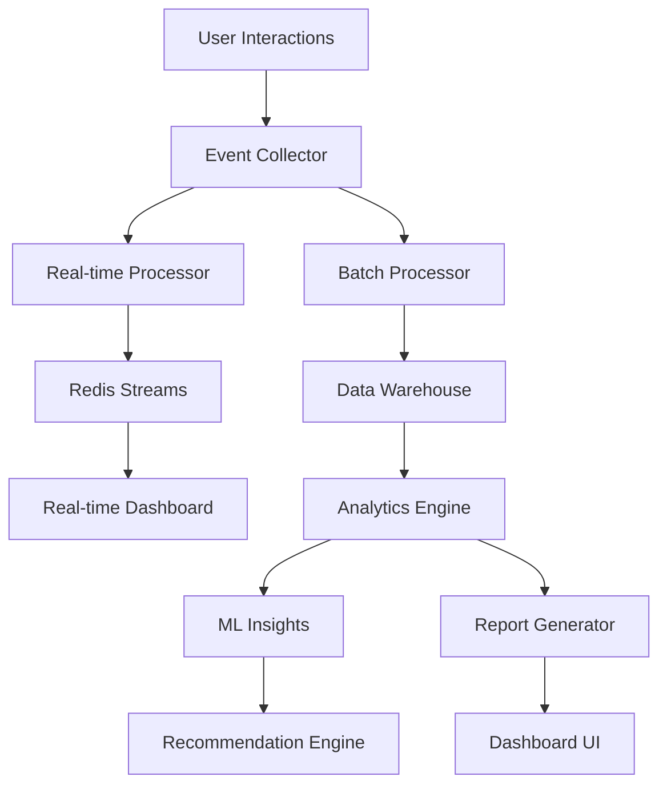

# Advanced Analytics and Reporting Specification

## Overview
This document outlines the implementation requirements for a comprehensive analytics and reporting system, providing deep insights into user behavior, learning patterns, content performance, and business metrics.

## 1. System Architecture

### 1.1 Technology Stack
- **Analytics Engine:** Custom analytics service + Google Analytics 4
- **Data Warehouse:** Supabase + BigQuery (for large-scale analytics)
- **Real-time Processing:** Redis Streams + WebSocket
- **Visualization:** Recharts + D3.js + Custom dashboards
- **Machine Learning:** TensorFlow.js (client-side) + Python ML services
- **Export:** PDF generation + CSV/Excel export

### 1.2 Architecture Diagram


## 2. Data Models and Schema

### 2.1 User Analytics Events
```sql
CREATE TABLE analytics_events (
    id UUID PRIMARY KEY DEFAULT gen_random_uuid(),
    user_id UUID REFERENCES auth.users(id),
    session_id VARCHAR(255) NOT NULL,
    event_type VARCHAR(100) NOT NULL,
    event_category VARCHAR(50) NOT NULL,
    event_action VARCHAR(100) NOT NULL,
    event_label VARCHAR(255),
    event_value NUMERIC,
    page_url VARCHAR(500),
    referrer VARCHAR(500),
    user_agent TEXT,
    ip_address INET,
    country VARCHAR(2),
    region VARCHAR(100),
    city VARCHAR(100),
    device_type VARCHAR(20),
    browser VARCHAR(50),
    os VARCHAR(50),
    screen_resolution VARCHAR(20),
    language VARCHAR(10),
    timezone VARCHAR(50),
    custom_properties JSONB DEFAULT '{}',
    timestamp TIMESTAMP WITH TIME ZONE DEFAULT NOW(),
    processed_at TIMESTAMP WITH TIME ZONE
);

-- Indexes for performance
CREATE INDEX idx_analytics_events_user_id ON analytics_events(user_id);
CREATE INDEX idx_analytics_events_timestamp ON analytics_events(timestamp DESC);
CREATE INDEX idx_analytics_events_type ON analytics_events(event_type);
CREATE INDEX idx_analytics_events_session ON analytics_events(session_id);
CREATE INDEX idx_analytics_events_category ON analytics_events(event_category);
```

### 2.2 Learning Analytics
```sql
CREATE TABLE learning_analytics (
    id UUID PRIMARY KEY DEFAULT gen_random_uuid(),
    user_id UUID REFERENCES auth.users(id),
    session_id VARCHAR(255) NOT NULL,
    content_id VARCHAR(255) NOT NULL,
    content_type VARCHAR(50) NOT NULL, -- lesson, story, exercise, quiz
    action VARCHAR(50) NOT NULL, -- start, complete, pause, skip, retry
    progress_percentage NUMERIC(5,2),
    time_spent INTEGER, -- seconds
    score NUMERIC(5,2),
    attempts INTEGER DEFAULT 1,
    difficulty_level VARCHAR(20),
    learning_path VARCHAR(100),
    mistakes JSONB DEFAULT '[]',
    hints_used INTEGER DEFAULT 0,
    help_accessed BOOLEAN DEFAULT false,
    completion_method VARCHAR(50), -- natural, forced, timeout
    device_type VARCHAR(20),
    learning_context JSONB DEFAULT '{}',
    timestamp TIMESTAMP WITH TIME ZONE DEFAULT NOW()
);

-- Indexes
CREATE INDEX idx_learning_analytics_user_id ON learning_analytics(user_id);
CREATE INDEX idx_learning_analytics_content ON learning_analytics(content_id, content_type);
CREATE INDEX idx_learning_analytics_timestamp ON learning_analytics(timestamp DESC);
CREATE INDEX idx_learning_analytics_action ON learning_analytics(action);
```

### 2.3 Content Performance Metrics
```sql
CREATE TABLE content_analytics (
    id UUID PRIMARY KEY DEFAULT gen_random_uuid(),
    content_id VARCHAR(255) NOT NULL,
    content_type VARCHAR(50) NOT NULL,
    metric_name VARCHAR(100) NOT NULL,
    metric_value NUMERIC,
    aggregation_period VARCHAR(20), -- hour, day, week, month
    period_start TIMESTAMP WITH TIME ZONE NOT NULL,
    period_end TIMESTAMP WITH TIME ZONE NOT NULL,
    user_segment VARCHAR(50), -- beginner, intermediate, advanced, all
    metadata JSONB DEFAULT '{}',
    created_at TIMESTAMP WITH TIME ZONE DEFAULT NOW()
);

-- Unique constraint to prevent duplicates
CREATE UNIQUE INDEX idx_content_analytics_unique 
ON content_analytics(content_id, content_type, metric_name, aggregation_period, period_start, user_segment);
```

### 2.4 User Behavior Patterns
```sql
CREATE TABLE user_behavior_patterns (
    id UUID PRIMARY KEY DEFAULT gen_random_uuid(),
    user_id UUID REFERENCES auth.users(id),
    pattern_type VARCHAR(50) NOT NULL, -- learning_streak, session_pattern, content_preference
    pattern_data JSONB NOT NULL,
    confidence_score NUMERIC(3,2), -- 0.00 to 1.00
    detected_at TIMESTAMP WITH TIME ZONE DEFAULT NOW(),
    last_updated TIMESTAMP WITH TIME ZONE DEFAULT NOW(),
    is_active BOOLEAN DEFAULT true
);

-- Indexes
CREATE INDEX idx_user_behavior_patterns_user_id ON user_behavior_patterns(user_id);
CREATE INDEX idx_user_behavior_patterns_type ON user_behavior_patterns(pattern_type);
CREATE INDEX idx_user_behavior_patterns_active ON user_behavior_patterns(is_active);
```

## 3. Analytics Service Implementation

### 3.1 Core Analytics Service
```typescript
interface AnalyticsService {
  // Event tracking
  trackEvent(event: AnalyticsEvent): Promise<void>;
  trackBatch(events: AnalyticsEvent[]): Promise<void>;
  trackPageView(pageData: PageViewData): Promise<void>;
  trackUserAction(action: UserAction): Promise<void>;
  
  // Learning analytics
  trackLearningEvent(event: LearningEvent): Promise<void>;
  trackProgress(progress: ProgressData): Promise<void>;
  trackCompletion(completion: CompletionData): Promise<void>;
  
  // Real-time analytics
  getRealtimeMetrics(): Promise<RealtimeMetrics>;
  subscribeToRealtimeUpdates(callback: (data: RealtimeUpdate) => void): void;
  
  // Query interface
  query(query: AnalyticsQuery): Promise<AnalyticsResult>;
  getMetrics(filters: MetricFilters): Promise<Metric[]>;
  getInsights(type: InsightType, filters: any): Promise<Insight[]>;
}

interface AnalyticsEvent {
  userId?: string;
  sessionId: string;
  eventType: string;
  eventCategory: string;
  eventAction: string;
  eventLabel?: string;
  eventValue?: number;
  customProperties?: Record<string, any>;
  timestamp?: Date;
}

interface LearningEvent {
  userId: string;
  sessionId: string;
  contentId: string;
  contentType: 'lesson' | 'story' | 'exercise' | 'quiz';
  action: 'start' | 'complete' | 'pause' | 'skip' | 'retry';
  progressPercentage?: number;
  timeSpent?: number;
  score?: number;
  attempts?: number;
  mistakes?: any[];
  hintsUsed?: number;
  learningContext?: Record<string, any>;
}
```

### 3.2 Real-time Analytics Engine
```typescript
interface RealtimeAnalytics {
  // Real-time metrics
  getCurrentActiveUsers(): Promise<number>;
  getLiveUserSessions(): Promise<UserSession[]>;
  getRealtimeEvents(): Promise<RealtimeEvent[]>;
  
  // Live dashboards
  streamDashboardData(dashboardId: string): AsyncIterable<DashboardUpdate>;
  getActiveLearners(): Promise<ActiveLearner[]>;
  getLiveContentPerformance(): Promise<ContentPerformance[]>;
  
  // Alerts and notifications
  setupRealtimeAlerts(config: AlertConfig): Promise<void>;
  triggerAlert(alert: RealtimeAlert): Promise<void>;
}

interface UserSession {
  sessionId: string;
  userId?: string;
  startTime: Date;
  lastActivity: Date;
  pageViews: number;
  eventsCount: number;
  currentPage: string;
  deviceInfo: DeviceInfo;
  location: LocationInfo;
}

interface RealtimeEvent {
  id: string;
  type: string;
  data: any;
  timestamp: Date;
  userId?: string;
  sessionId: string;
}
```

### 3.3 Machine Learning Insights
```typescript
interface MLInsights {
  // User behavior analysis
  analyzeUserBehavior(userId: string): Promise<BehaviorAnalysis>;
  predictUserChurn(userId: string): Promise<ChurnPrediction>;
  recommendContent(userId: string): Promise<ContentRecommendation[]>;
  
  // Learning pattern analysis
  identifyLearningPatterns(userId: string): Promise<LearningPattern[]>;
  predictLearningOutcomes(userId: string, contentId: string): Promise<OutcomePrediction>;
  optimizeLearningPath(userId: string): Promise<OptimizedPath>;
  
  // Content optimization
  analyzeContentEffectiveness(contentId: string): Promise<EffectivenessAnalysis>;
  identifyContentGaps(): Promise<ContentGap[]>;
  optimizeContentDifficulty(contentId: string): Promise<DifficultyOptimization>;
  
  // Cohort analysis
  performCohortAnalysis(cohortDefinition: CohortDefinition): Promise<CohortAnalysis>;
  identifyUserSegments(): Promise<UserSegment[]>;
}

interface BehaviorAnalysis {
  userId: string;
  learningStyle: 'visual' | 'auditory' | 'kinesthetic' | 'mixed';
  preferredSessionLength: number;
  optimalLearningTime: string;
  motivationFactors: string[];
  strugglingAreas: string[];
  strengths: string[];
  engagementLevel: 'low' | 'medium' | 'high';
  riskFactors: string[];
}

interface ChurnPrediction {
  userId: string;
  churnProbability: number; // 0-1
  riskLevel: 'low' | 'medium' | 'high';
  keyFactors: string[];
  recommendedActions: string[];
  timeframe: number; // days
}
```

## 4. Dashboard and Visualization

### 4.1 Admin Dashboard Components
```typescript
interface AdminDashboard {
  // Overview metrics
  getOverviewMetrics(): Promise<OverviewMetrics>;
  getUserGrowthMetrics(): Promise<GrowthMetrics>;
  getEngagementMetrics(): Promise<EngagementMetrics>;
  getRevenueMetrics(): Promise<RevenueMetrics>;
  
  // User analytics
  getUserDemographics(): Promise<Demographics>;
  getUserBehaviorTrends(): Promise<BehaviorTrend[]>;
  getRetentionAnalysis(): Promise<RetentionAnalysis>;
  
  // Content analytics
  getContentPerformance(): Promise<ContentPerformance[]>;
  getLessonAnalytics(): Promise<LessonAnalytics[]>;
  getStoryAnalytics(): Promise<StoryAnalytics[]>;
  
  // Learning analytics
  getLearningProgressMetrics(): Promise<ProgressMetrics>;
  getCompletionRates(): Promise<CompletionRate[]>;
  getDifficultyAnalysis(): Promise<DifficultyAnalysis>;
}

interface OverviewMetrics {
  totalUsers: number;
  activeUsers: {
    daily: number;
    weekly: number;
    monthly: number;
  };
  totalSessions: number;
  averageSessionDuration: number;
  totalLessonsCompleted: number;
  totalStoriesRead: number;
  userGrowthRate: number;
  engagementRate: number;
  retentionRate: {
    day1: number;
    day7: number;
    day30: number;
  };
}
```

### 4.2 User Progress Dashboard
```typescript
interface UserProgressDashboard {
  // Personal metrics
  getPersonalMetrics(userId: string): Promise<PersonalMetrics>;
  getLearningProgress(userId: string): Promise<LearningProgress>;
  getAchievements(userId: string): Promise<Achievement[]>;
  
  // Progress visualization
  getProgressChart(userId: string, timeframe: string): Promise<ProgressChart>;
  getSkillRadar(userId: string): Promise<SkillRadar>;
  getLearningStreak(userId: string): Promise<StreakData>;
  
  // Recommendations
  getPersonalizedRecommendations(userId: string): Promise<Recommendation[]>;
  getNextLessons(userId: string): Promise<NextLesson[]>;
  getWeakAreas(userId: string): Promise<WeakArea[]>;
}

interface PersonalMetrics {
  totalTimeSpent: number;
  lessonsCompleted: number;
  storiesRead: number;
  currentStreak: number;
  longestStreak: number;
  averageScore: number;
  skillLevel: string;
  progressPercentage: number;
  rank: number;
  totalPoints: number;
}
```

### 4.3 Content Creator Dashboard
```typescript
interface ContentCreatorDashboard {
  // Content performance
  getContentMetrics(creatorId: string): Promise<ContentMetrics>;
  getLessonPerformance(lessonId: string): Promise<LessonPerformance>;
  getStoryPerformance(storyId: string): Promise<StoryPerformance>;
  
  // User feedback
  getUserFeedback(contentId: string): Promise<UserFeedback[]>;
  getRatingsAnalysis(contentId: string): Promise<RatingsAnalysis>;
  getCompletionAnalysis(contentId: string): Promise<CompletionAnalysis>;
  
  // Optimization insights
  getOptimizationSuggestions(contentId: string): Promise<OptimizationSuggestion[]>;
  getDifficultyFeedback(contentId: string): Promise<DifficultyFeedback>;
  getEngagementHotspots(contentId: string): Promise<EngagementHotspot[]>;
}
```

## 5. Reporting System

### 5.1 Automated Reports
```typescript
interface ReportingService {
  // Report generation
  generateReport(config: ReportConfig): Promise<Report>;
  scheduleReport(config: ReportConfig, schedule: ReportSchedule): Promise<string>;
  getReportHistory(filters: ReportFilters): Promise<Report[]>;
  
  // Export functionality
  exportToPDF(reportId: string): Promise<Buffer>;
  exportToExcel(reportId: string): Promise<Buffer>;
  exportToCSV(reportId: string): Promise<string>;
  
  // Report templates
  createReportTemplate(template: ReportTemplate): Promise<ReportTemplate>;
  getReportTemplates(): Promise<ReportTemplate[]>;
  updateReportTemplate(id: string, updates: Partial<ReportTemplate>): Promise<ReportTemplate>;
}

interface ReportConfig {
  name: string;
  type: 'user_analytics' | 'content_performance' | 'learning_outcomes' | 'business_metrics';
  timeframe: {
    start: Date;
    end: Date;
  };
  filters: Record<string, any>;
  metrics: string[];
  visualizations: VisualizationConfig[];
  recipients: string[];
  format: 'pdf' | 'excel' | 'csv' | 'dashboard';
}

interface Report {
  id: string;
  name: string;
  type: string;
  generatedAt: Date;
  data: ReportData;
  visualizations: ReportVisualization[];
  summary: ReportSummary;
  insights: ReportInsight[];
  recommendations: string[];
}
```

### 5.2 Custom Report Builder
```typescript
interface ReportBuilder {
  // Report construction
  createCustomReport(): ReportBuilder;
  addMetric(metric: MetricDefinition): ReportBuilder;
  addFilter(filter: FilterDefinition): ReportBuilder;
  addVisualization(viz: VisualizationDefinition): ReportBuilder;
  setTimeframe(start: Date, end: Date): ReportBuilder;
  
  // Data aggregation
  groupBy(field: string): ReportBuilder;
  orderBy(field: string, direction: 'asc' | 'desc'): ReportBuilder;
  limit(count: number): ReportBuilder;
  
  // Execution
  build(): Promise<CustomReport>;
  preview(): Promise<ReportPreview>;
  save(name: string): Promise<string>;
}

interface MetricDefinition {
  name: string;
  field: string;
  aggregation: 'sum' | 'avg' | 'count' | 'min' | 'max';
  format?: string;
  calculation?: string;
}
```

## 6. Advanced Analytics Features

### 6.1 Cohort Analysis
```typescript
interface CohortAnalytics {
  // Cohort creation
  createCohort(definition: CohortDefinition): Promise<Cohort>;
  getCohorts(): Promise<Cohort[]>;
  updateCohort(id: string, updates: Partial<CohortDefinition>): Promise<Cohort>;
  
  // Cohort analysis
  analyzeCohortRetention(cohortId: string): Promise<RetentionAnalysis>;
  analyzeCohortBehavior(cohortId: string): Promise<BehaviorAnalysis>;
  compareCohorts(cohortIds: string[]): Promise<CohortComparison>;
  
  // Cohort insights
  getCohortInsights(cohortId: string): Promise<CohortInsight[]>;
  predictCohortOutcomes(cohortId: string): Promise<CohortPrediction>;
}

interface CohortDefinition {
  name: string;
  description: string;
  criteria: CohortCriteria;
  timeframe: {
    start: Date;
    end: Date;
  };
  trackingPeriod: number; // days
}

interface CohortCriteria {
  registrationDate?: DateRange;
  firstAction?: string;
  userProperties?: Record<string, any>;
  behaviorFilters?: BehaviorFilter[];
}
```

### 6.2 A/B Testing Analytics
```typescript
interface ABTestAnalytics {
  // Test management
  createTest(config: ABTestConfig): Promise<ABTest>;
  getActiveTests(): Promise<ABTest[]>;
  getTestResults(testId: string): Promise<ABTestResults>;
  
  // Statistical analysis
  calculateSignificance(testId: string): Promise<SignificanceResult>;
  getConfidenceInterval(testId: string, metric: string): Promise<ConfidenceInterval>;
  estimateSampleSize(config: SampleSizeConfig): Promise<number>;
  
  // Test insights
  getTestInsights(testId: string): Promise<TestInsight[]>;
  recommendTestDuration(testId: string): Promise<number>;
  detectTestAnomalies(testId: string): Promise<TestAnomaly[]>;
}

interface ABTestConfig {
  name: string;
  hypothesis: string;
  variants: TestVariant[];
  trafficAllocation: number; // percentage
  successMetrics: string[];
  minimumDetectableEffect: number;
  confidenceLevel: number;
  duration: number; // days
}
```

### 6.3 Predictive Analytics
```typescript
interface PredictiveAnalytics {
  // User predictions
  predictUserLifetimeValue(userId: string): Promise<LTVPrediction>;
  predictNextAction(userId: string): Promise<ActionPrediction>;
  predictOptimalContent(userId: string): Promise<ContentPrediction[]>;
  
  // Business predictions
  forecastUserGrowth(timeframe: number): Promise<GrowthForecast>;
  predictRevenue(timeframe: number): Promise<RevenueForecast>;
  forecastContentDemand(): Promise<DemandForecast>;
  
  // Learning predictions
  predictLearningSuccess(userId: string, contentId: string): Promise<SuccessPrediction>;
  estimateCompletionTime(userId: string, contentId: string): Promise<TimeEstimate>;
  predictSkillProgression(userId: string): Promise<SkillProgression>;
}

interface LTVPrediction {
  userId: string;
  predictedLTV: number;
  confidence: number;
  timeframe: number; // days
  factors: LTVFactor[];
  recommendations: string[];
}
```

## 7. Performance Optimization

### 7.1 Data Processing Optimization
```typescript
interface DataProcessor {
  // Batch processing
  processBatch(events: AnalyticsEvent[]): Promise<ProcessingResult>;
  scheduleProcessing(interval: number): void;
  optimizeQueries(): Promise<OptimizationResult>;
  
  // Real-time processing
  processRealtime(event: AnalyticsEvent): Promise<void>;
  streamProcessing(stream: EventStream): AsyncIterable<ProcessedEvent>;
  
  // Data aggregation
  aggregateMetrics(timeframe: string): Promise<AggregationResult>;
  precomputeReports(): Promise<void>;
  updateMaterializedViews(): Promise<void>;
}

interface ProcessingResult {
  processed: number;
  failed: number;
  duration: number;
  errors: ProcessingError[];
}
```

### 7.2 Caching Strategy
```typescript
interface AnalyticsCache {
  // Cache management
  cacheMetrics(key: string, data: any, ttl: number): Promise<void>;
  getCachedMetrics(key: string): Promise<any>;
  invalidateCache(pattern: string): Promise<void>;
  
  // Smart caching
  preloadPopularMetrics(): Promise<void>;
  adaptiveCaching(usage: CacheUsage): Promise<void>;
  
  // Cache optimization
  optimizeCacheUsage(): Promise<CacheOptimization>;
  getCacheStats(): Promise<CacheStats>;
}
```

## 8. Privacy and Compliance

### 8.1 Data Privacy
```typescript
interface PrivacyManager {
  // Data anonymization
  anonymizeUserData(userId: string): Promise<void>;
  pseudonymizeEvents(events: AnalyticsEvent[]): Promise<AnalyticsEvent[]>;
  
  // Consent management
  recordConsent(userId: string, consentType: string): Promise<void>;
  checkConsent(userId: string, dataType: string): Promise<boolean>;
  
  // Data retention
  enforceRetentionPolicy(): Promise<RetentionResult>;
  deleteExpiredData(): Promise<DeletionResult>;
  
  // GDPR compliance
  exportUserAnalytics(userId: string): Promise<UserAnalyticsExport>;
  deleteUserAnalytics(userId: string): Promise<DeletionResult>;
}
```

### 8.2 Data Security
```typescript
interface AnalyticsSecurity {
  // Access control
  checkAnalyticsPermission(userId: string, resource: string): Promise<boolean>;
  auditAnalyticsAccess(userId: string, action: string): Promise<void>;
  
  // Data encryption
  encryptSensitiveData(data: any): Promise<string>;
  decryptSensitiveData(encryptedData: string): Promise<any>;
  
  // Audit logging
  logAnalyticsOperation(operation: AnalyticsOperation): Promise<void>;
  getAuditLog(filters: AuditFilters): Promise<AuditLogEntry[]>;
}
```

## 9. Integration and APIs

### 9.1 Analytics API
```typescript
interface AnalyticsAPI {
  // Event ingestion
  POST('/api/analytics/events', event: AnalyticsEvent): Promise<void>;
  POST('/api/analytics/batch', events: AnalyticsEvent[]): Promise<void>;
  
  // Metrics retrieval
  GET('/api/analytics/metrics', filters: MetricFilters): Promise<Metric[]>;
  GET('/api/analytics/insights', type: InsightType): Promise<Insight[]>;
  
  // Real-time data
  WebSocket('/api/analytics/realtime'): RealtimeConnection;
  GET('/api/analytics/live'): Promise<RealtimeMetrics>;
  
  // Reports
  POST('/api/analytics/reports', config: ReportConfig): Promise<Report>;
  GET('/api/analytics/reports/:id'): Promise<Report>;
  GET('/api/analytics/reports/:id/export'): Promise<Buffer>;
}
```

### 9.2 Third-party Integrations
```typescript
interface ThirdPartyIntegrations {
  // Google Analytics 4
  syncWithGA4(): Promise<void>;
  importGA4Data(dateRange: DateRange): Promise<GA4Data>;
  
  // External BI tools
  exportToTableau(): Promise<TableauExport>;
  exportToPowerBI(): Promise<PowerBIExport>;
  
  // Marketing platforms
  syncWithHubSpot(): Promise<void>;
  exportToMailchimp(): Promise<MailchimpExport>;
}
```

## 10. Testing and Quality Assurance

### 10.1 Analytics Testing
```typescript
interface AnalyticsTesting {
  // Data validation
  validateEventData(event: AnalyticsEvent): ValidationResult;
  testDataIntegrity(): Promise<IntegrityReport>;
  
  // Performance testing
  loadTestAnalytics(config: LoadTestConfig): Promise<LoadTestResult>;
  benchmarkQueries(): Promise<BenchmarkResult>;
  
  // Accuracy testing
  testMetricAccuracy(metric: string, expectedValue: number): Promise<AccuracyResult>;
  validateReportData(reportId: string): Promise<ValidationResult>;
}
```

### 10.2 Monitoring and Alerting
```typescript
interface AnalyticsMonitoring {
  // System health
  checkAnalyticsHealth(): Promise<HealthStatus>;
  monitorDataQuality(): Promise<QualityMetrics>;
  
  // Performance monitoring
  trackQueryPerformance(): Promise<PerformanceMetrics>;
  monitorResourceUsage(): Promise<ResourceMetrics>;
  
  // Alerting
  setupDataQualityAlerts(): Promise<void>;
  setupPerformanceAlerts(): Promise<void>;
  triggerAlert(alert: AnalyticsAlert): Promise<void>;
}
```

---

*Implementation Priority: High*
*Estimated Effort: 3-4 weeks*
*Dependencies: Supabase, Redis, Recharts, TensorFlow.js*