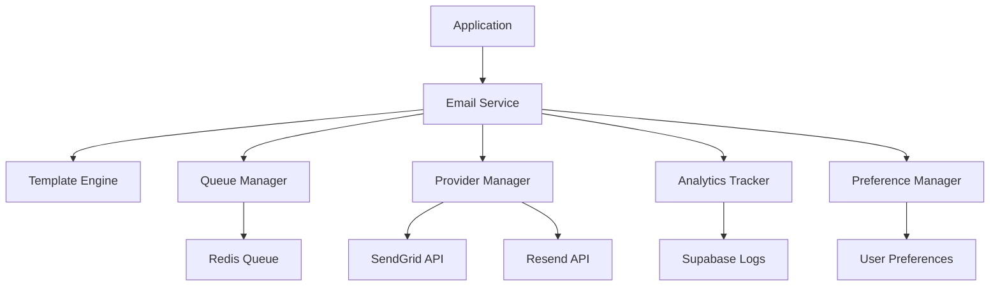

# Email Service Integration Specification

## Overview
This document outlines the implementation requirements for a comprehensive email service system, enabling automated communications, notifications, and user engagement through email.

## 1. System Architecture

### 1.1 Technology Stack
- **Email Provider:** SendGrid (primary), Resend (backup)
- **Template Engine:** React Email + Handlebars
- **Queue System:** Redis Bull Queue
- **Database:** Supabase (email logs, templates, preferences)
- **Authentication:** API Keys + OAuth2
- **Monitoring:** SendGrid Analytics + Custom metrics

### 1.2 Architecture Diagram


## 2. Database Schema

### 2.1 Email Templates
```sql
CREATE TABLE email_templates (
    id UUID PRIMARY KEY DEFAULT gen_random_uuid(),
    name VARCHAR(100) UNIQUE NOT NULL,
    subject VARCHAR(255) NOT NULL,
    html_content TEXT NOT NULL,
    text_content TEXT,
    template_variables JSONB DEFAULT '{}',
    category VARCHAR(50) NOT NULL,
    is_active BOOLEAN DEFAULT true,
    created_at TIMESTAMP WITH TIME ZONE DEFAULT NOW(),
    updated_at TIMESTAMP WITH TIME ZONE DEFAULT NOW(),
    created_by UUID REFERENCES auth.users(id)
);

-- Indexes
CREATE INDEX idx_email_templates_category ON email_templates(category);
CREATE INDEX idx_email_templates_active ON email_templates(is_active);
```

### 2.2 Email Logs
```sql
CREATE TABLE email_logs (
    id UUID PRIMARY KEY DEFAULT gen_random_uuid(),
    user_id UUID REFERENCES auth.users(id),
    template_id UUID REFERENCES email_templates(id),
    recipient_email VARCHAR(255) NOT NULL,
    subject VARCHAR(255) NOT NULL,
    status VARCHAR(20) NOT NULL CHECK (status IN ('queued', 'sent', 'delivered', 'opened', 'clicked', 'bounced', 'failed')),
    provider VARCHAR(20) NOT NULL,
    provider_message_id VARCHAR(255),
    error_message TEXT,
    sent_at TIMESTAMP WITH TIME ZONE,
    delivered_at TIMESTAMP WITH TIME ZONE,
    opened_at TIMESTAMP WITH TIME ZONE,
    clicked_at TIMESTAMP WITH TIME ZONE,
    metadata JSONB DEFAULT '{}',
    created_at TIMESTAMP WITH TIME ZONE DEFAULT NOW()
);

-- Indexes
CREATE INDEX idx_email_logs_user_id ON email_logs(user_id);
CREATE INDEX idx_email_logs_status ON email_logs(status);
CREATE INDEX idx_email_logs_sent_at ON email_logs(sent_at DESC);
CREATE INDEX idx_email_logs_provider_message_id ON email_logs(provider_message_id);
```

### 2.3 Email Preferences
```sql
CREATE TABLE email_preferences (
    id UUID PRIMARY KEY DEFAULT gen_random_uuid(),
    user_id UUID REFERENCES auth.users(id) UNIQUE,
    welcome_emails BOOLEAN DEFAULT true,
    lesson_reminders BOOLEAN DEFAULT true,
    progress_updates BOOLEAN DEFAULT true,
    achievement_notifications BOOLEAN DEFAULT true,
    weekly_digest BOOLEAN DEFAULT true,
    marketing_emails BOOLEAN DEFAULT false,
    frequency VARCHAR(20) DEFAULT 'daily' CHECK (frequency IN ('immediate', 'daily', 'weekly', 'never')),
    timezone VARCHAR(50) DEFAULT 'UTC',
    preferred_time TIME DEFAULT '09:00:00',
    unsubscribe_token VARCHAR(255) UNIQUE,
    created_at TIMESTAMP WITH TIME ZONE DEFAULT NOW(),
    updated_at TIMESTAMP WITH TIME ZONE DEFAULT NOW()
);

-- Generate unsubscribe token
CREATE OR REPLACE FUNCTION generate_unsubscribe_token()
RETURNS TRIGGER AS $$
BEGIN
    NEW.unsubscribe_token = encode(gen_random_bytes(32), 'hex');
    RETURN NEW;
END;
$$ LANGUAGE plpgsql;

CREATE TRIGGER set_unsubscribe_token
    BEFORE INSERT ON email_preferences
    FOR EACH ROW
    EXECUTE FUNCTION generate_unsubscribe_token();
```

### 2.4 Email Queue
```sql
CREATE TABLE email_queue (
    id UUID PRIMARY KEY DEFAULT gen_random_uuid(),
    user_id UUID REFERENCES auth.users(id),
    template_name VARCHAR(100) NOT NULL,
    recipient_email VARCHAR(255) NOT NULL,
    template_data JSONB DEFAULT '{}',
    priority INTEGER DEFAULT 5 CHECK (priority BETWEEN 1 AND 10),
    scheduled_for TIMESTAMP WITH TIME ZONE DEFAULT NOW(),
    attempts INTEGER DEFAULT 0,
    max_attempts INTEGER DEFAULT 3,
    status VARCHAR(20) DEFAULT 'pending' CHECK (status IN ('pending', 'processing', 'sent', 'failed', 'cancelled')),
    error_message TEXT,
    created_at TIMESTAMP WITH TIME ZONE DEFAULT NOW(),
    updated_at TIMESTAMP WITH TIME ZONE DEFAULT NOW()
);

-- Indexes
CREATE INDEX idx_email_queue_status ON email_queue(status);
CREATE INDEX idx_email_queue_scheduled_for ON email_queue(scheduled_for);
CREATE INDEX idx_email_queue_priority ON email_queue(priority DESC);
```

## 3. Email Service Implementation

### 3.1 Core Email Service
```typescript
interface EmailService {
  // Template management
  createTemplate(template: EmailTemplate): Promise<EmailTemplate>;
  updateTemplate(id: string, updates: Partial<EmailTemplate>): Promise<EmailTemplate>;
  getTemplate(name: string): Promise<EmailTemplate>;
  listTemplates(category?: string): Promise<EmailTemplate[]>;
  
  // Email sending
  sendEmail(request: EmailRequest): Promise<EmailResponse>;
  sendBulkEmail(requests: EmailRequest[]): Promise<EmailResponse[]>;
  scheduleEmail(request: EmailRequest, scheduledFor: Date): Promise<string>;
  
  // Queue management
  addToQueue(emailData: QueueEmailData): Promise<string>;
  processQueue(): Promise<void>;
  retryFailed(maxAttempts?: number): Promise<void>;
  
  // Analytics and tracking
  getEmailStats(filters: EmailStatsFilters): Promise<EmailStats>;
  trackEmailEvent(event: EmailEvent): Promise<void>;
  
  // User preferences
  updatePreferences(userId: string, preferences: EmailPreferences): Promise<void>;
  getPreferences(userId: string): Promise<EmailPreferences>;
  unsubscribe(token: string): Promise<void>;
}

interface EmailRequest {
  to: string | string[];
  templateName: string;
  templateData: Record<string, any>;
  priority?: number;
  scheduledFor?: Date;
  userId?: string;
  metadata?: Record<string, any>;
}

interface EmailResponse {
  success: boolean;
  messageId?: string;
  error?: string;
  provider: string;
}
```

### 3.2 Template Engine
```typescript
interface TemplateEngine {
  // Template compilation
  compileTemplate(template: EmailTemplate, data: Record<string, any>): Promise<CompiledEmail>;
  validateTemplate(template: EmailTemplate): Promise<ValidationResult>;
  previewTemplate(templateName: string, data: Record<string, any>): Promise<CompiledEmail>;
  
  // Template helpers
  registerHelper(name: string, helper: TemplateHelper): void;
  getAvailableVariables(templateName: string): Promise<string[]>;
}

interface CompiledEmail {
  subject: string;
  html: string;
  text: string;
  attachments?: EmailAttachment[];
}

interface EmailTemplate {
  id?: string;
  name: string;
  subject: string;
  htmlContent: string;
  textContent?: string;
  templateVariables: Record<string, any>;
  category: string;
  isActive: boolean;
}
```

### 3.3 Provider Manager
```typescript
interface EmailProvider {
  name: string;
  isAvailable(): Promise<boolean>;
  sendEmail(email: CompiledEmail, recipient: string): Promise<ProviderResponse>;
  sendBulkEmail(emails: BulkEmailData[]): Promise<ProviderResponse[]>;
  getDeliveryStatus(messageId: string): Promise<DeliveryStatus>;
  handleWebhook(payload: any): Promise<EmailEvent[]>;
}

interface ProviderManager {
  // Provider management
  addProvider(provider: EmailProvider): void;
  removeProvider(providerName: string): void;
  getActiveProvider(): EmailProvider;
  
  // Failover handling
  sendWithFailover(email: CompiledEmail, recipient: string): Promise<ProviderResponse>;
  handleProviderFailure(providerName: string): Promise<void>;
  
  // Load balancing
  selectProvider(criteria: ProviderSelectionCriteria): EmailProvider;
}

interface ProviderResponse {
  success: boolean;
  messageId?: string;
  error?: string;
  provider: string;
  timestamp: Date;
}
```

## 4. Email Templates

### 4.1 Welcome Email Template
```typescript
const welcomeEmailTemplate = {
  name: 'welcome',
  subject: 'Ia ora na! Welcome to TahitiSpeak 🌺',
  category: 'onboarding',
  htmlContent: `
    <div style="font-family: Arial, sans-serif; max-width: 600px; margin: 0 auto;">
      <header style="background: linear-gradient(135deg, #0ea5e9 0%, #3b82f6 100%); padding: 20px; text-align: center;">
        <h1 style="color: white; margin: 0;">Ia ora na, {{userName}}!</h1>
        <p style="color: white; margin: 10px 0 0 0;">Welcome to your Tahitian language journey</p>
      </header>
      
      <main style="padding: 30px 20px;">
        <p>We're excited to have you join our community of Tahitian language learners!</p>
        
        <div style="background: #f8fafc; padding: 20px; border-radius: 8px; margin: 20px 0;">
          <h3>🎯 Your Learning Journey Starts Here</h3>
          <ul>
            <li>📚 Interactive lessons with cultural context</li>
            <li>🎧 Audio pronunciation guides</li>
            <li>📖 Traditional stories and legends</li>
            <li>🏆 Achievement system to track progress</li>
          </ul>
        </div>
        
        <div style="text-align: center; margin: 30px 0;">
          <a href="{{dashboardUrl}}" style="background: #0ea5e9; color: white; padding: 12px 24px; text-decoration: none; border-radius: 6px; display: inline-block;">
            Start Learning Now
          </a>
        </div>
        
        <p>If you have any questions, our support team is here to help!</p>
      </main>
      
      <footer style="background: #f1f5f9; padding: 20px; text-align: center; font-size: 14px; color: #64748b;">
        <p>TahitiSpeak - Learn Tahitian with Cultural Context</p>
        <p><a href="{{unsubscribeUrl}}">Unsubscribe</a> | <a href="{{preferencesUrl}}">Email Preferences</a></p>
      </footer>
    </div>
  `,
  templateVariables: {
    userName: 'string',
    dashboardUrl: 'string',
    unsubscribeUrl: 'string',
    preferencesUrl: 'string'
  }
};
```

### 4.2 Lesson Reminder Template
```typescript
const lessonReminderTemplate = {
  name: 'lesson_reminder',
  subject: "Don't forget your Tahitian lesson today! 🌺",
  category: 'engagement',
  htmlContent: `
    <div style="font-family: Arial, sans-serif; max-width: 600px; margin: 0 auto;">
      <header style="background: #0ea5e9; padding: 20px; text-align: center;">
        <h1 style="color: white; margin: 0;">Time for your Tahitian lesson!</h1>
      </header>
      
      <main style="padding: 30px 20px;">
        <p>Hi {{userName}},</p>
        
        <p>Your daily Tahitian lesson is waiting for you! You're doing great with your learning streak of {{streakDays}} days.</p>
        
        {{#if nextLesson}}
        <div style="background: #f0f9ff; border-left: 4px solid #0ea5e9; padding: 15px; margin: 20px 0;">
          <h3 style="margin: 0 0 10px 0;">📚 Next Lesson: {{nextLesson.title}}</h3>
          <p style="margin: 0; color: #64748b;">{{nextLesson.description}}</p>
        </div>
        {{/if}}
        
        <div style="text-align: center; margin: 30px 0;">
          <a href="{{lessonUrl}}" style="background: #0ea5e9; color: white; padding: 12px 24px; text-decoration: none; border-radius: 6px; display: inline-block;">
            Continue Learning
          </a>
        </div>
        
        <p style="font-size: 14px; color: #64748b;">
          💡 Tip: Consistent daily practice is the key to language mastery!
        </p>
      </main>
    </div>
  `,
  templateVariables: {
    userName: 'string',
    streakDays: 'number',
    nextLesson: 'object',
    lessonUrl: 'string'
  }
};
```

### 4.3 Achievement Notification Template
```typescript
const achievementTemplate = {
  name: 'achievement_unlocked',
  subject: '🏆 Achievement Unlocked: {{achievementName}}',
  category: 'gamification',
  htmlContent: `
    <div style="font-family: Arial, sans-serif; max-width: 600px; margin: 0 auto;">
      <header style="background: linear-gradient(135deg, #f59e0b 0%, #d97706 100%); padding: 20px; text-align: center;">
        <h1 style="color: white; margin: 0;">🏆 Achievement Unlocked!</h1>
      </header>
      
      <main style="padding: 30px 20px; text-align: center;">
        <div style="background: #fffbeb; border: 2px solid #f59e0b; border-radius: 12px; padding: 30px; margin: 20px 0;">
          <div style="font-size: 48px; margin-bottom: 15px;">{{achievementIcon}}</div>
          <h2 style="color: #d97706; margin: 0 0 10px 0;">{{achievementName}}</h2>
          <p style="color: #92400e; margin: 0;">{{achievementDescription}}</p>
        </div>
        
        <p>Congratulations, {{userName}}! You've earned {{achievementPoints}} points.</p>
        
        <div style="background: #f8fafc; padding: 20px; border-radius: 8px; margin: 20px 0;">
          <h3>📊 Your Progress</h3>
          <p>Total Points: {{totalPoints}}</p>
          <p>Achievements Unlocked: {{totalAchievements}}</p>
          <p>Learning Streak: {{streakDays}} days</p>
        </div>
        
        <div style="text-align: center; margin: 30px 0;">
          <a href="{{profileUrl}}" style="background: #f59e0b; color: white; padding: 12px 24px; text-decoration: none; border-radius: 6px; display: inline-block;">
            View All Achievements
          </a>
        </div>
      </main>
    </div>
  `,
  templateVariables: {
    userName: 'string',
    achievementName: 'string',
    achievementDescription: 'string',
    achievementIcon: 'string',
    achievementPoints: 'number',
    totalPoints: 'number',
    totalAchievements: 'number',
    streakDays: 'number',
    profileUrl: 'string'
  }
};
```

## 5. Queue Management System

### 5.1 Email Queue Processor
```typescript
interface QueueProcessor {
  // Queue processing
  processQueue(): Promise<void>;
  processBatch(batchSize: number): Promise<ProcessingResult>;
  retryFailed(maxAttempts: number): Promise<void>;
  
  // Queue monitoring
  getQueueStats(): Promise<QueueStats>;
  getFailedEmails(): Promise<QueuedEmail[]>;
  clearQueue(): Promise<void>;
  
  // Scheduling
  scheduleProcessing(interval: number): void;
  stopScheduledProcessing(): void;
}

interface QueueStats {
  pending: number;
  processing: number;
  sent: number;
  failed: number;
  totalToday: number;
  averageProcessingTime: number;
}

interface ProcessingResult {
  processed: number;
  successful: number;
  failed: number;
  errors: QueueError[];
}
```

### 5.2 Rate Limiting
```typescript
interface RateLimiter {
  // Rate limiting
  checkRateLimit(provider: string): Promise<boolean>;
  updateRateLimit(provider: string, sent: number): Promise<void>;
  getRemainingQuota(provider: string): Promise<number>;
  
  // Quota management
  setDailyQuota(provider: string, quota: number): Promise<void>;
  resetQuota(provider: string): Promise<void>;
  getQuotaUsage(provider: string): Promise<QuotaUsage>;
}

interface QuotaUsage {
  used: number;
  remaining: number;
  resetTime: Date;
  dailyLimit: number;
}
```

## 6. Analytics and Tracking

### 6.1 Email Analytics
```typescript
interface EmailAnalytics {
  // Delivery metrics
  getDeliveryRate(filters: AnalyticsFilters): Promise<number>;
  getOpenRate(filters: AnalyticsFilters): Promise<number>;
  getClickRate(filters: AnalyticsFilters): Promise<number>;
  getBounceRate(filters: AnalyticsFilters): Promise<number>;
  
  // Engagement metrics
  getEngagementTrends(period: TimePeriod): Promise<EngagementTrend[]>;
  getTemplatePerformance(): Promise<TemplatePerformance[]>;
  getUserEngagement(userId: string): Promise<UserEngagement>;
  
  // Campaign analysis
  getCampaignStats(campaignId: string): Promise<CampaignStats>;
  compareTemplates(templateIds: string[]): Promise<TemplateComparison>;
}

interface EngagementTrend {
  date: Date;
  sent: number;
  delivered: number;
  opened: number;
  clicked: number;
  bounced: number;
}

interface TemplatePerformance {
  templateName: string;
  sent: number;
  openRate: number;
  clickRate: number;
  bounceRate: number;
  avgEngagementTime: number;
}
```

### 6.2 Event Tracking
```typescript
interface EmailEventTracker {
  // Event recording
  trackSent(emailId: string, metadata: EventMetadata): Promise<void>;
  trackDelivered(emailId: string, timestamp: Date): Promise<void>;
  trackOpened(emailId: string, userAgent: string, ip: string): Promise<void>;
  trackClicked(emailId: string, linkUrl: string, timestamp: Date): Promise<void>;
  trackBounced(emailId: string, bounceType: string, reason: string): Promise<void>;
  
  // Webhook handling
  handleSendGridWebhook(payload: SendGridWebhookPayload): Promise<void>;
  handleResendWebhook(payload: ResendWebhookPayload): Promise<void>;
  
  // Event querying
  getEmailEvents(emailId: string): Promise<EmailEvent[]>;
  getUserEmailHistory(userId: string): Promise<EmailEvent[]>;
}

interface EmailEvent {
  id: string;
  emailId: string;
  type: 'sent' | 'delivered' | 'opened' | 'clicked' | 'bounced' | 'failed';
  timestamp: Date;
  metadata: Record<string, any>;
}
```

## 7. User Preference Management

### 7.1 Preference Service
```typescript
interface PreferenceService {
  // Preference management
  getPreferences(userId: string): Promise<EmailPreferences>;
  updatePreferences(userId: string, preferences: Partial<EmailPreferences>): Promise<void>;
  
  // Subscription management
  subscribe(userId: string, categories: string[]): Promise<void>;
  unsubscribe(token: string): Promise<void>;
  unsubscribeCategory(userId: string, category: string): Promise<void>;
  
  // Frequency management
  setFrequency(userId: string, frequency: EmailFrequency): Promise<void>;
  getOptimalSendTime(userId: string): Promise<Date>;
  
  // Compliance
  exportUserData(userId: string): Promise<UserEmailData>;
  deleteUserData(userId: string): Promise<void>;
}

interface EmailPreferences {
  userId: string;
  welcomeEmails: boolean;
  lessonReminders: boolean;
  progressUpdates: boolean;
  achievementNotifications: boolean;
  weeklyDigest: boolean;
  marketingEmails: boolean;
  frequency: 'immediate' | 'daily' | 'weekly' | 'never';
  timezone: string;
  preferredTime: string;
  unsubscribeToken: string;
}
```

### 7.2 Unsubscribe Management
```typescript
interface UnsubscribeManager {
  // Unsubscribe handling
  processUnsubscribe(token: string): Promise<UnsubscribeResult>;
  createUnsubscribeLink(userId: string): Promise<string>;
  
  // Preference center
  getPreferenceCenter(token: string): Promise<PreferenceCenterData>;
  updatePreferencesViaToken(token: string, preferences: Partial<EmailPreferences>): Promise<void>;
  
  // Compliance tracking
  logUnsubscribe(userId: string, reason?: string): Promise<void>;
  getUnsubscribeStats(): Promise<UnsubscribeStats>;
}

interface UnsubscribeResult {
  success: boolean;
  userId?: string;
  previousPreferences?: EmailPreferences;
  error?: string;
}
```

## 8. Security and Compliance

### 8.1 Data Protection
```typescript
interface EmailSecurity {
  // Data encryption
  encryptEmailContent(content: string): Promise<string>;
  decryptEmailContent(encryptedContent: string): Promise<string>;
  
  // PII handling
  sanitizeEmailData(data: Record<string, any>): Record<string, any>;
  maskSensitiveData(email: string): string;
  
  // Audit logging
  logEmailAccess(userId: string, action: string, metadata: any): Promise<void>;
  getAuditLog(filters: AuditFilters): Promise<AuditLogEntry[]>;
}

interface AuditLogEntry {
  id: string;
  userId: string;
  action: string;
  timestamp: Date;
  ipAddress: string;
  userAgent: string;
  metadata: Record<string, any>;
}
```

### 8.2 GDPR Compliance
```typescript
interface GDPRCompliance {
  // Data subject rights
  exportUserEmailData(userId: string): Promise<EmailDataExport>;
  deleteUserEmailData(userId: string): Promise<DeletionResult>;
  
  // Consent management
  recordConsent(userId: string, consentType: string): Promise<void>;
  withdrawConsent(userId: string, consentType: string): Promise<void>;
  getConsentHistory(userId: string): Promise<ConsentRecord[]>;
  
  // Data retention
  cleanupExpiredData(): Promise<CleanupResult>;
  getDataRetentionPolicy(): Promise<RetentionPolicy>;
}
```

## 9. Testing Strategy

### 9.1 Email Testing
```typescript
interface EmailTesting {
  // Template testing
  testTemplate(templateName: string, testData: any): Promise<TestResult>;
  validateEmailContent(content: string): Promise<ValidationResult>;
  
  // Delivery testing
  sendTestEmail(template: string, recipient: string): Promise<void>;
  testProviderConnectivity(): Promise<ProviderStatus[]>;
  
  // Performance testing
  loadTestEmailSending(concurrency: number, duration: number): Promise<LoadTestResult>;
  benchmarkTemplateRendering(templateName: string): Promise<BenchmarkResult>;
}
```

### 9.2 Integration Testing
- Provider failover testing
- Webhook endpoint testing
- Queue processing testing
- Rate limiting testing
- Analytics accuracy testing

## 10. Monitoring and Alerting

### 10.1 System Monitoring
```typescript
interface EmailMonitoring {
  // Health checks
  checkSystemHealth(): Promise<HealthStatus>;
  checkProviderHealth(): Promise<ProviderHealthStatus[]>;
  
  // Performance monitoring
  getPerformanceMetrics(): Promise<PerformanceMetrics>;
  getQueueMetrics(): Promise<QueueMetrics>;
  
  // Alerting
  setupAlerts(config: AlertConfig): Promise<void>;
  triggerAlert(alert: Alert): Promise<void>;
}

interface HealthStatus {
  overall: 'healthy' | 'degraded' | 'unhealthy';
  components: ComponentHealth[];
  lastChecked: Date;
}

interface Alert {
  type: 'queue_backup' | 'provider_failure' | 'high_bounce_rate' | 'quota_exceeded';
  severity: 'low' | 'medium' | 'high' | 'critical';
  message: string;
  metadata: Record<string, any>;
}
```

### 10.2 Performance Metrics
- Email delivery time
- Queue processing speed
- Template rendering time
- Provider response time
- Error rates by category

---

*Implementation Priority: Critical*
*Estimated Effort: 2-3 weeks*
*Dependencies: SendGrid/Resend API, Redis, React Email*