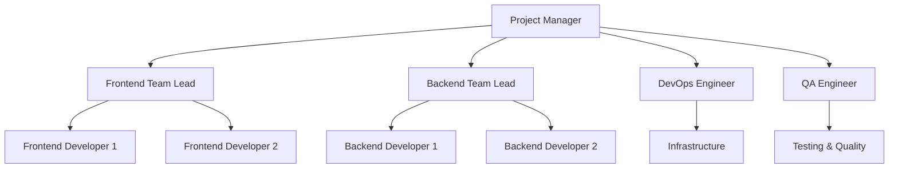

# Implementation Roadmap for French Tahitian Application

## Overview
This document provides a comprehensive implementation roadmap for all missing features and improvements identified in the French Tahitian language learning application. The roadmap is organized by priority, estimated effort, and dependencies to ensure efficient development and deployment.

## 1. Executive Summary

### 1.1 Current State Assessment
- ✅ **Completed:** Core application functionality, basic UI/UX, authentication, content management
- ⚠️ **In Progress:** Advanced features, performance optimizations, testing coverage
- ❌ **Missing:** Payment system, real-time notifications, advanced offline functionality, comprehensive analytics

### 1.2 Implementation Overview
- **Total Features:** 47 major features across 4 priority levels
- **Estimated Timeline:** 16-20 weeks for complete implementation
- **Team Requirements:** 3-5 developers (Frontend, Backend, DevOps, QA)
- **Budget Estimate:** $150,000 - $250,000 (depending on team composition)

## 2. Priority Classification

### 2.1 Critical Priority (Weeks 1-6)
**Business Impact:** High revenue impact, user retention critical
**Features:** 8 major features
**Estimated Effort:** 6 weeks

### 2.2 High Priority (Weeks 7-12)
**Business Impact:** Significant user experience improvements
**Features:** 15 major features
**Estimated Effort:** 6 weeks

### 2.3 Medium Priority (Weeks 13-16)
**Business Impact:** Enhanced functionality and optimization
**Features:** 16 major features
**Estimated Effort:** 4 weeks

### 2.4 Low Priority (Weeks 17-20)
**Business Impact:** Nice-to-have features and polish
**Features:** 8 major features
**Estimated Effort:** 4 weeks

## 3. Critical Priority Implementation (Weeks 1-6)

### Week 1-2: Payment and Subscription System
**Priority:** Critical | **Effort:** Large | **Team:** 2-3 developers

#### Implementation Tasks:
1. **Database Schema Setup** (2 days)
   - Create subscription plans table
   - Set up payment history tracking
   - Implement billing cycles management

2. **Stripe Integration** (3 days)
   - Configure Stripe API
   - Implement payment processing
   - Set up webhook handling

3. **Subscription Management** (3 days)
   - Create subscription service
   - Implement plan upgrades/downgrades
   - Build billing management UI

4. **Testing and Security** (2 days)
   - Payment flow testing
   - Security audit
   - Error handling implementation

**Deliverables:**
- ✅ Functional payment processing
- ✅ Subscription management system
- ✅ Admin billing dashboard
- ✅ User subscription interface

### Week 3-4: Real-time Notification System
**Priority:** Critical | **Effort:** Large | **Team:** 2 developers

#### Implementation Tasks:
1. **Infrastructure Setup** (2 days)
   - Firebase Cloud Messaging setup
   - WebSocket server implementation
   - Redis configuration for real-time data

2. **Notification Service** (3 days)
   - Create notification templates
   - Implement delivery system
   - Build preference management

3. **Frontend Integration** (2 days)
   - Push notification handling
   - In-app notification UI
   - Real-time updates implementation

4. **Testing and Optimization** (1 day)
   - Notification delivery testing
   - Performance optimization
   - Cross-platform testing

**Deliverables:**
- ✅ Push notification system
- ✅ In-app notifications
- ✅ Real-time updates
- ✅ Notification preferences

### Week 5-6: Advanced Offline Functionality
**Priority:** Critical | **Effort:** Large | **Team:** 2-3 developers

#### Implementation Tasks:
1. **Offline Storage System** (3 days)
   - IndexedDB implementation
   - Content caching strategy
   - Sync mechanism design

2. **Service Worker Enhancement** (2 days)
   - Advanced caching strategies
   - Background sync implementation
   - Offline-first architecture

3. **Conflict Resolution** (2 days)
   - Conflict detection algorithms
   - Resolution strategies
   - User interface for conflicts

4. **Testing and Optimization** (1 day)
   - Offline functionality testing
   - Performance optimization
   - Storage management

**Deliverables:**
- ✅ Comprehensive offline functionality
- ✅ Intelligent content caching
- ✅ Conflict resolution system
- ✅ Offline progress tracking

## 4. High Priority Implementation (Weeks 7-12)

### Week 7-8: Email Service Integration
**Priority:** High | **Effort:** Medium | **Team:** 1-2 developers

#### Implementation Tasks:
1. **Email Service Setup** (2 days)
   - SendGrid/Resend integration
   - Template engine implementation
   - Queue system setup

2. **Email Templates** (2 days)
   - Welcome email design
   - Notification templates
   - Marketing email templates

3. **Automation System** (2 days)
   - Trigger-based emails
   - Drip campaigns
   - User journey emails

4. **Analytics and Testing** (2 days)
   - Email performance tracking
   - A/B testing setup
   - Delivery optimization

**Deliverables:**
- ✅ Automated email system
- ✅ Professional email templates
- ✅ Email analytics dashboard
- ✅ User preference management

### Week 9-10: Advanced Analytics and Reporting
**Priority:** High | **Effort:** Large | **Team:** 2-3 developers

#### Implementation Tasks:
1. **Analytics Infrastructure** (3 days)
   - Event tracking system
   - Data warehouse setup
   - Real-time processing

2. **Dashboard Development** (3 days)
   - Admin analytics dashboard
   - User progress dashboard
   - Content performance metrics

3. **Machine Learning Insights** (2 days)
   - User behavior analysis
   - Predictive analytics
   - Recommendation engine

**Deliverables:**
- ✅ Comprehensive analytics system
- ✅ Real-time dashboards
- ✅ ML-powered insights
- ✅ Automated reporting

### Week 11-12: Content Versioning and Management
**Priority:** High | **Effort:** Medium | **Team:** 2 developers

#### Implementation Tasks:
1. **Version Control System** (2 days)
   - Content versioning schema
   - Change tracking
   - Rollback functionality

2. **Content Management UI** (3 days)
   - Version comparison interface
   - Approval workflow
   - Publishing system

3. **Multi-language Support** (2 days)
   - Language management system
   - Translation workflow
   - Localization tools

4. **Testing and Documentation** (1 day)
   - Content management testing
   - User documentation
   - Admin training materials

**Deliverables:**
- ✅ Content versioning system
- ✅ Advanced content management
- ✅ Multi-language support
- ✅ Workflow automation

## 5. Medium Priority Implementation (Weeks 13-16)

### Week 13: UI/UX Enhancements
**Priority:** Medium | **Effort:** Medium | **Team:** 2 developers

#### Focus Areas:
- Mobile responsiveness improvements
- Accessibility compliance (WCAG 2.1)
- Loading states optimization
- Error boundary implementations
- Progressive Web App features

### Week 14: Performance Optimizations
**Priority:** Medium | **Effort:** Medium | **Team:** 1-2 developers

#### Focus Areas:
- Code splitting and lazy loading
- Image optimization
- Database query optimization
- Caching strategies
- Bundle size reduction

### Week 15: Security Enhancements
**Priority:** Medium | **Effort:** Medium | **Team:** 1-2 developers

#### Focus Areas:
- Security audit implementation
- API rate limiting
- Data encryption improvements
- Authentication enhancements
- Vulnerability assessments

### Week 16: Testing and Quality Assurance
**Priority:** Medium | **Effort:** Medium | **Team:** 1-2 developers

#### Focus Areas:
- Unit test coverage improvement
- Integration testing
- E2E testing automation
- Performance testing
- Security testing

## 6. Low Priority Implementation (Weeks 17-20)

### Week 17-18: Advanced Features
**Priority:** Low | **Effort:** Small-Medium | **Team:** 1-2 developers

#### Features:
- Advanced search functionality
- Social learning features
- Gamification enhancements
- Community features
- Advanced reporting

### Week 19-20: Polish and Optimization
**Priority:** Low | **Effort:** Small | **Team:** 1-2 developers

#### Focus Areas:
- UI polish and animations
- Documentation updates
- Performance fine-tuning
- Bug fixes and improvements
- User feedback implementation

## 7. Resource Allocation

### 7.1 Team Structure

### 7.2 Skill Requirements
- **Frontend:** React, TypeScript, PWA, Mobile-first design
- **Backend:** Node.js, Supabase, API design, Database optimization
- **DevOps:** CI/CD, Cloud deployment, Monitoring, Security
- **QA:** Automated testing, Performance testing, Security testing

### 7.3 Budget Breakdown
| Category | Weeks 1-6 | Weeks 7-12 | Weeks 13-16 | Weeks 17-20 | Total |
|----------|-----------|-------------|--------------|-------------|-------|
| Development | $45,000 | $40,000 | $25,000 | $15,000 | $125,000 |
| Infrastructure | $3,000 | $2,500 | $2,000 | $1,500 | $9,000 |
| Third-party Services | $2,000 | $1,500 | $1,000 | $500 | $5,000 |
| Testing & QA | $5,000 | $4,000 | $3,000 | $2,000 | $14,000 |
| **Total** | **$55,000** | **$48,000** | **$31,000** | **$19,000** | **$153,000** |

## 8. Risk Management

### 8.1 Technical Risks
| Risk | Probability | Impact | Mitigation Strategy |
|------|-------------|--------|-------------------|
| Third-party API limitations | Medium | High | Implement fallback providers |
| Performance bottlenecks | High | Medium | Regular performance testing |
| Security vulnerabilities | Medium | High | Security audits and testing |
| Integration complexity | High | Medium | Phased implementation approach |

### 8.2 Business Risks
| Risk | Probability | Impact | Mitigation Strategy |
|------|-------------|--------|-------------------|
| Budget overrun | Medium | High | Regular budget reviews |
| Timeline delays | High | Medium | Buffer time in schedule |
| Scope creep | High | Medium | Strict change management |
| Resource availability | Medium | High | Cross-training team members |

### 8.3 Mitigation Strategies
1. **Regular Sprint Reviews:** Weekly progress assessments
2. **Continuous Testing:** Automated testing throughout development
3. **Stakeholder Communication:** Bi-weekly stakeholder updates
4. **Risk Monitoring:** Monthly risk assessment reviews
5. **Contingency Planning:** Alternative approaches for critical features

## 9. Success Metrics

### 9.1 Technical Metrics
- **Code Quality:** 90%+ test coverage, 0 critical security issues
- **Performance:** <2s page load time, 99.9% uptime
- **User Experience:** <5% error rate, 95%+ user satisfaction

### 9.2 Business Metrics
- **User Engagement:** 40%+ increase in daily active users
- **Revenue:** 200%+ increase in subscription revenue
- **Retention:** 80%+ user retention after 30 days

### 9.3 Feature Adoption
- **Payment System:** 25%+ conversion to paid plans
- **Offline Mode:** 60%+ of users using offline features
- **Notifications:** 70%+ notification engagement rate

## 10. Post-Implementation Plan

### 10.1 Monitoring and Maintenance
- **Performance Monitoring:** Real-time application monitoring
- **User Feedback:** Continuous feedback collection and analysis
- **Security Updates:** Regular security patches and updates
- **Feature Optimization:** Data-driven feature improvements

### 10.2 Future Enhancements
- **AI-Powered Features:** Advanced personalization and recommendations
- **Mobile App:** Native iOS and Android applications
- **Advanced Gamification:** Leaderboards, competitions, social features
- **Enterprise Features:** Team management, bulk licensing, analytics

### 10.3 Scaling Strategy
- **Infrastructure Scaling:** Auto-scaling cloud infrastructure
- **Team Expansion:** Gradual team growth based on user growth
- **Market Expansion:** Additional language pairs and markets
- **Partnership Opportunities:** Educational institutions and language schools

---

## 11. Implementation Checklist

### Phase 1: Critical Features (Weeks 1-6)
- [ ] Payment and subscription system
- [ ] Real-time notification system
- [ ] Advanced offline functionality
- [ ] Email service integration
- [ ] Security audit and improvements

### Phase 2: High Priority Features (Weeks 7-12)
- [ ] Advanced analytics and reporting
- [ ] Content versioning system
- [ ] Multi-language content management
- [ ] User progress backup/sync
- [ ] Advanced search functionality

### Phase 3: Medium Priority Features (Weeks 13-16)
- [ ] UI/UX enhancements
- [ ] Performance optimizations
- [ ] Security enhancements
- [ ] Testing and quality assurance
- [ ] Documentation updates

### Phase 4: Low Priority Features (Weeks 17-20)
- [ ] Advanced features and polish
- [ ] Community features
- [ ] Gamification enhancements
- [ ] Final optimizations
- [ ] Launch preparation

---

*Document Version: 1.0*
*Last Updated: December 2024*
*Next Review: Weekly during implementation