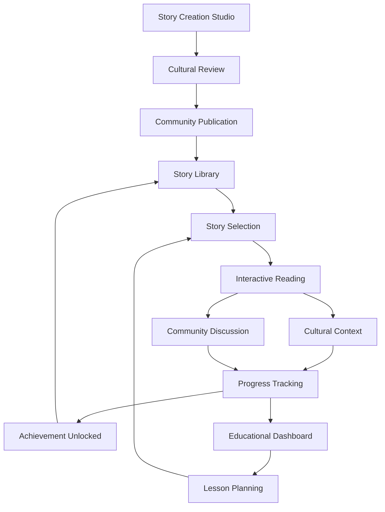

# Interactive Polynesian Story System - Product Requirements Document

## 1. Product Overview

The Interactive Polynesian Story System is an immersive storytelling engine that seamlessly integrates with the existing Tahitian language learning platform, offering users authentic cultural narratives with branching storylines, educational content, and cultural authenticity tracking. This system transforms traditional storytelling into an interactive learning experience that preserves Polynesian heritage while enhancing language acquisition through contextual, culturally-rich narratives.

The system addresses the need for authentic cultural content in language learning, providing learners with meaningful context for vocabulary and grammar while preserving and sharing traditional Polynesian stories, legends, and contemporary narratives.

## 2. Core Features

### 2.1 User Roles

| Role | Registration Method | Core Permissions |
|------|---------------------|------------------|
| Learner | Existing platform registration | Access stories, track progress, participate in discussions, save favorites |
| Cultural Contributor | Invitation-based verification | Submit stories, provide cultural context, moderate content |
| Educator | Professional verification | Create lesson plans, assign stories, track student progress, access analytics |
| Cultural Advisor | Expert verification | Review content authenticity, approve cultural elements, provide historical context |

### 2.2 Feature Module

Our Interactive Polynesian Story System consists of the following main pages:

1. **Story Library**: Browse and discover stories by category, difficulty, cultural theme, and region
2. **Interactive Story Reader**: Experience branching narratives with cultural annotations and language learning integration
3. **Cultural Context Hub**: Deep dive into historical background, cultural significance, and educational materials
4. **Progress & Analytics**: Track reading progress, cultural knowledge gained, and language learning achievements
5. **Community Discussions**: Share interpretations, ask questions, and connect with other learners and cultural experts
6. **Story Creation Studio**: Tools for cultural contributors to submit and edit authentic stories
7. **Educational Dashboard**: Lesson planning and progress tracking tools for educators

### 2.3 Page Details

| Page Name | Module Name | Feature description |
|-----------|-------------|---------------------|
| Story Library | Story Browser | Filter stories by difficulty, cultural theme, region, story type. Search functionality with cultural tags. Featured story recommendations based on learning progress |
| Story Library | Category Navigation | Browse by traditional legends, historical narratives, mythological tales, contemporary stories, family stories |
| Story Library | Personalized Recommendations | AI-powered story suggestions based on language level, cultural interests, and learning goals |
| Interactive Story Reader | Story Display | Present story text with interactive elements, choice points, and cultural annotations. Multi-language support (Tahitian, French, English) |
| Interactive Story Reader | Branching Navigation | Navigate through story choices that affect narrative outcomes. Track decision paths and alternative storylines |
| Interactive Story Reader | Cultural Annotations | Hover/click annotations for cultural context, historical background, and language explanations |
| Interactive Story Reader | Audio Integration | Native speaker narration with pronunciation guides and cultural intonation patterns |
| Cultural Context Hub | Historical Background | Detailed information about story origins, cultural significance, and historical context |
| Cultural Context Hub | Cultural Elements | Explanations of traditions, customs, beliefs, and practices referenced in stories |
| Cultural Context Hub | Language Learning | Vocabulary lists, grammar explanations, and cultural usage notes extracted from stories |
| Progress & Analytics | Reading Progress | Track stories completed, choices made, cultural knowledge gained, and time spent reading |
| Progress & Analytics | Cultural Authenticity Score | Measure understanding of cultural elements and authentic interpretation of story themes |
| Progress & Analytics | Learning Achievements | Unlock badges for cultural milestones, story completion, and community participation |
| Community Discussions | Story Forums | Discuss story interpretations, cultural meanings, and personal connections to narratives |
| Community Discussions | Cultural Q&A | Ask questions about cultural elements and receive answers from cultural advisors |
| Community Discussions | Sharing Platform | Share favorite stories, personal reflections, and cultural insights with the community |
| Story Creation Studio | Content Submission | Upload new stories with cultural verification and authenticity review process |
| Story Creation Studio | Cultural Annotation Tools | Add cultural context, historical notes, and educational elements to submitted stories |
| Story Creation Studio | Collaboration Features | Work with cultural advisors and educators to refine story content and educational value |
| Educational Dashboard | Lesson Planning | Create story-based lesson plans with learning objectives and cultural goals |
| Educational Dashboard | Student Progress | Monitor student engagement, comprehension, and cultural understanding across stories |
| Educational Dashboard | Assessment Tools | Create quizzes and discussions based on story content and cultural themes |

## 3. Core Process

### Learner Flow
1. **Discovery**: Browse story library or receive personalized recommendations based on language level and cultural interests
2. **Selection**: Choose story based on difficulty, cultural theme, or learning objectives
3. **Reading**: Experience interactive story with branching choices, cultural annotations, and audio narration
4. **Learning**: Engage with cultural context, vocabulary, and educational materials embedded in the story
5. **Discussion**: Participate in community discussions about story themes and cultural significance
6. **Progress**: Track completion, cultural knowledge gained, and unlock achievements

### Cultural Contributor Flow
1. **Verification**: Complete cultural contributor verification process with community elders or cultural experts
2. **Submission**: Upload authentic stories with cultural context and educational annotations
3. **Review**: Collaborate with cultural advisors for authenticity verification and educational enhancement
4. **Publication**: Stories approved for community access with contributor recognition
5. **Maintenance**: Update stories based on community feedback and cultural advisor recommendations

### Educator Flow
1. **Planning**: Create lesson plans incorporating specific stories and cultural themes
2. **Assignment**: Assign stories to students with learning objectives and discussion prompts
3. **Monitoring**: Track student progress, engagement, and cultural understanding
4. **Assessment**: Evaluate student comprehension through story-based quizzes and discussions
5. **Adaptation**: Modify lesson plans based on student performance and cultural learning outcomes

## 4. User Interface Design

### 4.1 Design Style

- **Primary Colors**: Deep ocean blue (#1e40af), tropical teal (#0891b2), warm coral (#f97316)
- **Secondary Colors**: Sunset orange (#fb923c), palm green (#059669), pearl white (#f8fafc)
- **Button Style**: Rounded corners with subtle shadows, gradient backgrounds for primary actions, flat design for secondary actions
- **Typography**: Inter for headings (18-32px), Open Sans for body text (14-16px), special Polynesian-inspired font for story titles
- **Layout Style**: Card-based design with generous white space, floating elements with tropical shadows, responsive grid system
- **Icons & Emojis**: Tropical and Polynesian-themed icons (🌺, 🏝️, 🌊, 🥥), cultural symbols, navigation elements inspired by traditional Polynesian art

### 4.2 Page Design Overview

| Page Name | Module Name | UI Elements |
|-----------|-------------|-------------|
| Story Library | Story Browser | Grid layout with story cards featuring cover art, difficulty indicators, cultural theme badges. Tropical color-coded categories with island-inspired navigation |
| Story Library | Filter Panel | Sidebar with collapsible sections, toggle switches for difficulty levels, cultural theme chips with traditional patterns |
| Interactive Story Reader | Story Display | Clean reading interface with tropical background patterns, floating cultural annotation bubbles, progress indicator styled as island chain |
| Interactive Story Reader | Choice Interface | Branching choice buttons with coral-inspired design, visual story path map, cultural impact indicators |
| Cultural Context Hub | Information Cards | Expandable cards with traditional Polynesian border patterns, image galleries with lightbox effects, timeline visualization for historical context |
| Progress & Analytics | Dashboard | Tropical-themed progress charts, achievement badges with traditional designs, cultural knowledge radar chart |
| Community Discussions | Forum Interface | Threaded discussions with user avatars, cultural advisor badges, story reference cards with preview snippets |
| Story Creation Studio | Editor Interface | Rich text editor with cultural annotation tools, preview pane with story formatting, collaboration sidebar for reviewer feedback |

### 4.3 Responsiveness

The system is designed mobile-first with adaptive layouts for tablets and desktops. Touch-optimized interactions for story navigation and cultural annotations. Responsive typography scaling and image optimization for various screen sizes. Offline reading capabilities with progressive web app features.

## 5. Technical Integration

### 5.1 Platform Integration

- **Seamless Authentication**: Integrates with existing user authentication system and profile management
- **Learning Progress**: Connects with current progress tracking and achievement systems from Sprints 1-10
- **Community Features**: Leverages existing social learning infrastructure from Sprint 10 (CommunityForum, StudyGroups)
- **Analytics Integration**: Extends AnalyticsDashboard and EngagementDashboard with story-specific metrics
- **Cultural Content**: Builds upon CulturalFeatures and CulturalImmersion components from previous sprints

### 5.2 Data Synchronization

- **User Profiles**: Story preferences and progress sync with existing UserProfile component
- **Achievement System**: Story-based achievements integrate with current AchievementSystem
- **Cultural Mapping**: Story locations connect with existing CulturalMap for geographic context
- **AI Integration**: Leverages AICulturalCompanion for personalized story recommendations and cultural guidance

## 6. Success Metrics

### 6.1 Engagement Metrics

- **Story Completion Rate**: Target 75% completion rate for started stories
- **Cultural Annotation Interaction**: 60% of readers engage with cultural context features
- **Community Participation**: 40% of story readers participate in discussions
- **Return Engagement**: 80% of users return to read additional stories within 7 days

### 6.2 Educational Outcomes

- **Cultural Knowledge Assessment**: 85% improvement in cultural understanding scores
- **Language Learning Integration**: 70% of vocabulary from stories retained in language assessments
- **Authentic Cultural Representation**: 95% approval rating from cultural advisors
- **Cross-Cultural Understanding**: Measurable improvement in cultural sensitivity assessments

### 6.3 Content Quality

- **Cultural Authenticity Score**: Maintain 90%+ authenticity rating from cultural experts
- **Educational Value**: 85% of educators rate stories as valuable for language learning
- **Community Contribution**: 25% of active users contribute to discussions or content creation
- **Story Diversity**: Represent all major Polynesian cultural regions and story types

## 7. Implementation Phases

### Phase 1: Core Story Engine (Weeks 1-4)
- Basic story reading interface with branching navigation
- Cultural annotation system
- Integration with existing user authentication and progress tracking
- Initial story library with 20 curated traditional stories

### Phase 2: Community & Cultural Features (Weeks 5-8)
- Community discussion forums
- Cultural advisor review system
- Story creation studio for contributors
- Enhanced cultural context hub with multimedia content

### Phase 3: Educational Integration (Weeks 9-12)
- Educational dashboard for teachers
- Advanced analytics and progress tracking
- AI-powered personalization and recommendations
- Assessment tools and learning outcome measurement

### Phase 4: Advanced Features (Weeks 13-16)
- Audio narration with native speakers
- Offline reading capabilities
- Advanced cultural authenticity tracking
- Mobile app optimization and PWA features

This comprehensive system will transform the Tahitian language learning platform into a rich cultural storytelling experience that preserves Polynesian heritage while enhancing educational outcomes through authentic, interactive narratives.