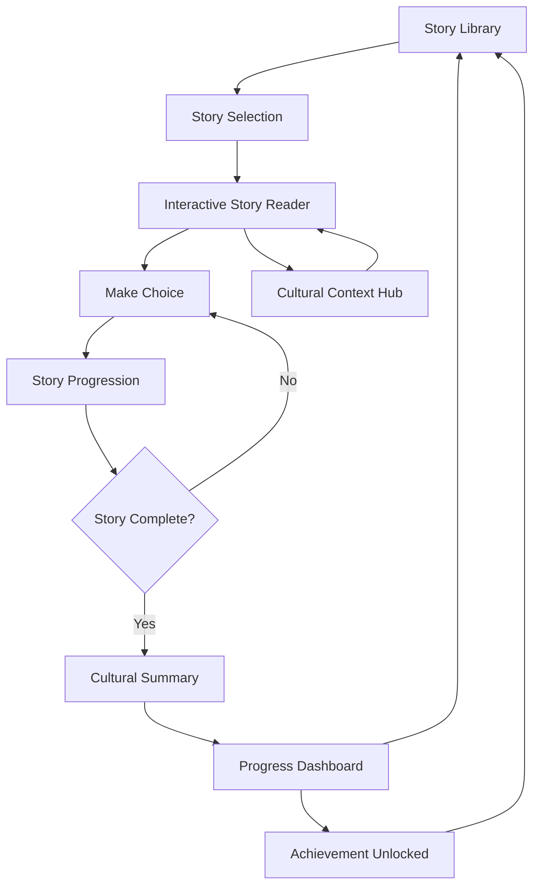

# Interactive Polynesian Story System - Product Requirements Document

## 1. Product Overview

The Interactive Polynesian Story System is a culturally authentic, educational storytelling platform that allows users to experience traditional, historical, mythological, and contemporary Tahitian stories through branching narratives and meaningful choices. This system preserves cultural heritage while providing an immersive learning experience that deepens understanding of Polynesian values, traditions, and worldview.

The platform addresses the need for culturally accurate digital preservation of Polynesian oral traditions while making them accessible to modern learners through interactive technology. Users will engage with stories that adapt based on their choices, creating personalized learning journeys that respect and honor Tahitian cultural authenticity.

This system targets cultural learners, educators, students, and anyone interested in Polynesian heritage, providing both entertainment and deep cultural education through technology.

## 2. Core Features

### 2.1 User Roles

| Role | Registration Method | Core Permissions |
|------|---------------------|------------------|
| Story Explorer | Email registration or guest access | Can read stories, make choices, view cultural notes |
| Cultural Learner | Account creation with progress tracking | Can save progress, access quizzes, track learning journey |
| Educator | Invitation-based registration | Can access educational resources, assign stories, view student progress |
| Cultural Contributor | Expert verification required | Can submit story content, review cultural accuracy |

### 2.2 Feature Module

Our Interactive Polynesian Story System consists of the following main pages:

1. **Story Library**: Browse available stories by category (traditional, historical, mythological, contemporary), difficulty level, and cultural themes.
2. **Interactive Story Reader**: Immersive story experience with branching narratives, multimedia content, and choice-driven progression.
3. **Cultural Context Hub**: Educational notes, cultural significance explanations, and additional learning resources.
4. **Progress Dashboard**: Track story completion, choices made, cultural knowledge gained, and learning achievements.
5. **Story Creation Studio**: Tools for cultural contributors to create and submit new interactive stories.

### 2.3 Page Details

| Page Name | Module Name | Feature description |
|-----------|-------------|---------------------|
| Story Library | Story Browser | Display categorized stories with thumbnails, descriptions, difficulty levels, and cultural themes. Filter by story type, length, and educational focus. |
| Story Library | Featured Stories | Highlight culturally significant stories, seasonal content, and newly added narratives with rich preview content. |
| Story Library | Search & Discovery | Advanced search by keywords, cultural elements, characters, and themes with intelligent recommendations. |
| Interactive Story Reader | Story Display Engine | Render story content with rich text, images, audio narration, and background music. Support for Tahitian language text and pronunciation guides. |
| Interactive Story Reader | Choice System | Present meaningful choices that affect story progression, character relationships, and cultural understanding outcomes. |
| Interactive Story Reader | Progress Tracking | Save story state, track choices made, and allow users to revisit previous decisions or restart stories. |
| Interactive Story Reader | Multimedia Integration | Display culturally appropriate images, play traditional music, and provide audio narration in Tahitian and French. |
| Cultural Context Hub | Educational Notes | Display cultural significance explanations, historical context, and traditional knowledge associated with story elements. |
| Cultural Context Hub | Language Learning | Provide Tahitian vocabulary, pronunciation guides, and cultural expressions encountered in stories. |
| Cultural Context Hub | Resource Links | Connect to additional learning materials, academic sources, and cultural institutions for deeper exploration. |
| Progress Dashboard | Learning Analytics | Track stories completed, cultural concepts learned, and progress through different story categories. |
| Progress Dashboard | Achievement System | Award badges for cultural milestones, story completion, and educational achievements with cultural significance. |
| Progress Dashboard | Personal Journey | Visualize learning path through Polynesian culture with personalized recommendations and next steps. |
| Story Creation Studio | Story Builder | Provide tools for creating branching narratives with node-based story structure and choice consequence mapping. |
| Story Creation Studio | Cultural Validation | Include cultural accuracy review system and expert approval workflow for submitted content. |
| Story Creation Studio | Multimedia Upload | Support for adding culturally appropriate images, audio recordings, and traditional music to story content. |

## 3. Core Process

### Story Explorer Flow
Users begin by browsing the Story Library, where they can filter stories by cultural themes, difficulty, or type. Upon selecting a story, they enter the Interactive Story Reader where they progress through branching narratives by making choices that reflect Polynesian values and cultural understanding. Cultural Context notes appear contextually to provide educational enrichment. Progress is automatically saved, allowing users to continue their journey across sessions.

### Cultural Learner Flow
Registered learners access their Progress Dashboard to view their cultural learning journey and receive personalized story recommendations. They engage with stories while tracking vocabulary learned and cultural concepts mastered. Completion of stories unlocks achievements and provides access to advanced cultural content and educational quizzes.

### Educator Flow
Educators access the platform to assign specific stories to students, monitor their progress through cultural learning objectives, and access supplementary educational materials. They can create custom learning paths that align with curriculum goals while maintaining cultural authenticity.

## 4. User Interface Design

### 4.1 Design Style

- **Primary Colors**: Deep ocean blue (#1e40af), tropical turquoise (#06b6d4), sunset coral (#f97316)
- **Secondary Colors**: Palm green (#059669), sandy beige (#d6d3d1), pearl white (#f8fafc)
- **Button Style**: Rounded corners with subtle shadows, inspired by smooth ocean stones and coral formations
- **Typography**: Primary font - Inter for readability, Secondary font - Playfair Display for story titles, Size range 14px-32px
- **Layout Style**: Card-based design with flowing, organic shapes reminiscent of ocean waves and island contours
- **Icons**: Hand-drawn style icons representing Polynesian cultural elements (palm trees, waves, traditional symbols)
- **Animations**: Gentle, wave-like transitions and subtle parallax effects that evoke ocean movement

### 4.2 Page Design Overview

| Page Name | Module Name | UI Elements |
|-----------|-------------|-------------|
| Story Library | Story Browser | Grid layout with story cards featuring tropical gradients, cultural imagery, and floating animation effects. Sidebar filters with island-inspired navigation. |
| Story Library | Featured Stories | Hero carousel with large story previews, overlay text with coral-colored backgrounds, and gentle fade transitions between featured content. |
| Interactive Story Reader | Story Display | Full-screen immersive layout with background images, floating text containers with translucent backgrounds, and choice buttons styled as traditional Polynesian navigation stones. |
| Interactive Story Reader | Choice System | Animated choice buttons that glow with tropical colors on hover, with smooth transitions and cultural iconography representing different paths. |
| Cultural Context Hub | Educational Notes | Sidebar panels that slide in with wave-like animations, featuring traditional patterns as borders and warm, sandy background colors. |
| Progress Dashboard | Learning Analytics | Circular progress indicators inspired by traditional Polynesian navigation charts, with tropical color gradients and achievement badges shaped like traditional symbols. |
| Story Creation Studio | Story Builder | Node-based visual editor with connections styled as flowing water, drag-and-drop interface with smooth animations, and cultural color coding for different story elements. |

### 4.3 Responsiveness

The platform is designed mobile-first with touch-optimized interactions for tablets and smartphones. Desktop versions feature enhanced multimedia capabilities and side-by-side cultural context viewing. Touch gestures include swipe navigation between story nodes and pinch-to-zoom for cultural imagery, ensuring accessibility across all devices while maintaining the immersive cultural experience.