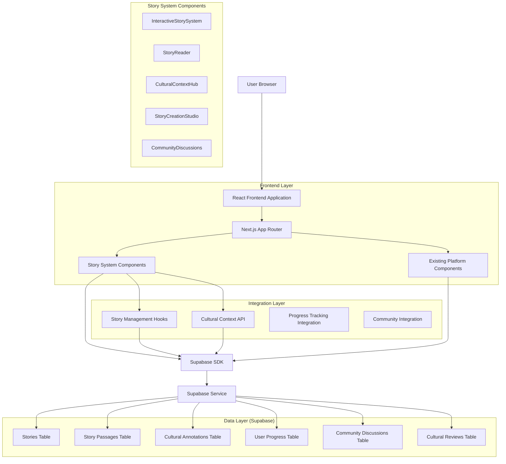
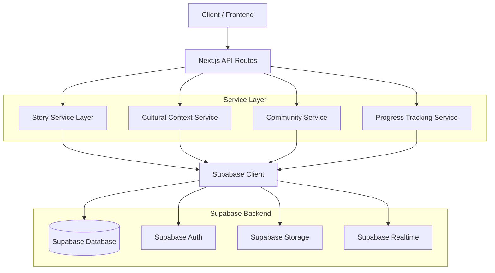
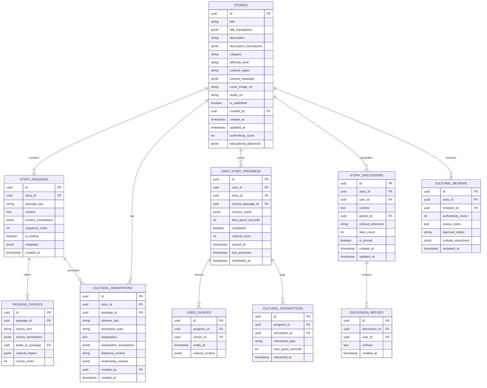

# Interactive Polynesian Story System - Technical Architecture Document

## 1. Architecture Design



## 2. Technology Description

- **Frontend**: React@18 + Next.js@14 + TypeScript + Tailwind CSS@3 + Framer Motion + Radix UI
- **Backend**: Supabase (PostgreSQL + Authentication + Real-time + Storage)
- **State Management**: React Context + Custom Hooks + Zustand (for complex story state)
- **Testing**: Jest + React Testing Library + Playwright + MSW
- **Build Tools**: Next.js with Turbopack + ESLint + Prettier

## 3. Route Definitions

| Route | Purpose |
|-------|---------|
| /stories | Story library homepage with browsing and filtering capabilities |
| /stories/[id] | Interactive story reader with branching navigation and cultural annotations |
| /stories/[id]/context | Cultural context hub for specific story with historical background |
| /stories/create | Story creation studio for cultural contributors |
| /stories/discussions/[id] | Community discussions for specific story |
| /cultural-hub | Central hub for cultural content and educational materials |
| /cultural-hub/[topic] | Specific cultural topic pages with related stories |
| /progress/stories | Story-specific progress tracking and achievements |
| /admin/stories | Administrative interface for story management and cultural review |
| /admin/cultural-review | Cultural advisor interface for content authenticity verification |

## 4. API Definitions

### 4.1 Core Story API

**Story Management**
```
GET /api/stories
```

Request:
| Param Name | Param Type | isRequired | Description |
|------------|------------|------------|-------------|
| category | string | false | Filter by story category (legends, historical, mythological, contemporary) |
| difficulty | string | false | Filter by difficulty level (beginner, intermediate, advanced) |
| cultural_region | string | false | Filter by Polynesian cultural region |
| limit | number | false | Number of stories to return (default: 20) |
| offset | number | false | Pagination offset |

Response:
| Param Name | Param Type | Description |
|------------|------------|-------------|
| stories | Story[] | Array of story objects |
| total | number | Total number of stories matching criteria |
| has_more | boolean | Whether more stories are available |

**Story Content Retrieval**
```
GET /api/stories/[id]
```

Response:
| Param Name | Param Type | Description |
|------------|------------|-------------|
| story | Story | Complete story object with passages and metadata |
| cultural_context | CulturalContext[] | Associated cultural annotations and context |
| user_progress | UserStoryProgress | User's progress through this story |

**Story Progress Tracking**
```
POST /api/stories/[id]/progress
```

Request:
| Param Name | Param Type | isRequired | Description |
|------------|------------|------------|-------------|
| passage_id | string | true | Current passage identifier |
| choices_made | string[] | false | Array of choice IDs made by user |
| time_spent | number | true | Time spent reading in seconds |
| cultural_interactions | string[] | false | Cultural annotations viewed |

**Cultural Context API**
```
GET /api/cultural-context/[story_id]
```

Response:
| Param Name | Param Type | Description |
|------------|------------|-------------|
| annotations | CulturalAnnotation[] | Cultural annotations for story elements |
| historical_context | HistoricalContext | Historical background information |
| educational_content | EducationalContent[] | Learning materials and vocabulary |

**Community Discussions**
```
GET /api/stories/[id]/discussions
POST /api/stories/[id]/discussions
```

Request (POST):
| Param Name | Param Type | isRequired | Description |
|------------|------------|------------|-------------|
| content | string | true | Discussion post content |
| parent_id | string | false | Parent post ID for replies |
| cultural_reference | string | false | Reference to specific cultural element |

### 4.2 Story Creation API

**Story Submission**
```
POST /api/stories/create
```

Request:
| Param Name | Param Type | isRequired | Description |
|------------|------------|------------|-------------|
| title | string | true | Story title in multiple languages |
| passages | StoryPassage[] | true | Array of story passages with choices |
| cultural_metadata | CulturalMetadata | true | Cultural context and authenticity information |
| educational_objectives | string[] | false | Learning objectives for educators |

**Cultural Review**
```
POST /api/stories/[id]/review
```

Request:
| Param Name | Param Type | isRequired | Description |
|------------|------------|------------|-------------|
| authenticity_score | number | true | Cultural authenticity rating (1-100) |
| review_notes | string | true | Detailed review comments |
| approval_status | string | true | approved, needs_revision, rejected |
| cultural_corrections | CulturalCorrection[] | false | Suggested improvements |

## 5. Server Architecture Diagram



## 6. Data Model

### 6.1 Data Model Definition



### 6.2 Data Definition Language

**Stories Table**
```sql
-- Create stories table
CREATE TABLE stories (
    id UUID PRIMARY KEY DEFAULT gen_random_uuid(),
    title VARCHAR(255) NOT NULL,
    title_translations JSONB DEFAULT '{}',
    description TEXT,
    description_translations JSONB DEFAULT '{}',
    category VARCHAR(50) NOT NULL CHECK (category IN ('legends', 'historical', 'mythological', 'contemporary', 'family')),
    difficulty_level VARCHAR(20) NOT NULL CHECK (difficulty_level IN ('beginner', 'intermediate', 'advanced')),
    cultural_region VARCHAR(100),
    cultural_metadata JSONB DEFAULT '{}',
    cover_image_url TEXT,
    audio_url TEXT,
    is_published BOOLEAN DEFAULT false,
    created_by UUID REFERENCES auth.users(id),
    created_at TIMESTAMP WITH TIME ZONE DEFAULT NOW(),
    updated_at TIMESTAMP WITH TIME ZONE DEFAULT NOW(),
    authenticity_score INTEGER DEFAULT 0 CHECK (authenticity_score >= 0 AND authenticity_score <= 100),
    educational_objectives JSONB DEFAULT '[]'
);

-- Create indexes
CREATE INDEX idx_stories_category ON stories(category);
CREATE INDEX idx_stories_difficulty ON stories(difficulty_level);
CREATE INDEX idx_stories_cultural_region ON stories(cultural_region);
CREATE INDEX idx_stories_published ON stories(is_published);
CREATE INDEX idx_stories_authenticity ON stories(authenticity_score DESC);

-- Row Level Security
ALTER TABLE stories ENABLE ROW LEVEL SECURITY;

-- Policies
CREATE POLICY "Stories are viewable by everyone" ON stories
    FOR SELECT USING (is_published = true);

CREATE POLICY "Authenticated users can view unpublished stories they created" ON stories
    FOR SELECT USING (auth.uid() = created_by);

CREATE POLICY "Cultural contributors can create stories" ON stories
    FOR INSERT WITH CHECK (auth.uid() IS NOT NULL);

CREATE POLICY "Story creators can update their own stories" ON stories
    FOR UPDATE USING (auth.uid() = created_by);

-- Grant permissions
GRANT SELECT ON stories TO anon;
GRANT ALL PRIVILEGES ON stories TO authenticated;
```

**Story Passages Table**
```sql
-- Create story_passages table
CREATE TABLE story_passages (
    id UUID PRIMARY KEY DEFAULT gen_random_uuid(),
    story_id UUID NOT NULL REFERENCES stories(id) ON DELETE CASCADE,
    passage_key VARCHAR(100) NOT NULL,
    content TEXT NOT NULL,
    content_translations JSONB DEFAULT '{}',
    sequence_order INTEGER NOT NULL,
    is_ending BOOLEAN DEFAULT false,
    metadata JSONB DEFAULT '{}',
    created_at TIMESTAMP WITH TIME ZONE DEFAULT NOW(),
    UNIQUE(story_id, passage_key)
);

-- Create indexes
CREATE INDEX idx_story_passages_story_id ON story_passages(story_id);
CREATE INDEX idx_story_passages_sequence ON story_passages(story_id, sequence_order);

-- Row Level Security
ALTER TABLE story_passages ENABLE ROW LEVEL SECURITY;

-- Policies
CREATE POLICY "Story passages are viewable with their stories" ON story_passages
    FOR SELECT USING (
        EXISTS (
            SELECT 1 FROM stories 
            WHERE stories.id = story_passages.story_id 
            AND (stories.is_published = true OR stories.created_by = auth.uid())
        )
    );

-- Grant permissions
GRANT SELECT ON story_passages TO anon;
GRANT ALL PRIVILEGES ON story_passages TO authenticated;
```

**Cultural Annotations Table**
```sql
-- Create cultural_annotations table
CREATE TABLE cultural_annotations (
    id UUID PRIMARY KEY DEFAULT gen_random_uuid(),
    story_id UUID NOT NULL REFERENCES stories(id) ON DELETE CASCADE,
    passage_id UUID REFERENCES story_passages(id) ON DELETE CASCADE,
    element_text VARCHAR(500) NOT NULL,
    annotation_type VARCHAR(50) NOT NULL CHECK (annotation_type IN ('cultural', 'historical', 'linguistic', 'traditional', 'contemporary')),
    explanation TEXT NOT NULL,
    explanation_translations JSONB DEFAULT '{}',
    historical_context TEXT,
    multimedia_content JSONB DEFAULT '{}',
    created_by UUID REFERENCES auth.users(id),
    created_at TIMESTAMP WITH TIME ZONE DEFAULT NOW()
);

-- Create indexes
CREATE INDEX idx_cultural_annotations_story_id ON cultural_annotations(story_id);
CREATE INDEX idx_cultural_annotations_passage_id ON cultural_annotations(passage_id);
CREATE INDEX idx_cultural_annotations_type ON cultural_annotations(annotation_type);

-- Row Level Security
ALTER TABLE cultural_annotations ENABLE ROW LEVEL SECURITY;

-- Policies
CREATE POLICY "Cultural annotations are viewable with their stories" ON cultural_annotations
    FOR SELECT USING (
        EXISTS (
            SELECT 1 FROM stories 
            WHERE stories.id = cultural_annotations.story_id 
            AND (stories.is_published = true OR stories.created_by = auth.uid())
        )
    );

-- Grant permissions
GRANT SELECT ON cultural_annotations TO anon;
GRANT ALL PRIVILEGES ON cultural_annotations TO authenticated;
```

**User Story Progress Table**
```sql
-- Create user_story_progress table
CREATE TABLE user_story_progress (
    id UUID PRIMARY KEY DEFAULT gen_random_uuid(),
    user_id UUID NOT NULL REFERENCES auth.users(id) ON DELETE CASCADE,
    story_id UUID NOT NULL REFERENCES stories(id) ON DELETE CASCADE,
    current_passage_id UUID REFERENCES story_passages(id),
    choices_made JSONB DEFAULT '[]',
    time_spent_seconds INTEGER DEFAULT 0,
    completed BOOLEAN DEFAULT false,
    cultural_score INTEGER DEFAULT 0 CHECK (cultural_score >= 0 AND cultural_score <= 100),
    started_at TIMESTAMP WITH TIME ZONE DEFAULT NOW(),
    last_accessed TIMESTAMP WITH TIME ZONE DEFAULT NOW(),
    completed_at TIMESTAMP WITH TIME ZONE,
    UNIQUE(user_id, story_id)
);

-- Create indexes
CREATE INDEX idx_user_story_progress_user_id ON user_story_progress(user_id);
CREATE INDEX idx_user_story_progress_story_id ON user_story_progress(story_id);
CREATE INDEX idx_user_story_progress_completed ON user_story_progress(completed);
CREATE INDEX idx_user_story_progress_cultural_score ON user_story_progress(cultural_score DESC);

-- Row Level Security
ALTER TABLE user_story_progress ENABLE ROW LEVEL SECURITY;

-- Policies
CREATE POLICY "Users can view their own story progress" ON user_story_progress
    FOR SELECT USING (auth.uid() = user_id);

CREATE POLICY "Users can update their own story progress" ON user_story_progress
    FOR ALL USING (auth.uid() = user_id);

-- Grant permissions
GRANT ALL PRIVILEGES ON user_story_progress TO authenticated;
```

**Initial Data**
```sql
-- Insert sample traditional stories
INSERT INTO stories (title, title_translations, description, description_translations, category, difficulty_level, cultural_region, is_published, authenticity_score) VALUES
('Te Fenua - The Land', '{"ta": "Te Fenua", "fr": "La Terre", "en": "The Land"}', 'A traditional legend about the creation of Tahiti', '{"ta": "Te parau tupuna no te faaputuraa o Tahiti", "fr": "Une légende traditionnelle sur la création de Tahiti", "en": "A traditional legend about the creation of Tahiti"}', 'legends', 'beginner', 'Tahiti', true, 95),
('Maui and the Sun', '{"ta": "Maui e te Ra", "fr": "Maui et le Soleil", "en": "Maui and the Sun"}', 'The famous story of how Maui slowed down the sun', '{"ta": "Te parau rave rahi no Maui i faaemi ai i te ra", "fr": "La célèbre histoire de comment Maui a ralenti le soleil", "en": "The famous story of how Maui slowed down the sun"}', 'mythological', 'intermediate', 'Polynesia', true, 98),
('The Pearl Diver', '{"ta": "Te Tahe Poe", "fr": "Le Plongeur de Perles", "en": "The Pearl Diver"}', 'A contemporary story about modern Tahitian pearl diving', '{"ta": "Te parau taime nei no te tahe poe Tahiti", "fr": "Une histoire contemporaine sur la plongée perlière tahitienne moderne", "en": "A contemporary story about modern Tahitian pearl diving"}', 'contemporary', 'advanced', 'Tuamotu', true, 92);

-- Insert sample story passages
INSERT INTO story_passages (story_id, passage_key, content, content_translations, sequence_order, is_ending) 
SELECT id, 'start', 'In the beginning, there was only the vast ocean...', '{"ta": "I te timaraa, te moana rahi anae...", "fr": "Au commencement, il n''y avait que le vaste océan...", "en": "In the beginning, there was only the vast ocean..."}', 1, false
FROM stories WHERE title = 'Te Fenua - The Land';
```

## 7. Integration Specifications

### 7.1 Existing Component Integration

**Authentication Integration**
- Leverages existing `useAuth` hook for user authentication
- Integrates with current user profile system for story preferences
- Maintains session state across story reading sessions

**Progress Tracking Integration**
- Extends existing `AchievementSystem` with story-based achievements
- Integrates with `IslandProgression` for cultural learning milestones
- Connects with `AnalyticsDashboard` for story engagement metrics

**Community Integration**
- Builds upon `CommunityForum` infrastructure for story discussions
- Leverages `StudyGroups` for collaborative story reading
- Integrates with `LivePractice` for story-based language practice

**Cultural Integration**
- Extends `CulturalFeatures` with story-specific cultural content
- Integrates with `CulturalMap` for geographic story context
- Leverages `AICulturalCompanion` for personalized story recommendations

### 7.2 API Integration Points

**Supabase Integration**
- Uses existing Supabase client configuration
- Extends current database schema with story-specific tables
- Leverages Supabase real-time for collaborative features
- Integrates with Supabase storage for story media content

**AI Integration**
- Connects with existing AI services for story recommendations
- Uses cultural context AI for authenticity verification
- Integrates with language learning AI for vocabulary extraction

This technical architecture ensures seamless integration with the existing platform while providing a robust foundation for the Interactive Polynesian Story System's unique features and cultural authenticity requirements.