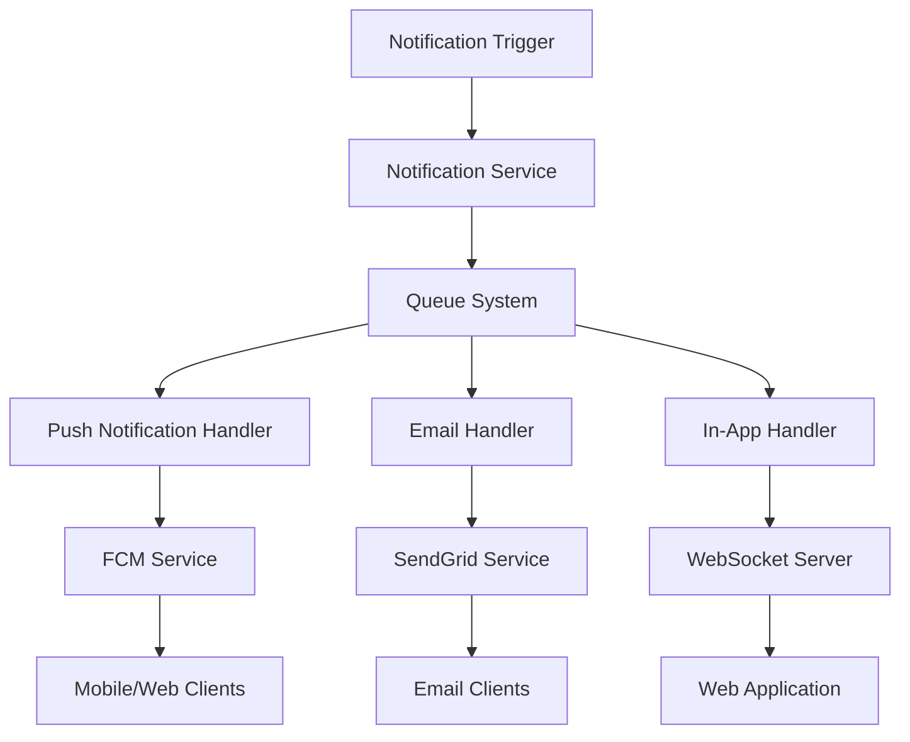

# Real-Time Notification System Specification

## Overview
This document outlines the implementation requirements for a comprehensive notification system supporting push notifications, email notifications, and in-app messaging for the French Tahitian language learning application.

## 1. System Architecture

### 1.1 Technology Stack
- **Push Notifications:** Firebase Cloud Messaging (FCM)
- **Email Service:** SendGrid
- **Real-time Communication:** WebSocket (Socket.io)
- **Queue System:** Redis Bull Queue
- **Database:** Supabase (PostgreSQL)
- **Frontend:** React with TypeScript
- **Mobile:** React Native with FCM

### 1.2 Architecture Diagram


## 2. Database Schema

### 2.1 Notification Templates Table
```sql
CREATE TABLE notification_templates (
    id UUID PRIMARY KEY DEFAULT gen_random_uuid(),
    name VARCHAR(100) NOT NULL UNIQUE,
    type VARCHAR(50) NOT NULL, -- 'push', 'email', 'in_app'
    subject VARCHAR(255),
    title VARCHAR(255),
    body TEXT NOT NULL,
    html_body TEXT,
    variables JSONB, -- Template variables
    is_active BOOLEAN DEFAULT true,
    created_at TIMESTAMP WITH TIME ZONE DEFAULT NOW(),
    updated_at TIMESTAMP WITH TIME ZONE DEFAULT NOW()
);

-- Insert default templates
INSERT INTO notification_templates (name, type, subject, title, body, variables) VALUES
('lesson_reminder', 'push', NULL, 'Time for your Tahitian lesson!', 'Don''t break your streak! Complete today''s lesson to continue your journey.', '["user_name", "streak_count"]'),
('lesson_completed', 'push', NULL, 'Great job!', 'You completed {lesson_name}! Keep up the excellent work.', '["lesson_name", "xp_earned"]'),
('subscription_welcome', 'email', 'Welcome to Premium!', NULL, 'Thank you for upgrading to Premium! You now have access to all features.', '["user_name", "plan_name"]'),
('payment_failed', 'email', 'Payment Issue', NULL, 'We couldn''t process your payment. Please update your payment method.', '["user_name", "amount"]'),
('story_discussion', 'in_app', NULL, 'New Discussion', 'Someone replied to your comment on {story_name}', '["story_name", "commenter_name"]');
```

### 2.2 User Notification Preferences Table
```sql
CREATE TABLE user_notification_preferences (
    id UUID PRIMARY KEY DEFAULT gen_random_uuid(),
    user_id UUID REFERENCES auth.users(id) ON DELETE CASCADE,
    push_enabled BOOLEAN DEFAULT true,
    email_enabled BOOLEAN DEFAULT true,
    in_app_enabled BOOLEAN DEFAULT true,
    lesson_reminders BOOLEAN DEFAULT true,
    achievement_notifications BOOLEAN DEFAULT true,
    social_notifications BOOLEAN DEFAULT true,
    marketing_emails BOOLEAN DEFAULT false,
    weekly_progress BOOLEAN DEFAULT true,
    quiet_hours_start TIME,
    quiet_hours_end TIME,
    timezone VARCHAR(50) DEFAULT 'UTC',
    created_at TIMESTAMP WITH TIME ZONE DEFAULT NOW(),
    updated_at TIMESTAMP WITH TIME ZONE DEFAULT NOW(),
    UNIQUE(user_id)
);
```

### 2.3 Notification History Table
```sql
CREATE TABLE notification_history (
    id UUID PRIMARY KEY DEFAULT gen_random_uuid(),
    user_id UUID REFERENCES auth.users(id) ON DELETE CASCADE,
    template_id UUID REFERENCES notification_templates(id),
    type VARCHAR(50) NOT NULL,
    title VARCHAR(255),
    body TEXT,
    data JSONB, -- Additional notification data
    status VARCHAR(50) DEFAULT 'pending', -- 'pending', 'sent', 'delivered', 'failed', 'read'
    sent_at TIMESTAMP WITH TIME ZONE,
    delivered_at TIMESTAMP WITH TIME ZONE,
    read_at TIMESTAMP WITH TIME ZONE,
    error_message TEXT,
    external_id VARCHAR(255), -- FCM message ID, SendGrid message ID, etc.
    created_at TIMESTAMP WITH TIME ZONE DEFAULT NOW()
);

CREATE INDEX idx_notification_history_user_id ON notification_history(user_id);
CREATE INDEX idx_notification_history_status ON notification_history(status);
CREATE INDEX idx_notification_history_created_at ON notification_history(created_at DESC);
```

### 2.4 Device Tokens Table
```sql
CREATE TABLE user_device_tokens (
    id UUID PRIMARY KEY DEFAULT gen_random_uuid(),
    user_id UUID REFERENCES auth.users(id) ON DELETE CASCADE,
    token VARCHAR(500) NOT NULL,
    platform VARCHAR(20) NOT NULL, -- 'web', 'ios', 'android'
    device_info JSONB,
    is_active BOOLEAN DEFAULT true,
    last_used TIMESTAMP WITH TIME ZONE DEFAULT NOW(),
    created_at TIMESTAMP WITH TIME ZONE DEFAULT NOW(),
    UNIQUE(user_id, token)
);

CREATE INDEX idx_device_tokens_user_id ON user_device_tokens(user_id);
CREATE INDEX idx_device_tokens_active ON user_device_tokens(is_active);
```

## 3. API Endpoints

### 3.1 Notification Management
```typescript
// POST /api/notifications/send
// Sends a notification to specific users
interface SendNotificationRequest {
  userIds: string[];
  templateName: string;
  variables?: Record<string, any>;
  scheduledFor?: string; // ISO date string
  priority?: 'low' | 'normal' | 'high';
}

// GET /api/notifications/history
// Returns notification history for user
interface NotificationHistoryQuery {
  page?: number;
  limit?: number;
  type?: 'push' | 'email' | 'in_app';
  status?: 'sent' | 'delivered' | 'failed' | 'read';
}

// POST /api/notifications/mark-read
// Marks notifications as read
interface MarkReadRequest {
  notificationIds: string[];
}

// GET /api/notifications/unread-count
// Returns count of unread notifications
```

### 3.2 Preferences Management
```typescript
// GET /api/notifications/preferences
// Returns user notification preferences

// PUT /api/notifications/preferences
// Updates user notification preferences
interface UpdatePreferencesRequest {
  pushEnabled?: boolean;
  emailEnabled?: boolean;
  inAppEnabled?: boolean;
  lessonReminders?: boolean;
  achievementNotifications?: boolean;
  socialNotifications?: boolean;
  marketingEmails?: boolean;
  weeklyProgress?: boolean;
  quietHoursStart?: string;
  quietHoursEnd?: string;
  timezone?: string;
}
```

### 3.3 Device Token Management
```typescript
// POST /api/notifications/register-device
// Registers device token for push notifications
interface RegisterDeviceRequest {
  token: string;
  platform: 'web' | 'ios' | 'android';
  deviceInfo?: {
    model?: string;
    os?: string;
    appVersion?: string;
  };
}

// DELETE /api/notifications/unregister-device
// Unregisters device token
interface UnregisterDeviceRequest {
  token: string;
}
```

## 4. Notification Service Implementation

### 4.1 Core Notification Service
```typescript
interface NotificationService {
  // Send notification using template
  sendNotification(params: {
    userIds: string[];
    templateName: string;
    variables?: Record<string, any>;
    scheduledFor?: Date;
    priority?: 'low' | 'normal' | 'high';
  }): Promise<void>;

  // Send immediate notification
  sendImmediate(params: {
    userId: string;
    type: 'push' | 'email' | 'in_app';
    title?: string;
    body: string;
    data?: Record<string, any>;
  }): Promise<void>;

  // Schedule notification
  scheduleNotification(params: {
    userIds: string[];
    templateName: string;
    scheduledFor: Date;
    variables?: Record<string, any>;
  }): Promise<void>;

  // Cancel scheduled notification
  cancelScheduledNotification(notificationId: string): Promise<void>;
}
```

### 4.2 Push Notification Handler
```typescript
interface PushNotificationHandler {
  sendToDevice(params: {
    token: string;
    title: string;
    body: string;
    data?: Record<string, any>;
    imageUrl?: string;
    actionButtons?: Array<{
      id: string;
      title: string;
      action: string;
    }>;
  }): Promise<string>; // Returns FCM message ID

  sendToTopic(params: {
    topic: string;
    title: string;
    body: string;
    data?: Record<string, any>;
  }): Promise<string>;

  subscribeToTopic(token: string, topic: string): Promise<void>;
  unsubscribeFromTopic(token: string, topic: string): Promise<void>;
}
```

### 4.3 Email Notification Handler
```typescript
interface EmailNotificationHandler {
  sendEmail(params: {
    to: string;
    subject: string;
    htmlContent: string;
    textContent?: string;
    templateId?: string;
    templateData?: Record<string, any>;
    attachments?: Array<{
      filename: string;
      content: Buffer;
      contentType: string;
    }>;
  }): Promise<string>; // Returns SendGrid message ID

  sendBulkEmail(params: {
    recipients: Array<{
      email: string;
      substitutions?: Record<string, any>;
    }>;
    templateId: string;
    subject: string;
  }): Promise<string[]>;
}
```

## 5. Frontend Components

### 5.1 Notification Center Component
```typescript
interface NotificationCenterProps {
  isOpen: boolean;
  onClose: () => void;
  onNotificationClick: (notification: Notification) => void;
}

// Features:
// - Real-time notification updates
// - Mark as read functionality
// - Notification filtering
// - Infinite scroll for history
// - Action buttons for notifications
```

### 5.2 Notification Preferences Component
```typescript
interface NotificationPreferencesProps {
  preferences: UserNotificationPreferences;
  onUpdate: (preferences: Partial<UserNotificationPreferences>) => void;
}

// Features:
// - Toggle switches for different notification types
// - Quiet hours time picker
// - Timezone selection
// - Preview notification examples
// - Bulk enable/disable options
```

### 5.3 Push Notification Permission Component
```typescript
interface PushPermissionProps {
  onPermissionGranted: (token: string) => void;
  onPermissionDenied: () => void;
}

// Features:
// - Permission request UI
// - Benefits explanation
// - Fallback for denied permissions
// - Re-request permission flow
```

## 6. Notification Types & Triggers

### 6.1 Learning Progress Notifications
- **Lesson Reminder:** Daily reminder if no lesson completed
- **Streak Milestone:** When user reaches streak milestones (7, 30, 100 days)
- **Lesson Completed:** Immediate feedback after lesson completion
- **Weekly Progress:** Weekly summary of learning progress
- **Achievement Unlocked:** When user earns new achievements

### 6.2 Social Notifications
- **Discussion Reply:** When someone replies to user's comment
- **Story Recommendation:** When new stories match user interests
- **Community Activity:** Updates from followed users or groups
- **Live Session:** Reminders for scheduled live practice sessions

### 6.3 System Notifications
- **Subscription Updates:** Payment confirmations, renewals, failures
- **Feature Announcements:** New features or content releases
- **Maintenance Alerts:** Scheduled maintenance notifications
- **Security Alerts:** Login from new device, password changes

### 6.4 Marketing Notifications
- **Re-engagement:** For inactive users (with opt-in)
- **Premium Upgrade:** Feature highlights for free users
- **Cultural Events:** Tahitian cultural celebrations and events
- **Content Updates:** New lessons, stories, or cultural content

## 7. Real-time Features

### 7.1 WebSocket Implementation
```typescript
interface WebSocketEvents {
  // Client to server
  'join_room': { userId: string };
  'mark_read': { notificationIds: string[] };
  
  // Server to client
  'new_notification': Notification;
  'notification_read': { notificationId: string };
  'notification_count_update': { unreadCount: number };
}
```

### 7.2 Real-time Notification Delivery
- Instant delivery for high-priority notifications
- Batching for low-priority notifications
- Offline queue for when user is not connected
- Retry mechanism for failed deliveries

## 8. Analytics & Monitoring

### 8.1 Key Metrics
- Notification delivery rate
- Open/click-through rates
- Opt-out rates
- User engagement after notifications
- Platform-specific performance

### 8.2 A/B Testing
- Notification timing optimization
- Message content testing
- Frequency optimization
- Channel effectiveness comparison

### 8.3 Performance Monitoring
- Queue processing times
- FCM/SendGrid API response times
- WebSocket connection stability
- Database query performance

## 9. Security & Privacy

### 9.1 Data Protection
- Encrypted device tokens
- Secure webhook endpoints
- GDPR-compliant data handling
- User consent management

### 9.2 Spam Prevention
- Rate limiting per user
- Frequency caps
- Content filtering
- Abuse reporting system

### 9.3 Privacy Controls
- Granular notification preferences
- Easy opt-out mechanisms
- Data retention policies
- Transparent privacy settings

## 10. Testing Strategy

### 10.1 Unit Tests
- Template rendering
- Preference validation
- Queue processing
- Database operations

### 10.2 Integration Tests
- FCM integration
- SendGrid integration
- WebSocket functionality
- End-to-end notification flow

### 10.3 Load Testing
- High-volume notification sending
- Concurrent user connections
- Queue performance under load
- Database performance

---

*Implementation Priority: Critical*
*Estimated Effort: 1-2 weeks*
*Dependencies: Firebase project setup, SendGrid account, Redis instance*