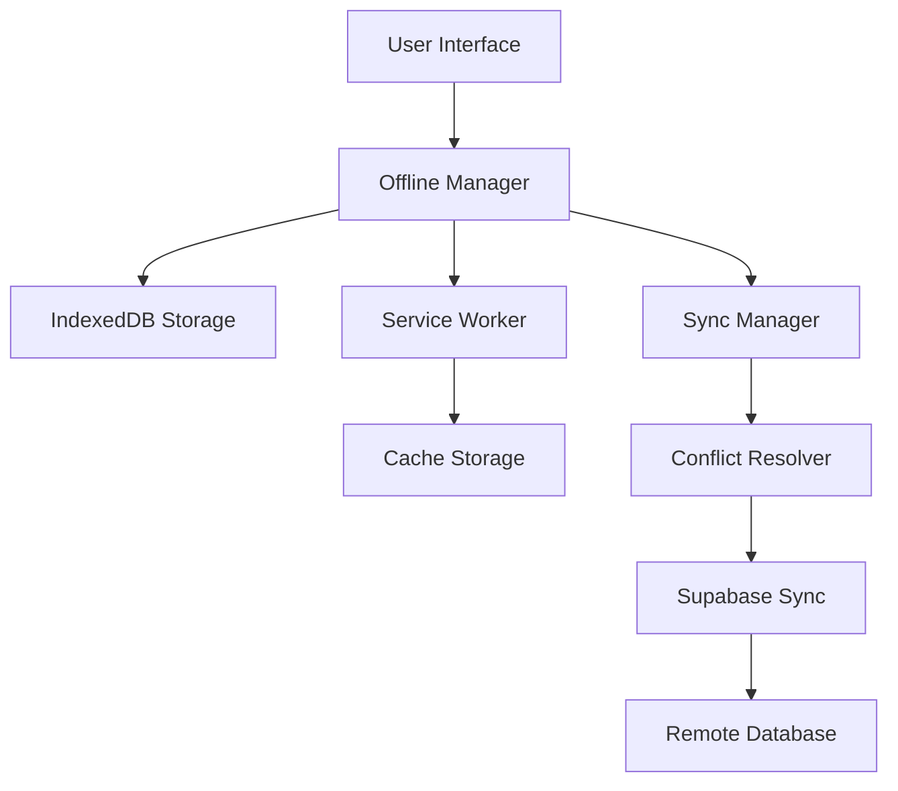

# Advanced Offline Functionality Specification

## Overview
This document outlines the implementation requirements for comprehensive offline functionality, enabling users to access lessons, stories, and track progress without an internet connection.

## 1. System Architecture

### 1.1 Technology Stack
- **Offline Storage:** IndexedDB with Dexie.js
- **Service Worker:** Workbox for caching strategies
- **Sync:** Background Sync API
- **Conflict Resolution:** Custom merge algorithms
- **Compression:** LZ-string for data compression
- **Database:** Local IndexedDB + Supabase sync

### 1.2 Architecture Diagram


## 2. Offline Storage Schema

### 2.1 IndexedDB Database Structure
```typescript
interface OfflineDatabase {
  // Content storage
  lessons: OfflineLesson[];
  stories: OfflineStory[];
  culturalContent: OfflineCulturalContent[];
  audioFiles: OfflineAudioFile[];
  
  // User data
  userProgress: OfflineUserProgress[];
  achievements: OfflineAchievement[];
  bookmarks: OfflineBookmark[];
  notes: OfflineNote[];
  
  // Sync metadata
  syncQueue: SyncQueueItem[];
  conflictResolution: ConflictItem[];
  lastSync: SyncTimestamp[];
}
```

### 2.2 Offline Content Models
```typescript
interface OfflineLesson {
  id: string;
  title: string;
  description: string;
  level: string;
  content: LessonContent;
  audioFiles: string[]; // References to cached audio
  images: string[]; // References to cached images
  exercises: Exercise[];
  culturalNotes: CulturalNote[];
  downloadedAt: Date;
  lastUpdated: Date;
  version: number;
  size: number; // In bytes
}

interface OfflineStory {
  id: string;
  title: string;
  description: string;
  passages: StoryPassage[];
  choices: StoryChoice[];
  culturalAnnotations: CulturalAnnotation[];
  audioNarration: string[]; // Audio file references
  images: string[];
  downloadedAt: Date;
  lastUpdated: Date;
  version: number;
  size: number;
}

interface OfflineUserProgress {
  id: string;
  userId: string;
  lessonId?: string;
  storyId?: string;
  progressData: any;
  completedAt?: Date;
  score?: number;
  timeSpent: number;
  lastModified: Date;
  syncStatus: 'pending' | 'synced' | 'conflict';
  localVersion: number;
  remoteVersion?: number;
}
```

## 3. Offline Manager Service

### 3.1 Core Offline Manager
```typescript
interface OfflineManager {
  // Content management
  downloadContent(contentId: string, type: 'lesson' | 'story'): Promise<void>;
  removeContent(contentId: string, type: 'lesson' | 'story'): Promise<void>;
  getOfflineContent(type: 'lesson' | 'story'): Promise<any[]>;
  
  // Storage management
  getStorageUsage(): Promise<StorageUsage>;
  clearCache(): Promise<void>;
  optimizeStorage(): Promise<void>;
  
  // Sync management
  syncWhenOnline(): Promise<void>;
  forcSync(): Promise<void>;
  getSyncStatus(): Promise<SyncStatus>;
  
  // Conflict resolution
  resolveConflicts(): Promise<void>;
  getConflicts(): Promise<ConflictItem[]>;
}

interface StorageUsage {
  totalSize: number;
  availableSpace: number;
  usedSpace: number;
  contentBreakdown: {
    lessons: number;
    stories: number;
    audio: number;
    images: number;
    userData: number;
  };
}
```

### 3.2 Content Download Manager
```typescript
interface ContentDownloadManager {
  // Download queue management
  addToDownloadQueue(items: DownloadItem[]): Promise<void>;
  removeFromDownloadQueue(itemId: string): Promise<void>;
  getDownloadQueue(): Promise<DownloadItem[]>;
  
  // Download execution
  downloadItem(item: DownloadItem): Promise<void>;
  pauseDownload(itemId: string): Promise<void>;
  resumeDownload(itemId: string): Promise<void>;
  cancelDownload(itemId: string): Promise<void>;
  
  // Progress tracking
  onDownloadProgress(callback: (progress: DownloadProgress) => void): void;
  getDownloadProgress(itemId: string): Promise<DownloadProgress>;
}

interface DownloadItem {
  id: string;
  type: 'lesson' | 'story' | 'audio' | 'image';
  contentId: string;
  url: string;
  size: number;
  priority: 'high' | 'medium' | 'low';
  dependencies: string[]; // Other items this depends on
}

interface DownloadProgress {
  itemId: string;
  status: 'queued' | 'downloading' | 'completed' | 'failed' | 'paused';
  progress: number; // 0-100
  downloadedBytes: number;
  totalBytes: number;
  speed: number; // bytes per second
  estimatedTimeRemaining: number; // seconds
  error?: string;
}
```

## 4. Sync Management System

### 4.1 Sync Manager
```typescript
interface SyncManager {
  // Sync operations
  syncUserProgress(): Promise<SyncResult>;
  syncUserData(): Promise<SyncResult>;
  syncContentUpdates(): Promise<SyncResult>;
  
  // Conflict handling
  detectConflicts(): Promise<ConflictItem[]>;
  resolveConflict(conflictId: string, resolution: ConflictResolution): Promise<void>;
  
  // Sync scheduling
  scheduleSync(): void;
  cancelScheduledSync(): void;
  
  // Sync status
  getSyncStatus(): SyncStatus;
  onSyncStatusChange(callback: (status: SyncStatus) => void): void;
}

interface SyncResult {
  success: boolean;
  itemsSynced: number;
  conflicts: ConflictItem[];
  errors: SyncError[];
  duration: number;
}

interface ConflictItem {
  id: string;
  type: 'progress' | 'note' | 'bookmark' | 'achievement';
  localData: any;
  remoteData: any;
  conflictType: 'update_conflict' | 'delete_conflict' | 'create_conflict';
  timestamp: Date;
}
```

### 4.2 Conflict Resolution Strategies
```typescript
interface ConflictResolver {
  // Resolution strategies
  resolveByTimestamp(conflict: ConflictItem): ConflictResolution;
  resolveByUserChoice(conflict: ConflictItem, userChoice: 'local' | 'remote' | 'merge'): ConflictResolution;
  resolveByMerge(conflict: ConflictItem): ConflictResolution;
  
  // Custom merge algorithms
  mergeUserProgress(local: OfflineUserProgress, remote: OfflineUserProgress): OfflineUserProgress;
  mergeUserNotes(local: OfflineNote, remote: OfflineNote): OfflineNote;
  mergeBookmarks(local: OfflineBookmark[], remote: OfflineBookmark[]): OfflineBookmark[];
}

interface ConflictResolution {
  action: 'use_local' | 'use_remote' | 'merge' | 'manual';
  resolvedData?: any;
  requiresUserInput: boolean;
}
```

## 5. Service Worker Implementation

### 5.1 Caching Strategies
```typescript
// Cache strategies for different content types
const cacheStrategies = {
  // Static assets - Cache First
  staticAssets: new CacheFirst({
    cacheName: 'static-assets-v1',
    plugins: [{
      cacheKeyWillBeUsed: async ({ request }) => {
        return `${request.url}?v=${APP_VERSION}`;
      }
    }]
  }),
  
  // API responses - Network First with fallback
  apiResponses: new NetworkFirst({
    cacheName: 'api-responses-v1',
    networkTimeoutSeconds: 3,
    plugins: [{
      cacheWillUpdate: async ({ response }) => {
        return response.status === 200;
      }
    }]
  }),
  
  // Audio files - Cache First with background update
  audioFiles: new StaleWhileRevalidate({
    cacheName: 'audio-files-v1',
    plugins: [{
      cacheableResponse: {
        statuses: [0, 200]
      }
    }]
  }),
  
  // Images - Cache First
  images: new CacheFirst({
    cacheName: 'images-v1',
    plugins: [{
      cacheableResponse: {
        statuses: [0, 200]
      },
      expiration: {
        maxEntries: 100,
        maxAgeSeconds: 30 * 24 * 60 * 60 // 30 days
      }
    }]
  })
};
```

### 5.2 Background Sync
```typescript
// Background sync for offline actions
self.addEventListener('sync', event => {
  if (event.tag === 'user-progress-sync') {
    event.waitUntil(syncUserProgress());
  } else if (event.tag === 'content-download') {
    event.waitUntil(downloadQueuedContent());
  } else if (event.tag === 'conflict-resolution') {
    event.waitUntil(resolveQueuedConflicts());
  }
});

async function syncUserProgress() {
  const offlineManager = await getOfflineManager();
  const pendingProgress = await offlineManager.getPendingSync();
  
  for (const item of pendingProgress) {
    try {
      await syncProgressItem(item);
      await offlineManager.markSynced(item.id);
    } catch (error) {
      console.error('Sync failed for item:', item.id, error);
      await offlineManager.markSyncFailed(item.id, error.message);
    }
  }
}
```

## 6. User Interface Components

### 6.1 Offline Content Manager
```typescript
interface OfflineContentManagerProps {
  onDownloadContent: (contentId: string, type: string) => void;
  onRemoveContent: (contentId: string, type: string) => void;
  storageUsage: StorageUsage;
  downloadQueue: DownloadItem[];
}

// Features:
// - Available content for download
// - Downloaded content management
// - Storage usage visualization
// - Download queue management
// - Bulk download/remove operations
```

### 6.2 Sync Status Indicator
```typescript
interface SyncStatusIndicatorProps {
  syncStatus: SyncStatus;
  onForceSync: () => void;
  onResolveConflicts: () => void;
  conflictCount: number;
}

// Features:
// - Real-time sync status display
// - Last sync timestamp
// - Conflict notification badge
// - Manual sync trigger
// - Offline/online indicator
```

### 6.3 Conflict Resolution Interface
```typescript
interface ConflictResolutionProps {
  conflicts: ConflictItem[];
  onResolveConflict: (conflictId: string, resolution: ConflictResolution) => void;
  onResolveAll: (strategy: 'local' | 'remote' | 'timestamp') => void;
}

// Features:
// - Side-by-side conflict comparison
// - Resolution strategy selection
// - Bulk conflict resolution
// - Preview of resolution results
// - Undo conflict resolution
```

## 7. Offline Learning Experience

### 7.1 Offline Lesson Player
```typescript
interface OfflineLessonPlayerProps {
  lesson: OfflineLesson;
  onProgressUpdate: (progress: LessonProgress) => void;
  onComplete: (results: LessonResults) => void;
}

// Features:
// - Full lesson functionality offline
// - Audio playback from cache
// - Progress tracking in IndexedDB
// - Exercise completion and scoring
// - Cultural notes and annotations
```

### 7.2 Offline Story Reader
```typescript
interface OfflineStoryReaderProps {
  story: OfflineStory;
  onChoiceSelect: (choiceId: string) => void;
  onProgressUpdate: (progress: StoryProgress) => void;
}

// Features:
// - Interactive story navigation
// - Choice tracking and branching
// - Cultural annotation display
// - Audio narration playback
// - Progress persistence
```

### 7.3 Offline Progress Dashboard
```typescript
interface OfflineProgressDashboardProps {
  offlineProgress: OfflineUserProgress[];
  syncStatus: SyncStatus;
  onSync: () => void;
}

// Features:
// - Offline progress visualization
// - Sync status for each item
// - Pending sync queue display
// - Manual sync triggers
// - Progress export functionality
```

## 8. Storage Optimization

### 8.1 Content Compression
```typescript
interface ContentCompressor {
  compressContent(content: any): Promise<CompressedContent>;
  decompressContent(compressed: CompressedContent): Promise<any>;
  getCompressionRatio(original: any, compressed: CompressedContent): number;
}

// Compression strategies:
// - Text content: LZ-string compression
// - Audio files: Opus codec optimization
// - Images: WebP format with quality adjustment
// - JSON data: GZIP compression
```

### 8.2 Intelligent Caching
```typescript
interface IntelligentCache {
  // Priority-based caching
  cacheByPriority(items: CacheItem[]): Promise<void>;
  
  // Usage-based eviction
  evictLeastUsed(targetSize: number): Promise<void>;
  
  // Predictive pre-caching
  preCacheRecommended(userId: string): Promise<void>;
  
  // Cache optimization
  optimizeCache(): Promise<CacheOptimizationResult>;
}

interface CacheItem {
  id: string;
  type: string;
  size: number;
  priority: number;
  lastAccessed: Date;
  accessCount: number;
  userRelevance: number;
}
```

## 9. Performance Considerations

### 9.1 Lazy Loading
- Progressive content loading
- On-demand audio file loading
- Virtualized lists for large datasets
- Image lazy loading with placeholders

### 9.2 Memory Management
- Efficient IndexedDB queries
- Memory cleanup for unused content
- Garbage collection optimization
- Resource pooling for audio/video

### 9.3 Battery Optimization
- Background sync throttling
- Efficient download scheduling
- CPU-intensive task optimization
- Network usage optimization

## 10. Testing Strategy

### 10.1 Offline Testing
- Network disconnection simulation
- Slow network condition testing
- Storage quota limit testing
- Service worker functionality testing

### 10.2 Sync Testing
- Conflict scenario simulation
- Data integrity verification
- Sync performance testing
- Error recovery testing

### 10.3 Performance Testing
- Storage performance benchmarks
- Memory usage monitoring
- Battery usage analysis
- User experience metrics

## 11. Monitoring & Analytics

### 11.1 Offline Usage Metrics
- Offline session duration
- Content download patterns
- Sync success/failure rates
- Storage usage trends

### 11.2 Performance Metrics
- Content load times offline
- Sync operation duration
- Conflict resolution time
- Storage optimization effectiveness

### 11.3 User Behavior Analytics
- Most downloaded content
- Offline learning patterns
- Feature usage in offline mode
- User satisfaction with offline experience

---

*Implementation Priority: Critical*
*Estimated Effort: 2-3 weeks*
*Dependencies: Service Worker support, IndexedDB, Background Sync API*