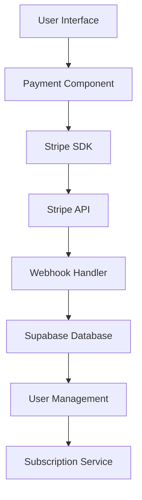

# Payment & Subscription System Specification

## Overview
This document outlines the implementation requirements for the payment and subscription system for the French Tahitian language learning application.

## 1. System Architecture

### 1.1 Technology Stack
- **Payment Processor:** Stripe
- **Backend:** Next.js API Routes
- **Database:** Supabase (PostgreSQL)
- **Frontend:** React with TypeScript
- **Mobile:** React Native with Stripe SDK

### 1.2 Architecture Diagram


## 2. Database Schema

### 2.1 Subscription Plans Table
```sql
CREATE TABLE subscription_plans (
    id UUID PRIMARY KEY DEFAULT gen_random_uuid(),
    name VARCHAR(100) NOT NULL,
    description TEXT,
    price_monthly DECIMAL(10,2),
    price_yearly DECIMAL(10,2),
    stripe_price_id_monthly VARCHAR(255),
    stripe_price_id_yearly VARCHAR(255),
    features JSONB,
    max_lessons INTEGER,
    max_stories INTEGER,
    ai_interactions_limit INTEGER,
    offline_content BOOLEAN DEFAULT false,
    priority_support BOOLEAN DEFAULT false,
    created_at TIMESTAMP WITH TIME ZONE DEFAULT NOW(),
    updated_at TIMESTAMP WITH TIME ZONE DEFAULT NOW()
);

-- Insert default plans
INSERT INTO subscription_plans (name, description, price_monthly, price_yearly, features, max_lessons, max_stories, ai_interactions_limit, offline_content, priority_support) VALUES
('Free', 'Basic access to Tahitian learning', 0.00, 0.00, '["3 foundation lessons", "Basic cultural content", "Community access"]', 3, 0, 10, false, false),
('Premium', 'Full access to all content', 19.99, 199.99, '["Unlimited lessons", "All stories", "AI tutor", "Offline content", "Priority support"]', -1, -1, -1, true, true),
('Enterprise', 'For organizations and schools', 49.99, 499.99, '["Everything in Premium", "Team management", "Analytics dashboard", "Custom content", "Dedicated support"]', -1, -1, -1, true, true);
```

### 2.2 User Subscriptions Table
```sql
CREATE TABLE user_subscriptions (
    id UUID PRIMARY KEY DEFAULT gen_random_uuid(),
    user_id UUID REFERENCES auth.users(id) ON DELETE CASCADE,
    plan_id UUID REFERENCES subscription_plans(id),
    stripe_customer_id VARCHAR(255),
    stripe_subscription_id VARCHAR(255),
    status VARCHAR(50) DEFAULT 'active',
    current_period_start TIMESTAMP WITH TIME ZONE,
    current_period_end TIMESTAMP WITH TIME ZONE,
    cancel_at_period_end BOOLEAN DEFAULT false,
    trial_start TIMESTAMP WITH TIME ZONE,
    trial_end TIMESTAMP WITH TIME ZONE,
    created_at TIMESTAMP WITH TIME ZONE DEFAULT NOW(),
    updated_at TIMESTAMP WITH TIME ZONE DEFAULT NOW()
);

CREATE INDEX idx_user_subscriptions_user_id ON user_subscriptions(user_id);
CREATE INDEX idx_user_subscriptions_stripe_customer ON user_subscriptions(stripe_customer_id);
```

### 2.3 Payment History Table
```sql
CREATE TABLE payment_history (
    id UUID PRIMARY KEY DEFAULT gen_random_uuid(),
    user_id UUID REFERENCES auth.users(id) ON DELETE CASCADE,
    subscription_id UUID REFERENCES user_subscriptions(id),
    stripe_payment_intent_id VARCHAR(255),
    amount DECIMAL(10,2),
    currency VARCHAR(3) DEFAULT 'USD',
    status VARCHAR(50),
    payment_method VARCHAR(100),
    description TEXT,
    created_at TIMESTAMP WITH TIME ZONE DEFAULT NOW()
);

CREATE INDEX idx_payment_history_user_id ON payment_history(user_id);
CREATE INDEX idx_payment_history_created_at ON payment_history(created_at DESC);
```

## 3. API Endpoints

### 3.1 Subscription Management
```typescript
// GET /api/subscriptions/plans
// Returns available subscription plans

// POST /api/subscriptions/create
// Creates a new subscription
interface CreateSubscriptionRequest {
  planId: string;
  paymentMethodId: string;
  billingCycle: 'monthly' | 'yearly';
}

// POST /api/subscriptions/update
// Updates existing subscription
interface UpdateSubscriptionRequest {
  subscriptionId: string;
  newPlanId?: string;
  cancelAtPeriodEnd?: boolean;
}

// POST /api/subscriptions/cancel
// Cancels subscription
interface CancelSubscriptionRequest {
  subscriptionId: string;
  reason?: string;
}

// GET /api/subscriptions/status
// Returns current subscription status for user
```

### 3.2 Payment Processing
```typescript
// POST /api/payments/create-intent
// Creates payment intent for one-time payments
interface CreatePaymentIntentRequest {
  amount: number;
  currency: string;
  description: string;
}

// POST /api/payments/confirm
// Confirms payment
interface ConfirmPaymentRequest {
  paymentIntentId: string;
  paymentMethodId: string;
}

// GET /api/payments/history
// Returns payment history for user
```

### 3.3 Webhook Handlers
```typescript
// POST /api/webhooks/stripe
// Handles Stripe webhook events
// Events to handle:
// - customer.subscription.created
// - customer.subscription.updated
// - customer.subscription.deleted
// - invoice.payment_succeeded
// - invoice.payment_failed
// - customer.subscription.trial_will_end
```

## 4. Frontend Components

### 4.1 Subscription Plans Component
```typescript
interface SubscriptionPlansProps {
  currentPlan?: SubscriptionPlan;
  onSelectPlan: (plan: SubscriptionPlan, billingCycle: 'monthly' | 'yearly') => void;
}

// Features:
// - Plan comparison table
// - Feature highlighting
// - Pricing toggle (monthly/yearly)
// - Current plan indication
// - Upgrade/downgrade buttons
```

### 4.2 Payment Form Component
```typescript
interface PaymentFormProps {
  selectedPlan: SubscriptionPlan;
  billingCycle: 'monthly' | 'yearly';
  onPaymentSuccess: (subscription: UserSubscription) => void;
  onPaymentError: (error: string) => void;
}

// Features:
// - Stripe Elements integration
// - Payment method selection
// - Billing address collection
// - Tax calculation
// - Proration display
// - Loading states
```

### 4.3 Subscription Management Dashboard
```typescript
interface SubscriptionDashboardProps {
  subscription: UserSubscription;
  paymentHistory: PaymentRecord[];
}

// Features:
// - Current plan details
// - Usage statistics
// - Payment history
// - Plan upgrade/downgrade
// - Cancellation options
// - Invoice downloads
```

## 5. Security Considerations

### 5.1 Data Protection
- All payment data handled by Stripe (PCI compliant)
- No credit card information stored locally
- Encrypted webhook endpoints
- Secure API key management

### 5.2 Access Control
- User can only access their own subscription data
- Admin endpoints require proper authorization
- Rate limiting on payment endpoints
- CSRF protection on all forms

### 5.3 Fraud Prevention
- Stripe Radar integration
- IP address validation
- Unusual activity monitoring
- Failed payment attempt tracking

## 6. Testing Strategy

### 6.1 Unit Tests
- Payment form validation
- Subscription logic
- Webhook processing
- Database operations

### 6.2 Integration Tests
- Stripe API integration
- Webhook event handling
- Payment flow end-to-end
- Subscription lifecycle

### 6.3 Manual Testing
- Payment form usability
- Error handling scenarios
- Mobile payment experience
- Cross-browser compatibility

## 7. Deployment Checklist

### 7.1 Environment Setup
- [ ] Stripe API keys configured
- [ ] Webhook endpoints registered
- [ ] Database migrations applied
- [ ] SSL certificates installed

### 7.2 Production Readiness
- [ ] Payment flows tested
- [ ] Error monitoring configured
- [ ] Backup procedures in place
- [ ] Support documentation created

### 7.3 Go-Live Tasks
- [ ] DNS configuration
- [ ] CDN setup for static assets
- [ ] Performance monitoring
- [ ] Customer support training

## 8. Monitoring & Analytics

### 8.1 Key Metrics
- Subscription conversion rate
- Payment success rate
- Churn rate
- Average revenue per user (ARPU)
- Customer lifetime value (CLV)

### 8.2 Alerts
- Failed payment notifications
- Subscription cancellations
- Unusual payment patterns
- System errors

### 8.3 Reporting
- Daily revenue reports
- Monthly subscription analytics
- Payment method performance
- Geographic revenue distribution

---

*Implementation Priority: Critical*
*Estimated Effort: 2-3 weeks*
*Dependencies: Stripe account setup, SSL certificates*