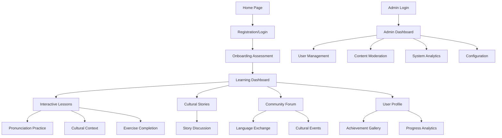

# Product Requirements Document
## TahitiSpeak - French Tahitian Language Learning Platform

## 1. Product Overview

TahitiSpeak is a comprehensive, AI-powered language learning platform specifically designed for French Tahitian language education. The platform combines modern web technologies with cultural immersion to provide an engaging, effective learning experience that preserves and promotes Tahitian language and culture.

The platform addresses the critical need for accessible Tahitian language education by offering interactive lessons, cultural context, AI-powered pronunciation feedback, and community features. Target users include language enthusiasts, cultural preservationists, tourists, and Tahitian diaspora seeking to connect with their heritage.

TahitiSpeak aims to become the premier digital platform for Tahitian language learning, contributing to language preservation while generating sustainable revenue through premium features and cultural content partnerships.

## 2. Core Features

### 2.1 User Roles

| Role | Registration Method | Core Permissions |
|------|---------------------|------------------|
| Learner | Email registration with email verification | Access basic lessons, track progress, participate in community |
| Premium Learner | Subscription upgrade after registration | Access advanced lessons, AI tutoring, offline content, priority support |
| Cultural Contributor | Invitation-based or application process | Submit cultural content, moderate discussions, access contributor tools |
| Administrator | Internal invitation only | Full platform management, user moderation, content curation, analytics access |
| Instructor | Application and approval process | Create lessons, manage student groups, access teaching analytics |

### 2.2 Feature Module

Our TahitiSpeak platform consists of the following essential pages:

1. **Home Page**: Hero section with cultural imagery, navigation menu, featured lessons preview, user testimonials, and quick access to registration
2. **Authentication Pages**: Login and registration forms with social authentication options and email verification
3. **Learning Dashboard**: Progress overview, lesson recommendations, achievement display, daily challenges, and learning streak tracking
4. **Interactive Lessons**: Structured lesson content with audio pronunciation, interactive exercises, cultural context, and AI-powered feedback
5. **Cultural Stories**: Immersive storytelling with traditional tales, historical content, and multimedia presentations
6. **Community Forum**: Discussion boards, language exchange, cultural discussions, and peer support
7. **User Profile**: Personal settings, learning preferences, achievement gallery, and progress statistics
8. **Admin Dashboard**: User management, content moderation, analytics overview, and system configuration
9. **Offline Mode**: Downloaded content access, progress synchronization, and offline exercise completion

### 2.3 Page Details

| Page Name | Module Name | Feature Description |
|-----------|-------------|---------------------|
| Home Page | Hero Section | Display stunning Tahitian imagery with animated transitions, platform introduction, and call-to-action buttons |
| Home Page | Navigation Bar | Responsive navigation with language switcher, user authentication status, and quick access to main sections |
| Home Page | Featured Content | Showcase popular lessons, cultural highlights, and success stories with interactive previews |
| Authentication | Login Form | Secure user authentication with email/password, social login options, remember me functionality, and password recovery |
| Authentication | Registration Form | User account creation with email verification, terms acceptance, language preference selection, and welcome onboarding |
| Learning Dashboard | Progress Overview | Visual progress tracking with completion percentages, time spent learning, and achievement milestones |
| Learning Dashboard | Lesson Recommendations | AI-powered lesson suggestions based on user progress, learning style, and cultural interests |
| Learning Dashboard | Daily Challenges | Gamified daily exercises with streak tracking, point rewards, and social sharing capabilities |
| Interactive Lessons | Content Delivery | Structured lesson presentation with text, audio, images, and interactive elements for comprehensive learning |
| Interactive Lessons | Pronunciation Practice | AI-powered speech recognition with real-time feedback, pronunciation scoring, and improvement suggestions |
| Interactive Lessons | Cultural Context | Rich cultural information accompanying language lessons with historical background and modern usage examples |
| Interactive Lessons | Exercise System | Varied exercise types including multiple choice, fill-in-the-blank, audio matching, and conversation practice |
| Cultural Stories | Story Browser | Curated collection of traditional Tahitian stories with filtering by theme, difficulty, and cultural significance |
| Cultural Stories | Multimedia Player | Integrated audio narration, visual illustrations, and interactive elements for immersive storytelling |
| Cultural Stories | Discussion Integration | Story-specific discussion threads for cultural insights, language questions, and community engagement |
| Community Forum | Discussion Boards | Organized forums for language practice, cultural exchange, and learner support with moderation tools |
| Community Forum | Language Exchange | Peer matching system for conversation practice with video chat integration and scheduling tools |
| Community Forum | Cultural Events | Community calendar with virtual events, cultural celebrations, and group learning activities |
| User Profile | Settings Management | Personal preferences including notification settings, privacy controls, and learning customization |
| User Profile | Achievement Gallery | Visual display of earned badges, certificates, and learning milestones with social sharing options |
| User Profile | Progress Analytics | Detailed learning statistics with charts, trends, and personalized insights for improvement |
| Admin Dashboard | User Management | Comprehensive user administration with role assignment, account moderation, and support ticket handling |
| Admin Dashboard | Content Moderation | Review and approval system for user-generated content with automated flagging and manual review workflows |
| Admin Dashboard | Analytics Overview | Platform-wide statistics including user engagement, lesson completion rates, and revenue metrics |
| Admin Dashboard | System Configuration | Platform settings management including feature toggles, notification templates, and integration configurations |
| Offline Mode | Content Download | Selective lesson downloading for offline access with storage management and update synchronization |
| Offline Mode | Progress Sync | Automatic synchronization of offline progress when connection is restored with conflict resolution |

## 3. Core Process

### Regular User Flow
Users begin their journey on the home page where they discover the platform's cultural focus and learning approach. After registration with email verification, they complete an onboarding assessment to determine their starting level and learning preferences. The learning dashboard becomes their central hub, displaying personalized lesson recommendations and progress tracking. Users progress through interactive lessons that combine language instruction with cultural context, practicing pronunciation with AI feedback and completing varied exercises. They can explore cultural stories for immersive learning and participate in community discussions for peer support. Progress is continuously tracked with achievements and badges motivating continued engagement.

### Premium User Flow
Premium users follow the same initial flow but gain access to advanced features including unlimited AI tutoring sessions, offline content downloads, and priority customer support. They can access exclusive cultural content, participate in live virtual events with native speakers, and receive personalized learning plans adapted to their goals and schedule.

### Admin Flow
Administrators access a comprehensive dashboard for platform management, including user moderation, content review, and system analytics. They can create and manage notification campaigns, configure platform settings, and monitor user engagement metrics. Content moderation workflows allow for efficient review of user-generated content and community discussions.

## 4. User Interface Design

### 4.1 Design Style

**Color Palette:**
- Primary: Tropical Teal (#20B2AA) - representing the Pacific Ocean
- Secondary: Sunset Orange (#FF6B35) - evoking Tahitian sunsets
- Accent: Coral Pink (#FF7F7F) - reflecting tropical flowers
- Neutral: Warm Gray (#F5F5F5) for backgrounds
- Text: Deep Navy (#2C3E50) for readability

**Typography:**
- Headers: Poppins (modern, friendly, highly readable)
- Body Text: Inter (clean, professional, optimized for screens)
- Cultural Text: Playfair Display (elegant, traditional feel for cultural content)
- Font Sizes: 16px base, 18px for better accessibility, scalable responsive design

**Button Style:**
- Rounded corners (8px border-radius) for modern, friendly appearance
- Subtle shadows and hover animations for interactive feedback
- Gradient backgrounds for primary actions
- Outlined style for secondary actions

**Layout Style:**
- Card-based design with subtle shadows and rounded corners
- Top navigation with sticky behavior
- Sidebar navigation for dashboard areas
- Grid-based responsive layout with consistent spacing
- Mobile-first approach with touch-friendly interactions

**Icons and Visual Elements:**
- Lucide React icons for consistency and modern appearance
- Custom cultural illustrations for Tahitian-specific content
- Animated micro-interactions for engagement
- Progress indicators with tropical-themed animations
- Achievement badges with island and ocean motifs

### 4.2 Page Design Overview

| Page Name | Module Name | UI Elements |
|-----------|-------------|-------------|
| Home Page | Hero Section | Full-width background with Tahitian landscape imagery, animated text overlay with fade-in effects, prominent CTA buttons with gradient styling, responsive video background option |
| Home Page | Navigation | Sticky header with transparent-to-solid transition, hamburger menu for mobile, language switcher with flag icons, user avatar dropdown with smooth animations |
| Home Page | Featured Content | Card grid layout with hover effects, thumbnail images with overlay text, progress indicators for lesson previews, testimonial carousel with auto-advance |
| Learning Dashboard | Progress Overview | Circular progress charts with animated fills, color-coded achievement badges, streak counter with flame animation, weekly/monthly toggle views |
| Learning Dashboard | Lesson Grid | Masonry layout for varied content types, difficulty indicators with color coding, completion checkmarks, estimated time badges, cultural theme icons |
| Interactive Lessons | Content Area | Split-screen layout with content and exercises, audio waveform visualizations, pronunciation feedback with color-coded accuracy, cultural image galleries with lightbox |
| Interactive Lessons | Exercise Interface | Drag-and-drop interactions, real-time validation feedback, progress bar with smooth animations, hint system with expandable panels |
| Cultural Stories | Story Browser | Pinterest-style grid with story thumbnails, filter sidebar with checkbox groups, search bar with autocomplete, category tags with color coding |
| Cultural Stories | Story Reader | Immersive full-screen reading mode, audio controls with custom styling, illustration viewer with zoom capabilities, discussion panel with slide-out animation |
| Community Forum | Discussion List | Thread list with unread indicators, user avatar integration, post preview with truncation, sorting and filtering controls with dropdown menus |
| Community Forum | Chat Interface | Real-time message bubbles, typing indicators, emoji picker integration, file sharing with drag-and-drop, video chat modal overlay |
| User Profile | Settings Panel | Tabbed interface with smooth transitions, toggle switches for preferences, avatar upload with crop functionality, notification preference matrix |
| User Profile | Achievement Display | Badge gallery with unlock animations, progress tracking with visual milestones, social sharing buttons, certificate download options |
| Admin Dashboard | Management Interface | Data table with sorting and pagination, bulk action checkboxes, modal dialogs for detailed views, chart widgets with interactive tooltips |
| Offline Mode | Download Manager | File size indicators with storage usage, download progress bars, sync status icons, offline indicator with network detection |

### 4.3 Responsiveness

The platform follows a mobile-first responsive design approach with specific breakpoints:

**Mobile (320px - 768px):**
- Single-column layouts with stacked content
- Touch-optimized button sizes (minimum 44px)
- Collapsible navigation with slide-out menu
- Swipe gestures for lesson navigation
- Optimized typography scaling for readability

**Tablet (768px - 1024px):**
- Two-column layouts where appropriate
- Adaptive navigation with both hamburger and horizontal options
- Touch and mouse interaction support
- Optimized spacing for tablet-specific usage patterns

**Desktop (1024px+):**
- Multi-column layouts with sidebar navigation
- Hover states and advanced interactions
- Keyboard navigation support
- Large screen optimization with maximum content widths

**Accessibility Features:**
- WCAG 2.1 AA compliance with proper color contrast ratios
- Screen reader compatibility with semantic HTML and ARIA labels
- Keyboard navigation support for all interactive elements
- Focus indicators with high visibility
- Alternative text for all images and cultural content
- Captions and transcripts for audio content
- Reduced motion options for users with vestibular disorders

The design system ensures consistent user experience across all devices while maintaining the cultural authenticity and educational effectiveness that makes TahitiSpeak unique in the language learning market.