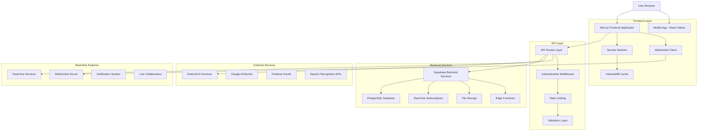
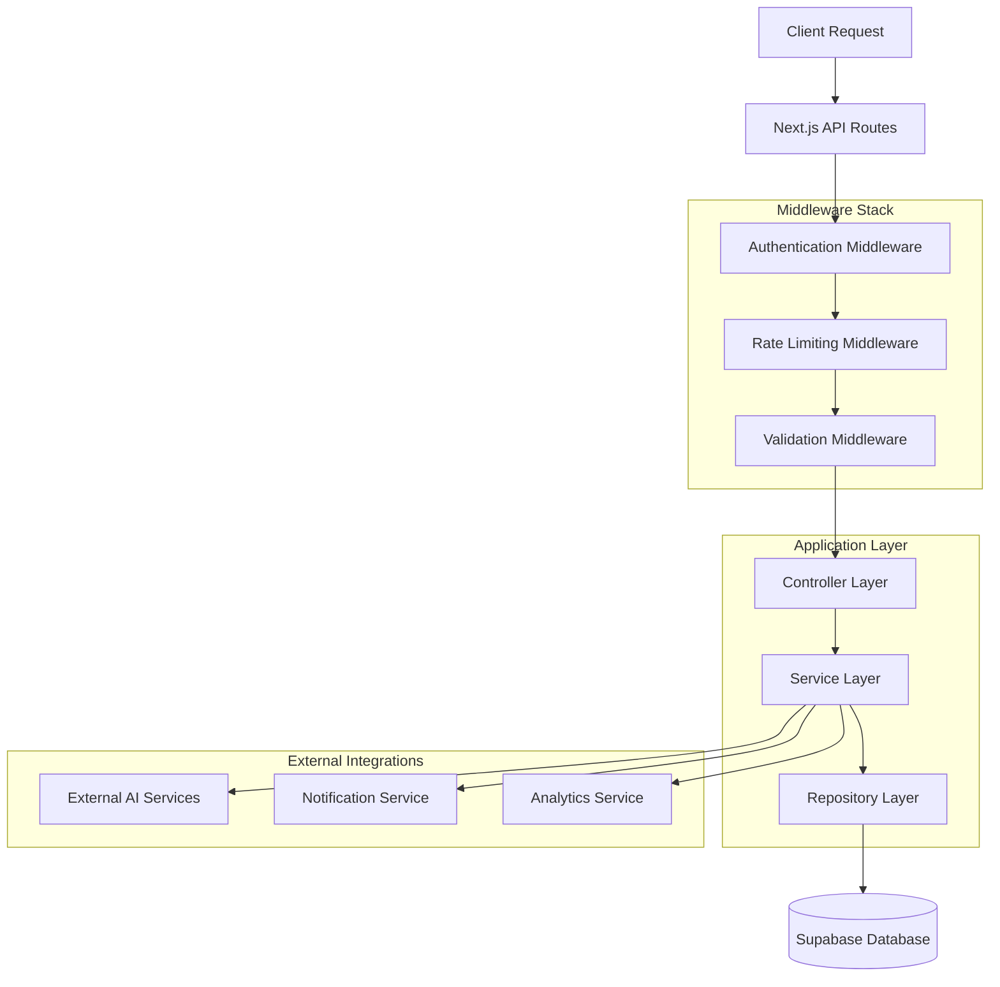
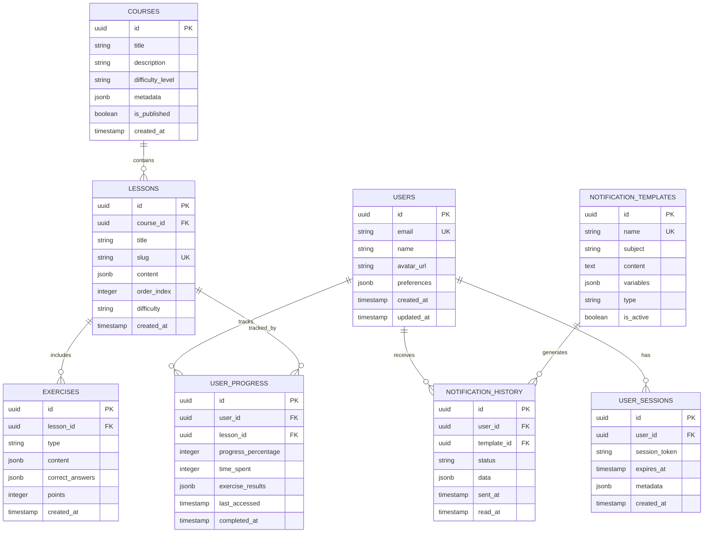

# Technical Architecture Document
## TahitiSpeak - French Tahitian Language Learning Platform

## 1. Architecture Design



## 2. Technology Description

### Frontend Stack
- **Next.js 14**: React framework with App Router, SSR, and static generation
- **React 18**: UI library with concurrent features and hooks
- **TypeScript 5**: Type-safe development with strict configuration
- **Tailwind CSS 4**: Utility-first CSS framework with custom design system
- **Framer Motion**: Animation library for smooth UI transitions
- **Radix UI**: Accessible component primitives
- **Lucide React**: Modern icon library
- **Recharts**: Data visualization and analytics charts

### Backend Services
- **Supabase**: Backend-as-a-Service with PostgreSQL, authentication, and real-time features
- **Next.js API Routes**: Server-side API endpoints with middleware support
- **WebSocket Server**: Real-time communication using Socket.io
- **Firebase Genkit**: AI integration framework for language processing

### Mobile Development
- **React Native**: Cross-platform mobile development
- **Expo**: Development platform and build tools
- **Native modules**: Platform-specific integrations

### Development Tools
- **ESLint**: Code linting with custom rules
- **Prettier**: Code formatting
- **Jest**: Unit and integration testing
- **Playwright**: End-to-end testing
- **Lighthouse CI**: Performance monitoring
- **Bundle Analyzer**: Build optimization analysis

## 3. Route Definitions

| Route | Purpose |
|-------|---------|
| `/` | Home page with hero section and course overview |
| `/auth/login` | User authentication and login |
| `/auth/register` | User registration with email verification |
| `/dashboard` | User dashboard with progress tracking and analytics |
| `/lessons/[slug]` | Interactive lesson pages with AI-powered features |
| `/stories` | Cultural stories and immersive content |
| `/profile` | User profile management and preferences |
| `/admin` | Admin dashboard for content and user management |
| `/admin/analytics` | Advanced analytics and reporting |
| `/admin/courses` | Course content management |
| `/admin/users` | User management and moderation |
| `/offline` | Offline mode with cached content |
| `/api/auth/*` | Authentication API endpoints |
| `/api/lessons/*` | Lesson content and progress APIs |
| `/api/ai/*` | AI-powered language processing |
| `/api/notifications/*` | Notification system APIs |
| `/api/analytics/*` | Analytics and tracking APIs |

## 4. API Definitions

### 4.1 Core Authentication APIs

**User Login**
```
POST /api/auth/login
```

Request:
| Param Name | Param Type | isRequired | Description |
|------------|------------|------------|-------------|
| email | string | true | User email address |
| password | string | true | User password |
| rememberMe | boolean | false | Extended session duration |

Response:
| Param Name | Param Type | Description |
|------------|------------|-------------|
| success | boolean | Authentication status |
| user | User | User profile data |
| session | Session | Authentication session |

Example:
```json
{
  "email": "user@example.com",
  "password": "securePassword123",
  "rememberMe": true
}
```

**User Registration**
```
POST /api/auth/register
```

Request:
| Param Name | Param Type | isRequired | Description |
|------------|------------|------------|-------------|
| email | string | true | User email address |
| password | string | true | User password (min 8 chars) |
| name | string | true | User display name |
| language | string | false | Preferred interface language |

### 4.2 Lesson Management APIs

**Get Lesson Content**
```
GET /api/lessons/[slug]
```

Response:
| Param Name | Param Type | Description |
|------------|------------|-------------|
| id | string | Lesson unique identifier |
| title | string | Lesson title |
| content | LessonContent | Interactive lesson data |
| progress | number | User completion percentage |

**Update Lesson Progress**
```
POST /api/lessons/[slug]/progress
```

Request:
| Param Name | Param Type | isRequired | Description |
|------------|------------|------------|-------------|
| progress | number | true | Completion percentage (0-100) |
| timeSpent | number | true | Time spent in seconds |
| exercises | ExerciseResult[] | false | Exercise completion data |

### 4.3 AI Integration APIs

**Text Translation**
```
POST /api/ai/translate
```

Request:
| Param Name | Param Type | isRequired | Description |
|------------|------------|------------|-------------|
| text | string | true | Text to translate |
| sourceLang | string | true | Source language code |
| targetLang | string | true | Target language code |
| context | string | false | Cultural context |

**Pronunciation Analysis**
```
POST /api/ai/pronunciation
```

Request:
| Param Name | Param Type | isRequired | Description |
|------------|------------|------------|-------------|
| audioData | Blob | true | Audio recording data |
| targetText | string | true | Expected pronunciation text |
| language | string | true | Language code |

### 4.4 Notification APIs

**Send Notification**
```
POST /api/notifications/send
```

Request:
| Param Name | Param Type | isRequired | Description |
|------------|------------|------------|-------------|
| userIds | string[] | true | Target user IDs |
| templateName | string | true | Notification template |
| data | object | false | Template variables |
| scheduledFor | Date | false | Scheduled delivery time |

## 5. Server Architecture Diagram



## 6. Data Model

### 6.1 Data Model Definition



### 6.2 Data Definition Language

**Users Table**
```sql
-- Create users table
CREATE TABLE users (
    id UUID PRIMARY KEY DEFAULT gen_random_uuid(),
    email VARCHAR(255) UNIQUE NOT NULL,
    name VARCHAR(100) NOT NULL,
    avatar_url TEXT,
    preferences JSONB DEFAULT '{}',
    created_at TIMESTAMP WITH TIME ZONE DEFAULT NOW(),
    updated_at TIMESTAMP WITH TIME ZONE DEFAULT NOW()
);

-- Create indexes
CREATE INDEX idx_users_email ON users(email);
CREATE INDEX idx_users_created_at ON users(created_at DESC);

-- Enable RLS
ALTER TABLE users ENABLE ROW LEVEL SECURITY;

-- RLS Policies
CREATE POLICY "Users can view own profile" ON users
    FOR SELECT USING (auth.uid() = id);

CREATE POLICY "Users can update own profile" ON users
    FOR UPDATE USING (auth.uid() = id);
```

**Courses and Lessons Tables**
```sql
-- Create courses table
CREATE TABLE courses (
    id UUID PRIMARY KEY DEFAULT gen_random_uuid(),
    title VARCHAR(200) NOT NULL,
    description TEXT,
    difficulty_level VARCHAR(20) CHECK (difficulty_level IN ('beginner', 'intermediate', 'advanced')),
    metadata JSONB DEFAULT '{}',
    is_published BOOLEAN DEFAULT false,
    created_at TIMESTAMP WITH TIME ZONE DEFAULT NOW()
);

-- Create lessons table
CREATE TABLE lessons (
    id UUID PRIMARY KEY DEFAULT gen_random_uuid(),
    course_id UUID REFERENCES courses(id) ON DELETE CASCADE,
    title VARCHAR(200) NOT NULL,
    slug VARCHAR(100) UNIQUE NOT NULL,
    content JSONB NOT NULL,
    order_index INTEGER NOT NULL,
    difficulty VARCHAR(20) DEFAULT 'beginner',
    created_at TIMESTAMP WITH TIME ZONE DEFAULT NOW()
);

-- Create indexes
CREATE INDEX idx_lessons_course_id ON lessons(course_id);
CREATE INDEX idx_lessons_slug ON lessons(slug);
CREATE INDEX idx_lessons_order ON lessons(course_id, order_index);

-- RLS Policies
CREATE POLICY "Published courses are viewable by all" ON courses
    FOR SELECT USING (is_published = true);

CREATE POLICY "Lessons are viewable by all" ON lessons
    FOR SELECT USING (true);
```

**User Progress Tracking**
```sql
-- Create user_progress table
CREATE TABLE user_progress (
    id UUID PRIMARY KEY DEFAULT gen_random_uuid(),
    user_id UUID REFERENCES users(id) ON DELETE CASCADE,
    lesson_id UUID REFERENCES lessons(id) ON DELETE CASCADE,
    progress_percentage INTEGER DEFAULT 0 CHECK (progress_percentage >= 0 AND progress_percentage <= 100),
    time_spent INTEGER DEFAULT 0,
    exercise_results JSONB DEFAULT '[]',
    last_accessed TIMESTAMP WITH TIME ZONE DEFAULT NOW(),
    completed_at TIMESTAMP WITH TIME ZONE,
    UNIQUE(user_id, lesson_id)
);

-- Create indexes
CREATE INDEX idx_user_progress_user_id ON user_progress(user_id);
CREATE INDEX idx_user_progress_lesson_id ON user_progress(lesson_id);
CREATE INDEX idx_user_progress_completed ON user_progress(completed_at DESC) WHERE completed_at IS NOT NULL;

-- RLS Policies
CREATE POLICY "Users can view own progress" ON user_progress
    FOR SELECT USING (auth.uid() = user_id);

CREATE POLICY "Users can update own progress" ON user_progress
    FOR ALL USING (auth.uid() = user_id);
```

**Notification System Tables**
```sql
-- Create notification_templates table
CREATE TABLE notification_templates (
    id UUID PRIMARY KEY DEFAULT gen_random_uuid(),
    name VARCHAR(100) UNIQUE NOT NULL,
    subject VARCHAR(200) NOT NULL,
    content TEXT NOT NULL,
    variables JSONB DEFAULT '[]',
    type VARCHAR(50) NOT NULL,
    is_active BOOLEAN DEFAULT true,
    created_at TIMESTAMP WITH TIME ZONE DEFAULT NOW()
);

-- Create notification_history table
CREATE TABLE notification_history (
    id UUID PRIMARY KEY DEFAULT gen_random_uuid(),
    user_id UUID REFERENCES users(id) ON DELETE CASCADE,
    template_id UUID REFERENCES notification_templates(id),
    status VARCHAR(20) DEFAULT 'pending',
    data JSONB DEFAULT '{}',
    sent_at TIMESTAMP WITH TIME ZONE,
    read_at TIMESTAMP WITH TIME ZONE,
    created_at TIMESTAMP WITH TIME ZONE DEFAULT NOW()
);

-- Create indexes
CREATE INDEX idx_notification_history_user_id ON notification_history(user_id);
CREATE INDEX idx_notification_history_status ON notification_history(status);
CREATE INDEX idx_notification_history_sent_at ON notification_history(sent_at DESC);

-- Insert default templates
INSERT INTO notification_templates (name, subject, content, type) VALUES
('welcome', 'Welcome to TahitiSpeak!', 'Welcome {{name}}! Start your Tahitian learning journey today.', 'system'),
('lesson_complete', 'Lesson Completed!', 'Congratulations {{name}}! You completed {{lesson_title}}.', 'achievement'),
('daily_reminder', 'Daily Practice Reminder', 'Don''t forget your daily Tahitian practice, {{name}}!', 'reminder');
```

This technical architecture provides a comprehensive foundation for the TahitiSpeak platform, ensuring scalability, maintainability, and optimal performance across all components.