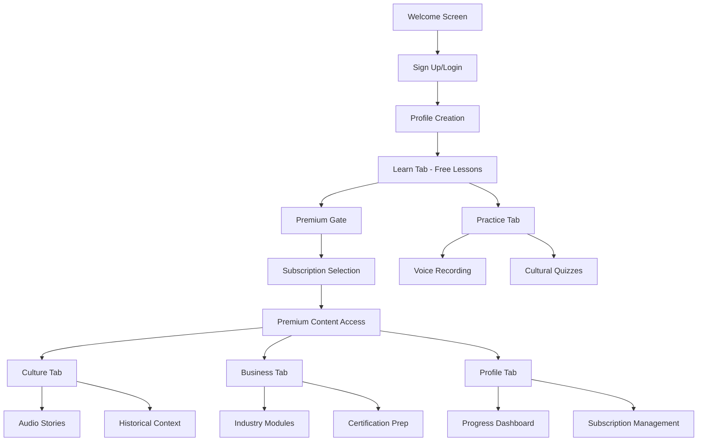

# Tahiti French Tutor - Product Requirements Document

## 1. Product Overview

**Tahiti French Tutor** is a premium French language learning mobile application that uniquely integrates authentic Polynesian cultural expertise with modern language education technology. The app targets premium French learners, tourism professionals, and cultural enthusiasts through a freemium business model with subscription tiers.

- **Unique Value Proposition**: PhD-level Polynesian cultural expertise from University of Hawaii graduate, combining French language learning with authentic cultural context
- **Target Market**: Premium French learners seeking cultural immersion, tourism/hospitality professionals, and cultural enthusiasts
- **Business Model**: Freemium with premium subscriptions ($9.99/month individual, $49.99/month corporate) and free trial access

## 2. Core Features

### 2.1 User Roles

| Role | Registration Method | Core Permissions |
|------|---------------------|------------------|
| Free User | Email registration or social media | Access to 3 foundation lessons, basic pronunciation, limited cultural content |
| Premium Individual | Subscription upgrade | Full lesson access, AI cultural tutor, offline content, advanced pronunciation analytics |
| Corporate User | Corporate package enrollment | Team management, industry-specific modules, progress analytics, certification prep |

### 2.2 Feature Module

Our Tahiti French Tutor application consists of the following main pages:

1. **Authentication Flow**: Welcome screen with Tahitian cultural imagery, sign up/login with email or social media, user profile creation with learning goals
2. **Learn Tab**: CEFR-aligned lessons (A1-C1) with Polynesian cultural context, interactive cards, progress tracking with XP and streaks
3. **Practice Tab**: Interactive exercises, voice recording and pronunciation feedback, matching games, cultural etiquette quizzes
4. **Culture Tab**: Polynesian cultural insights, traditional legends told in French, historical context modules, cultural calendar
5. **Business Tab**: Professional French for tourism/hospitality, industry-specific scenarios, certification preparation
6. **Profile Tab**: Progress tracking, subscription management, settings, achievement system

### 2.3 Page Details

| Page Name | Module Name | Feature description |
|-----------|-------------|---------------------|
| Authentication Flow | Welcome Screen | Display Tahitian landscape imagery, app introduction, cultural positioning statement |
| Authentication Flow | Sign Up/Login | Email registration, social media integration, free trial activation (3 lessons) |
| Authentication Flow | Profile Creation | Learning goal selection, cultural interest assessment, notification preferences |
| Learn Tab | Lesson System | CEFR-aligned progression (A1-C1), interactive phrase cards with cultural context, offline lesson access |
| Learn Tab | Cultural Integration | "Did You Know?" cultural facts, Tahitian-French phrase comparisons, traditional context explanations |
| Learn Tab | Progress Tracking | XP points system, streak counters, lesson completion badges, cultural knowledge milestones |
| Practice Tab | Interactive Exercises | Multiple choice with cultural explanations, fill-in-the-blank business scenarios, matching games |
| Practice Tab | Voice Features | Record pronunciation, compare with native French-Polynesian accent, AI feedback on accuracy |
| Practice Tab | Cultural Quizzes | Business etiquette assessments, traditional customs knowledge, hospitality scenarios |
| Culture Tab | Audio Stories | 2-3 minute cultural legends in simple French, traditional navigation stories, wedding customs |
| Culture Tab | Historical Context | French colonial period to modern autonomy, cultural evolution, modern Polynesian identity |
| Culture Tab | Cultural Calendar | Polynesian festivals, traditional celebrations, seasonal customs and vocabulary |
| Business Tab | Industry Modules | Hotel operations, restaurant service, tour guide excellence, aviation/cruise services |
| Business Tab | Scenario Practice | Guest complaint resolution, menu explanations, emergency procedures, cultural sensitivity |
| Business Tab | Certification Prep | Business French assessment, industry-specific vocabulary, professional communication |
| Profile Tab | Progress Dashboard | Learning statistics, cultural knowledge score, pronunciation improvement tracking |
| Profile Tab | Subscription Management | Plan comparison, payment processing, corporate team features, billing history |
| Profile Tab | Settings | Notification preferences, offline content management, privacy controls, language settings |

## 3. Core Process

**Free User Flow:**
Users register and access 3 foundation lessons covering greetings with cultural protocols, food and hospitality with Polynesian cuisine context, and travel navigation with island geography. After completing free content, users encounter premium gate with subscription options.

**Premium Individual Flow:**
Subscribed users access full lesson progression, AI cultural tutor for personalized explanations, offline content downloads, advanced pronunciation analytics, and weekly live Q&A sessions with cultural experts.

**Corporate User Flow:**
Corporate subscribers manage team accounts, access industry-specific modules for tourism/hospitality, track team progress analytics, and prepare for business French certifications.

## 4. User Interface Design

### 4.1 Design Style

- **Primary Colors**: Deep Ocean Blue (#005f73) for headers and navigation, Coral Sunset (#f07167) for accent elements
- **Secondary Colors**: Sandy Beach (#e9d8a6) for backgrounds, Tropical Green (#52b788) for success states, Clean White (#fefefe) base
- **Button Style**: Rounded corners with soft shadows, gradient overlays inspired by Tahitian sunsets
- **Typography**: Bold sans-serif headers with Polynesian-inspired accents, system fonts (SF Pro iOS, Roboto Android) for body text, elegant serif for cultural quotes
- **Layout Style**: Card-based interface with tropical gradient backgrounds, traditional Polynesian patterns as subtle background elements
- **Accessibility**: High contrast ratios, proper font sizing, voice-over support, cultural sensitivity in visual representations

### 4.2 Page Design Overview

| Page Name | Module Name | UI Elements |
|-----------|-------------|-------------|
| Welcome Screen | Hero Section | Full-screen Tahitian landscape background, gradient overlay, elegant typography with cultural positioning |
| Learn Tab | Lesson Cards | Ocean-inspired gradient cards, progress indicators, cultural imagery integration, XP point displays |
| Practice Tab | Exercise Interface | Interactive elements with coral accent colors, voice recording waveforms, cultural context sidebars |
| Culture Tab | Story Display | Immersive storytelling layout, traditional pattern borders, audio player with Polynesian design elements |
| Business Tab | Scenario Cards | Professional layout with cultural sensitivity indicators, industry-specific iconography, progress tracking |
| Profile Tab | Dashboard | Clean metrics display, achievement badges with cultural motifs, subscription status with premium styling |

### 4.3 Responsiveness

The application is designed mobile-first for iOS and Android with touch interaction optimization. Platform-specific design guidelines are followed while maintaining brand consistency, including iOS navigation patterns and Android material design principles adapted to the tropical aesthetic.

## 5. Content Structure

### 5.1 Foundation Lessons (Free Tier)

1. **Greetings & Respect**: "Ia ora na" (Tahitian) + "Bonjour" (French) with cultural protocol explanations
2. **Food & Hospitality**: Restaurant French with Polynesian cuisine context, "Mauruuru" vs "Merci" usage
3. **Travel & Navigation**: Transportation vocabulary with island geography, "Nana" vs "Au revoir" farewell customs

### 5.2 Cultural Audio Stories

- **The Legend of Mount Orohena**: 2-3 minute story in simple French with geographical vocabulary
- **Modern Tahitian Wedding Customs**: Event vocabulary with cultural tradition explanations
- **Traditional Polynesian Navigation**: Maritime French vocabulary with historical navigation techniques

### 5.3 Business Scenarios

- **Hotel Operations**: Guest complaint resolution with cultural sensitivity, "Comment puis-je vous aider?" with service expectations
- **Restaurant Service**: Menu explanations including traditional and French dishes, wine pairing vocabulary
- **Tour Guide Excellence**: Emergency procedures with calm, culturally appropriate communication
- **Airport Assistance**: French-speaking tourist support with Polynesian hospitality standards

### 5.4 Premium Features

- **AI Cultural Tutor**: OpenAI-powered explanations of cultural context and language nuances
- **Advanced Pronunciation**: Native French-Polynesian accent comparison with detailed feedback
- **Live Q&A Sessions**: Weekly virtual sessions with cultural experts and language instructors
- **Downloadable Guides**: Offline cultural guides and audio stories for immersive learning
- **Certification Prep**: Business French certification preparation with industry-specific modules