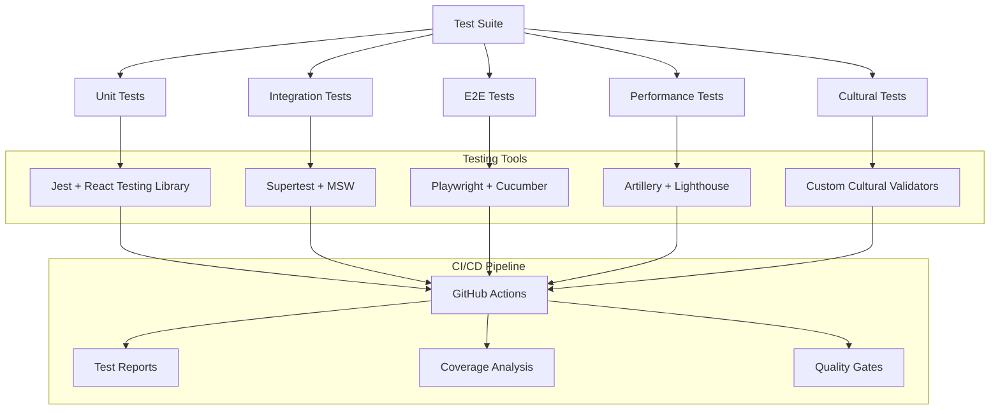

# TahitiSpeak Testing Strategy
## Comprehensive Testing Framework for Enhanced French-Tahitian Learning Platform

## 1. Testing Overview

### 1.1 Testing Objectives
- Ensure seamless integration of TalkingHead, Firebase Genkit, and Isograph
- Validate cultural authenticity and language accuracy
- Verify performance and scalability requirements
- Guarantee accessibility and user experience standards
- Maintain data integrity and security compliance

### 1.2 Testing Scope
- **Unit Testing**: Individual components and functions
- **Integration Testing**: Service interactions and data flow
- **End-to-End Testing**: Complete user workflows
- **Performance Testing**: Load, stress, and scalability
- **Cultural Testing**: Language accuracy and cultural sensitivity
- **Accessibility Testing**: WCAG 2.1 AA compliance
- **Security Testing**: Authentication, authorization, and data protection

## 2. Testing Framework Architecture



## 3. Unit Testing Strategy

### 3.1 TalkingHead Avatar Testing

**Component Tests**
```typescript
// tests/components/TalkingHead.test.tsx
import { render, screen, waitFor } from '@testing-library/react';
import { TalkingHead } from '@/components/TalkingHead';
import { mockThreeJS, mockMediaPipe } from '@/tests/mocks';

describe('TalkingHead Component', () => {
  beforeEach(() => {
    mockThreeJS.reset();
    mockMediaPipe.reset();
  });

  test('initializes 3D avatar correctly', async () => {
    render(<TalkingHead />);
    
    await waitFor(() => {
      expect(mockThreeJS.scene.add).toHaveBeenCalled();
      expect(screen.getByTestId('avatar-canvas')).toBeInTheDocument();
    });
  });

  test('synchronizes lip movements with audio', async () => {
    const mockAudio = { duration: 5000, phonemes: ['a', 'e', 'i'] };
    render(<TalkingHead audioData={mockAudio} />);
    
    await waitFor(() => {
      expect(mockThreeJS.morphTargets.setWeight).toHaveBeenCalledWith('viseme_a', expect.any(Number));
    });
  });

  test('handles Tahitian phonemes correctly', async () => {
    const tahitianPhonemes = ['ʔ', 'ŋ', 'ā', 'ē', 'ī', 'ō', 'ū'];
    render(<TalkingHead phonemes={tahitianPhonemes} />);
    
    tahitianPhonemes.forEach(phoneme => {
      expect(mockThreeJS.morphTargets.getWeight(`viseme_${phoneme}`)).toBeDefined();
    });
  });

  test('applies cultural avatar styling', () => {
    render(<TalkingHead culturalStyle="polynesian" />);
    
    expect(mockThreeJS.material.map).toMatch(/polynesian-texture/);
    expect(mockThreeJS.geometry.attributes.position).toBeDefined();
  });
});
```

**Service Tests**
```typescript
// tests/services/AvatarService.test.ts
import { AvatarService } from '@/services/AvatarService';
import { mockWebGL, mockAudioContext } from '@/tests/mocks';

describe('AvatarService', () => {
  let avatarService: AvatarService;

  beforeEach(() => {
    avatarService = new AvatarService();
  });

  test('generates lip sync data from audio', async () => {
    const audioBuffer = new ArrayBuffer(1024);
    const lipSyncData = await avatarService.generateLipSync(audioBuffer, 'tahitian');
    
    expect(lipSyncData).toHaveProperty('phonemes');
    expect(lipSyncData).toHaveProperty('timings');
    expect(lipSyncData.phonemes).toBeInstanceOf(Array);
  });

  test('handles Tahitian pronunciation patterns', async () => {
    const tahitianText = "Ia ora na, e aha tō 'oe i hina'aro nei?";
    const pronunciation = await avatarService.generatePronunciation(tahitianText);
    
    expect(pronunciation).toContain('ʔ'); // glottal stop
    expect(pronunciation).toMatch(/[āēīōū]/); // long vowels
  });

  test('optimizes performance for real-time rendering', async () => {
    const startTime = performance.now();
    await avatarService.renderFrame();
    const endTime = performance.now();
    
    expect(endTime - startTime).toBeLessThan(16.67); // 60fps target
  });
});
```

### 3.2 Firebase Genkit AI Testing

**AI Service Tests**
```typescript
// tests/services/AIService.test.ts
import { AIService } from '@/services/AIService';
import { mockGeminiAPI } from '@/tests/mocks';

describe('AIService', () => {
  let aiService: AIService;

  beforeEach(() => {
    aiService = new AIService();
    mockGeminiAPI.reset();
  });

  test('generates culturally appropriate conversations', async () => {
    const prompt = {
      topic: 'traditional greetings',
      level: 'beginner',
      culturalContext: 'meeting elders'
    };
    
    const conversation = await aiService.generateConversation(prompt);
    
    expect(conversation.exchanges).toHaveLength(expect.any(Number));
    expect(conversation.culturalNotes).toContain('respect');
    expect(conversation.vocabulary.some(word => word.cultural_significance)).toBe(true);
  });

  test('provides accurate pronunciation feedback', async () => {
    const audioData = 'base64-encoded-audio';
    const targetPhrase = 'mauruuru roa';
    
    const feedback = await aiService.analyzePronunciation(audioData, targetPhrase);
    
    expect(feedback.accuracy).toBeGreaterThanOrEqual(0);
    expect(feedback.accuracy).toBeLessThanOrEqual(1);
    expect(feedback.specificFeedback).toBeInstanceOf(Array);
  });

  test('handles rate limiting gracefully', async () => {
    mockGeminiAPI.setRateLimit(true);
    
    const result = await aiService.generateConversation({ topic: 'test' });
    
    expect(result.error).toContain('rate limit');
    expect(aiService.getRetryCount()).toBeGreaterThan(0);
  });

  test('validates cultural sensitivity', async () => {
    const sensitivePrompt = {
      topic: 'sacred traditions',
      culturalContext: 'religious ceremony'
    };
    
    const response = await aiService.generateConversation(sensitivePrompt);
    
    expect(response.culturalWarnings).toBeDefined();
    expect(response.respectfulLanguage).toBe(true);
  });
});
```

### 3.3 Isograph GraphQL Testing

**GraphQL Resolver Tests**
```typescript
// tests/graphql/resolvers.test.ts
import { createTestClient } from 'apollo-server-testing';
import { server } from '@/graphql/server';
import { mockDatabase } from '@/tests/mocks';

describe('GraphQL Resolvers', () => {
  const { query, mutate } = createTestClient(server);

  beforeEach(() => {
    mockDatabase.reset();
  });

  test('fetches lessons with cultural context', async () => {
    const GET_LESSONS = `
      query GetLessons($filters: LessonFilters) {
        lessons(filters: $filters) {
          id
          title
          culturalContext {
            themes
            significance
          }
        }
      }
    `;

    const response = await query({
      query: GET_LESSONS,
      variables: { filters: { level: 'BEGINNER' } }
    });

    expect(response.errors).toBeUndefined();
    expect(response.data.lessons).toHaveLength(expect.any(Number));
    expect(response.data.lessons[0].culturalContext).toBeDefined();
  });

  test('updates user progress correctly', async () => {
    const UPDATE_PROGRESS = `
      mutation UpdateProgress($input: ProgressUpdateInput!) {
        updateProgress(input: $input) {
          currentLevel
          streakDays
        }
      }
    `;

    const response = await mutate({
      mutation: UPDATE_PROGRESS,
      variables: {
        input: {
          lessonId: 'lesson-1',
          score: 0.85,
          timeSpent: 1200
        }
      }
    });

    expect(response.errors).toBeUndefined();
    expect(response.data.updateProgress.currentLevel).toBeDefined();
  });

  test('handles data masking for sensitive information', async () => {
    const GET_USER_DATA = `
      query GetUserData {
        currentUser {
          id
          name
          email @include(if: $includeEmail)
        }
      }
    `;

    const response = await query({
      query: GET_USER_DATA,
      variables: { includeEmail: false }
    });

    expect(response.data.currentUser.email).toBeUndefined();
    expect(response.data.currentUser.name).toBeDefined();
  });
});
```

## 4. Integration Testing Strategy

### 4.1 Service Integration Tests

```typescript
// tests/integration/services.test.ts
import { TalkingHeadService } from '@/services/TalkingHeadService';
import { AIService } from '@/services/AIService';
import { GraphQLService } from '@/services/GraphQLService';

describe('Service Integration', () => {
  test('AI generates content for avatar to speak', async () => {
    const aiService = new AIService();
    const avatarService = new TalkingHeadService();
    
    // Generate conversation with AI
    const conversation = await aiService.generateConversation({
      topic: 'family introductions',
      level: 'beginner'
    });
    
    // Avatar speaks the generated content
    const speechResult = await avatarService.speak({
      text: conversation.exchanges[0].tahitian,
      language: 'tahitian'
    });
    
    expect(speechResult.audioUrl).toBeDefined();
    expect(speechResult.lipSyncTimings).toHaveLength(expect.any(Number));
  });

  test('GraphQL fetches data for AI context', async () => {
    const graphqlService = new GraphQLService();
    const aiService = new AIService();
    
    // Fetch user progress for personalized content
    const userProgress = await graphqlService.getUserProgress('user-123');
    
    // Generate personalized conversation
    const conversation = await aiService.generateConversation({
      topic: 'review',
      level: userProgress.currentLevel,
      weaknesses: userProgress.weaknesses
    });
    
    expect(conversation.exercises).toContain(
      expect.objectContaining({
        type: expect.stringMatching(new RegExp(userProgress.weaknesses.join('|')))
      })
    );
  });

  test('Avatar pronunciation feedback updates GraphQL data', async () => {
    const avatarService = new TalkingHeadService();
    const aiService = new AIService();
    const graphqlService = new GraphQLService();
    
    // User attempts pronunciation
    const audioData = 'mock-audio-data';
    const feedback = await aiService.analyzePronunciation(audioData, 'mauruuru');
    
    // Update progress in GraphQL
    const progressUpdate = await graphqlService.updatePronunciationProgress({
      word: 'mauruuru',
      accuracy: feedback.accuracy,
      attempts: 1
    });
    
    expect(progressUpdate.success).toBe(true);
    expect(progressUpdate.newAccuracyScore).toBeGreaterThanOrEqual(feedback.accuracy);
  });
});
```

### 4.2 Database Integration Tests

```typescript
// tests/integration/database.test.ts
import { createClient } from '@supabase/supabase-js';
import { testConfig } from '@/config/test';

describe('Database Integration', () => {
  let supabase: any;

  beforeAll(() => {
    supabase = createClient(testConfig.supabaseUrl, testConfig.supabaseKey);
  });

  test('stores and retrieves lesson progress', async () => {
    const progressData = {
      user_id: 'test-user',
      lesson_id: 'lesson-1',
      score: 0.85,
      time_spent: 1200,
      exercise_results: [{ exercise_id: 'ex-1', correct: true }]
    };

    // Insert progress
    const { data: inserted, error: insertError } = await supabase
      .from('lesson_progress')
      .insert(progressData)
      .select();

    expect(insertError).toBeNull();
    expect(inserted[0].score).toBe(0.85);

    // Retrieve progress
    const { data: retrieved, error: selectError } = await supabase
      .from('lesson_progress')
      .select('*')
      .eq('user_id', 'test-user');

    expect(selectError).toBeNull();
    expect(retrieved).toHaveLength(1);
  });

  test('enforces row level security', async () => {
    // Attempt to access another user's data
    const { data, error } = await supabase
      .from('user_progress')
      .select('*')
      .eq('user_id', 'other-user');

    expect(data).toHaveLength(0); // Should be empty due to RLS
  });

  test('handles cultural content relationships', async () => {
    const { data: lessons, error } = await supabase
      .from('lessons')
      .select(`
        *,
        vocabulary_items(*),
        cultural_content(*)
      `)
      .eq('level', 'BEGINNER');

    expect(error).toBeNull();
    expect(lessons[0].vocabulary_items).toBeInstanceOf(Array);
    expect(lessons[0].cultural_content).toBeDefined();
  });
});
```

## 5. End-to-End Testing Strategy

### 5.1 User Journey Tests

```typescript
// tests/e2e/user-journey.spec.ts
import { test, expect } from '@playwright/test';

test.describe('Complete Learning Journey', () => {
  test('new user completes first lesson with avatar', async ({ page }) => {
    // Navigate to app
    await page.goto('/learn');
    
    // Select first lesson
    await page.click('[data-testid="lesson-1"]');
    
    // Wait for avatar to load
    await expect(page.locator('[data-testid="avatar-canvas"]')).toBeVisible();
    
    // Avatar introduces lesson
    await page.click('[data-testid="start-lesson"]');
    await expect(page.locator('[data-testid="avatar-speaking"]')).toBeVisible();
    
    // Complete vocabulary exercise
    await page.click('[data-testid="vocabulary-exercise"]');
    await page.fill('[data-testid="answer-input"]', 'mauruuru');
    await page.click('[data-testid="submit-answer"]');
    
    // Verify AI feedback
    await expect(page.locator('[data-testid="ai-feedback"]')).toContainText('Correct!');
    
    // Complete pronunciation exercise
    await page.click('[data-testid="pronunciation-exercise"]');
    await page.click('[data-testid="record-button"]');
    
    // Simulate recording
    await page.waitForTimeout(2000);
    await page.click('[data-testid="stop-recording"]');
    
    // Wait for AI analysis
    await expect(page.locator('[data-testid="pronunciation-feedback"]')).toBeVisible();
    
    // Complete lesson
    await page.click('[data-testid="complete-lesson"]');
    
    // Verify progress update
    await expect(page.locator('[data-testid="progress-bar"]')).toHaveAttribute('aria-valuenow', '1');
  });

  test('user practices conversation with AI', async ({ page }) => {
    await page.goto('/practice/conversation');
    
    // Select conversation topic
    await page.selectOption('[data-testid="topic-select"]', 'family');
    await page.click('[data-testid="start-conversation"]');
    
    // AI generates conversation starter
    await expect(page.locator('[data-testid="ai-message"]')).toBeVisible();
    
    // Avatar speaks the AI message
    await expect(page.locator('[data-testid="avatar-speaking"]')).toBeVisible();
    
    // User responds
    await page.fill('[data-testid="user-response"]', 'Ia ora na, o vau o John');
    await page.click('[data-testid="send-response"]');
    
    // AI provides feedback and continues conversation
    await expect(page.locator('[data-testid="cultural-note"]')).toBeVisible();
    await expect(page.locator('[data-testid="next-ai-message"]')).toBeVisible();
  });

  test('user explores cultural content', async ({ page }) => {
    await page.goto('/cultural/insights');
    
    // Browse cultural categories
    await page.click('[data-testid="category-traditions"]');
    
    // Select specific content
    await page.click('[data-testid="content-greetings"]');
    
    // Verify multimedia content loads
    await expect(page.locator('[data-testid="cultural-video"]')).toBeVisible();
    await expect(page.locator('[data-testid="cultural-audio"]')).toBeVisible();
    
    // Avatar explains cultural context
    await page.click('[data-testid="explain-context"]');
    await expect(page.locator('[data-testid="avatar-explanation"]')).toBeVisible();
    
    // User bookmarks content
    await page.click('[data-testid="bookmark-content"]');
    await expect(page.locator('[data-testid="bookmark-success"]')).toBeVisible();
  });
});
```

### 5.2 Performance Tests

```typescript
// tests/e2e/performance.spec.ts
import { test, expect } from '@playwright/test';

test.describe('Performance Testing', () => {
  test('avatar renders at 60fps', async ({ page }) => {
    await page.goto('/learn/lessons/1');
    
    // Start performance monitoring
    await page.evaluate(() => {
      window.performanceData = {
        frameCount: 0,
        startTime: performance.now()
      };
      
      function countFrames() {
        window.performanceData.frameCount++;
        requestAnimationFrame(countFrames);
      }
      requestAnimationFrame(countFrames);
    });
    
    // Let avatar run for 5 seconds
    await page.waitForTimeout(5000);
    
    // Check frame rate
    const fps = await page.evaluate(() => {
      const elapsed = performance.now() - window.performanceData.startTime;
      return (window.performanceData.frameCount / elapsed) * 1000;
    });
    
    expect(fps).toBeGreaterThan(55); // Allow some tolerance
  });

  test('AI response time under 3 seconds', async ({ page }) => {
    await page.goto('/practice/conversation');
    
    const startTime = Date.now();
    await page.click('[data-testid="start-conversation"]');
    await expect(page.locator('[data-testid="ai-message"]')).toBeVisible();
    const endTime = Date.now();
    
    expect(endTime - startTime).toBeLessThan(3000);
  });

  test('GraphQL queries complete under 500ms', async ({ page }) => {
    await page.goto('/learn');
    
    // Monitor network requests
    const responses: any[] = [];
    page.on('response', response => {
      if (response.url().includes('/graphql')) {
        responses.push({
          url: response.url(),
          timing: response.timing()
        });
      }
    });
    
    // Trigger GraphQL queries
    await page.reload();
    await page.waitForLoadState('networkidle');
    
    // Check response times
    responses.forEach(response => {
      expect(response.timing.responseEnd - response.timing.requestStart).toBeLessThan(500);
    });
  });
});
```

## 6. Cultural Testing Strategy

### 6.1 Language Accuracy Tests

```typescript
// tests/cultural/language-accuracy.test.ts
import { CulturalValidator } from '@/utils/CulturalValidator';
import { tahitianDictionary } from '@/data/tahitian-dictionary';

describe('Cultural Language Testing', () => {
  let validator: CulturalValidator;

  beforeEach(() => {
    validator = new CulturalValidator();
  });

  test('validates Tahitian pronunciation patterns', () => {
    const validPronunciations = [
      { word: 'mauruuru', ipa: '[mauˈruuru]' },
      { word: 'fenua', ipa: '[feˈnua]' },
      { word: 'taata', ipa: '[taˈata]' }
    ];

    validPronunciations.forEach(({ word, ipa }) => {
      expect(validator.validatePronunciation(word, ipa)).toBe(true);
    });
  });

  test('detects cultural context appropriateness', () => {
    const contexts = [
      {
        phrase: 'Ia ora na',
        context: 'casual_greeting',
        appropriate: true
      },
      {
        phrase: 'Ia ora na te Atua',
        context: 'casual_greeting',
        appropriate: false // too formal/religious
      }
    ];

    contexts.forEach(({ phrase, context, appropriate }) => {
      expect(validator.validateContext(phrase, context)).toBe(appropriate);
    });
  });

  test('ensures respectful representation of sacred concepts', () => {
    const sacredTerms = ['mana', 'tabu', 'marae', 'tiki'];
    
    sacredTerms.forEach(term => {
      const usage = validator.checkSacredTermUsage(term);
      expect(usage.requiresWarning).toBe(true);
      expect(usage.culturalGuidance).toBeDefined();
    });
  });

  test('validates regional dialect variations', () => {
    const dialectVariations = [
      { word: 'house', tahiti: 'fare', marquesas: 'hale' },
      { word: 'water', tahiti: 'pape', marquesas: 'vai' }
    ];

    dialectVariations.forEach(({ word, tahiti, marquesas }) => {
      expect(validator.isValidDialect(word, tahiti, 'tahiti')).toBe(true);
      expect(validator.isValidDialect(word, marquesas, 'marquesas')).toBe(true);
    });
  });
});
```

### 6.2 Cultural Sensitivity Tests

```typescript
// tests/cultural/sensitivity.test.ts
import { CulturalSensitivityChecker } from '@/utils/CulturalSensitivityChecker';

describe('Cultural Sensitivity Testing', () => {
  let checker: CulturalSensitivityChecker;

  beforeEach(() => {
    checker = new CulturalSensitivityChecker();
  });

  test('flags inappropriate cultural appropriation', () => {
    const inappropriateContent = [
      'Wear a traditional headdress for fun',
      'Tahitian tattoos are just decorative',
      'Use sacred chants as background music'
    ];

    inappropriateContent.forEach(content => {
      const result = checker.checkContent(content);
      expect(result.isAppropriate).toBe(false);
      expect(result.warnings).toContain('cultural appropriation');
    });
  });

  test('validates respectful cultural education', () => {
    const respectfulContent = [
      'Traditional tattoos have deep spiritual meaning',
      'Learn about the cultural significance before participating',
      'Respect sacred spaces and ceremonies'
    ];

    respectfulContent.forEach(content => {
      const result = checker.checkContent(content);
      expect(result.isAppropriate).toBe(true);
      expect(result.culturalValue).toBeGreaterThan(0.8);
    });
  });

  test('ensures inclusive representation', () => {
    const avatarRepresentations = [
      { gender: 'male', age: 'elder', region: 'tahiti' },
      { gender: 'female', age: 'adult', region: 'moorea' },
      { gender: 'non-binary', age: 'young', region: 'bora-bora' }
    ];

    const diversity = checker.checkDiversity(avatarRepresentations);
    expect(diversity.genderBalance).toBeGreaterThan(0.7);
    expect(diversity.ageRepresentation).toBeGreaterThan(0.7);
    expect(diversity.regionalCoverage).toBeGreaterThan(0.7);
  });
});
```

## 7. Accessibility Testing

### 7.1 WCAG Compliance Tests

```typescript
// tests/accessibility/wcag.test.ts
import { injectAxe, checkA11y } from 'axe-playwright';
import { test, expect } from '@playwright/test';

test.describe('Accessibility Testing', () => {
  test.beforeEach(async ({ page }) => {
    await injectAxe(page);
  });

  test('avatar interface meets WCAG AA standards', async ({ page }) => {
    await page.goto('/learn/lessons/1');
    await checkA11y(page, '[data-testid="avatar-container"]', {
      detailedReport: true,
      detailedReportOptions: { html: true }
    });
  });

  test('supports keyboard navigation', async ({ page }) => {
    await page.goto('/learn');
    
    // Tab through interactive elements
    await page.keyboard.press('Tab');
    await expect(page.locator(':focus')).toBeVisible();
    
    // Navigate to lesson
    await page.keyboard.press('Enter');
    await expect(page.url()).toContain('/lessons/');
    
    // Control avatar with keyboard
    await page.keyboard.press('Space'); // Play/pause
    await page.keyboard.press('ArrowRight'); // Next
    await page.keyboard.press('ArrowLeft'); // Previous
  });

  test('provides screen reader support', async ({ page }) => {
    await page.goto('/learn/lessons/1');
    
    // Check ARIA labels
    await expect(page.locator('[data-testid="avatar-canvas"]')).toHaveAttribute('aria-label');
    await expect(page.locator('[data-testid="lesson-content"]')).toHaveAttribute('role', 'main');
    
    // Check live regions for dynamic content
    await expect(page.locator('[aria-live="polite"]')).toBeVisible();
  });

  test('supports high contrast mode', async ({ page }) => {
    // Enable high contrast
    await page.emulateMedia({ colorScheme: 'dark', reducedMotion: 'reduce' });
    await page.goto('/learn');
    
    // Check contrast ratios
    const contrastRatio = await page.evaluate(() => {
      const element = document.querySelector('[data-testid="lesson-card"]');
      const styles = getComputedStyle(element);
      // Calculate contrast ratio between text and background
      return calculateContrastRatio(styles.color, styles.backgroundColor);
    });
    
    expect(contrastRatio).toBeGreaterThan(4.5); // WCAG AA standard
  });
});
```

## 8. Security Testing

### 8.1 Authentication & Authorization Tests

```typescript
// tests/security/auth.test.ts
import { test, expect } from '@playwright/test';
import { createClient } from '@supabase/supabase-js';

test.describe('Security Testing', () => {
  test('prevents unauthorized access to user data', async ({ page }) => {
    // Attempt to access protected route without authentication
    await page.goto('/progress');
    await expect(page.url()).toContain('/login');
    
    // Attempt direct API access
    const response = await page.request.get('/api/user/progress');
    expect(response.status()).toBe(401);
  });

  test('validates JWT tokens properly', async ({ page }) => {
    // Login with valid credentials
    await page.goto('/login');
    await page.fill('[data-testid="email"]', 'test@example.com');
    await page.fill('[data-testid="password"]', 'validpassword');
    await page.click('[data-testid="login-button"]');
    
    // Check token in localStorage
    const token = await page.evaluate(() => localStorage.getItem('supabase.auth.token'));
    expect(token).toBeDefined();
    
    // Verify token expiration handling
    await page.evaluate(() => {
      const expiredToken = 'expired.jwt.token';
      localStorage.setItem('supabase.auth.token', expiredToken);
    });
    
    await page.reload();
    await expect(page.url()).toContain('/login');
  });

  test('protects against XSS attacks', async ({ page }) => {
    await page.goto('/practice/conversation');
    
    // Attempt XSS injection
    const maliciousScript = '<script>alert("XSS")</script>';
    await page.fill('[data-testid="user-response"]', maliciousScript);
    await page.click('[data-testid="send-response"]');
    
    // Verify script is not executed
    const alerts = [];
    page.on('dialog', dialog => {
      alerts.push(dialog.message());
      dialog.dismiss();
    });
    
    await page.waitForTimeout(1000);
    expect(alerts).toHaveLength(0);
    
    // Verify content is properly escaped
    const messageContent = await page.textContent('[data-testid="user-message"]');
    expect(messageContent).toContain('<script>');
    expect(messageContent).not.toContain('alert');
  });

  test('implements proper CORS policies', async ({ page }) => {
    // Test cross-origin requests
    const response = await page.evaluate(async () => {
      try {
        const result = await fetch('http://malicious-site.com/api/data', {
          method: 'POST',
          headers: { 'Content-Type': 'application/json' },
          body: JSON.stringify({ data: 'test' })
        });
        return result.status;
      } catch (error) {
        return error.message;
      }
    });
    
    expect(response).toContain('CORS');
  });
});
```

## 9. Performance Testing

### 9.1 Load Testing

```typescript
// tests/performance/load.test.ts
import { test, expect } from '@playwright/test';

test.describe('Load Testing', () => {
  test('handles concurrent users', async ({ browser }) => {
    const contexts = await Promise.all(
      Array.from({ length: 10 }, () => browser.newContext())
    );
    
    const pages = await Promise.all(
      contexts.map(context => context.newPage())
    );
    
    // Simulate 10 concurrent users
    const startTime = Date.now();
    await Promise.all(
      pages.map(async (page, index) => {
        await page.goto('/learn');
        await page.click(`[data-testid="lesson-${index % 3 + 1}"]`);
        await page.waitForSelector('[data-testid="avatar-canvas"]');
      })
    );
    const endTime = Date.now();
    
    expect(endTime - startTime).toBeLessThan(10000); // 10 seconds max
    
    // Cleanup
    await Promise.all(contexts.map(context => context.close()));
  });

  test('avatar performance under load', async ({ page }) => {
    await page.goto('/learn/lessons/1');
    
    // Monitor memory usage
    const initialMemory = await page.evaluate(() => {
      return (performance as any).memory?.usedJSHeapSize || 0;
    });
    
    // Run avatar for extended period
    await page.click('[data-testid="start-lesson"]');
    await page.waitForTimeout(30000); // 30 seconds
    
    const finalMemory = await page.evaluate(() => {
      return (performance as any).memory?.usedJSHeapSize || 0;
    });
    
    // Check for memory leaks
    const memoryIncrease = finalMemory - initialMemory;
    expect(memoryIncrease).toBeLessThan(50 * 1024 * 1024); // 50MB max increase
  });
});
```

## 10. Continuous Integration Testing

### 10.1 GitHub Actions Workflow

```yaml
# .github/workflows/test.yml
name: TahitiSpeak Testing Pipeline

on:
  push:
    branches: [main, develop]
  pull_request:
    branches: [main]

jobs:
  unit-tests:
    runs-on: ubuntu-latest
    steps:
      - uses: actions/checkout@v3
      - uses: actions/setup-node@v3
        with:
          node-version: '18'
          cache: 'npm'
      
      - name: Install dependencies
        run: npm ci
      
      - name: Run unit tests
        run: npm run test:unit -- --coverage
      
      - name: Upload coverage
        uses: codecov/codecov-action@v3

  integration-tests:
    runs-on: ubuntu-latest
    services:
      postgres:
        image: postgres:15
        env:
          POSTGRES_PASSWORD: postgres
        options: >-
          --health-cmd pg_isready
          --health-interval 10s
          --health-timeout 5s
          --health-retries 5
    
    steps:
      - uses: actions/checkout@v3
      - uses: actions/setup-node@v3
        with:
          node-version: '18'
          cache: 'npm'
      
      - name: Install dependencies
        run: npm ci
      
      - name: Setup test database
        run: npm run db:setup:test
      
      - name: Run integration tests
        run: npm run test:integration

  e2e-tests:
    runs-on: ubuntu-latest
    steps:
      - uses: actions/checkout@v3
      - uses: actions/setup-node@v3
        with:
          node-version: '18'
          cache: 'npm'
      
      - name: Install dependencies
        run: npm ci
      
      - name: Install Playwright
        run: npx playwright install --with-deps
      
      - name: Build application
        run: npm run build
      
      - name: Run E2E tests
        run: npm run test:e2e
      
      - name: Upload test results
        uses: actions/upload-artifact@v3
        if: failure()
        with:
          name: playwright-report
          path: playwright-report/

  cultural-validation:
    runs-on: ubuntu-latest
    steps:
      - uses: actions/checkout@v3
      - uses: actions/setup-node@v3
        with:
          node-version: '18'
          cache: 'npm'
      
      - name: Install dependencies
        run: npm ci
      
      - name: Run cultural tests
        run: npm run test:cultural
      
      - name: Validate language accuracy
        run: npm run validate:language

  security-scan:
    runs-on: ubuntu-latest
    steps:
      - uses: actions/checkout@v3
      
      - name: Run security audit
        run: npm audit --audit-level high
      
      - name: Run OWASP ZAP scan
        uses: zaproxy/action-full-scan@v0.4.0
        with:
          target: 'http://localhost:3000'

  performance-tests:
    runs-on: ubuntu-latest
    steps:
      - uses: actions/checkout@v3
      - uses: actions/setup-node@v3
        with:
          node-version: '18'
          cache: 'npm'
      
      - name: Install dependencies
        run: npm ci
      
      - name: Build application
        run: npm run build
      
      - name: Run Lighthouse CI
        run: npm run lighthouse:ci
      
      - name: Run load tests
        run: npm run test:load
```

## 11. Test Data Management

### 11.1 Test Data Setup

```typescript
// tests/fixtures/test-data.ts
export const testUsers = [
  {
    id: 'user-1',
    email: 'beginner@test.com',
    name: 'Test Beginner',
    level: 'BEGINNER',
    preferences: {
      culturalFocus: ['traditions', 'language'],
      studyReminders: true
    }
  },
  {
    id: 'user-2',
    email: 'advanced@test.com',
    name: 'Test Advanced',
    level: 'ADVANCED',
    preferences: {
      culturalFocus: ['history', 'literature'],
      studyReminders: false
    }
  }
];

export const testLessons = [
  {
    id: 'lesson-1',
    title: 'Basic Greetings',
    level: 'BEGINNER',
    content: {
      french: 'Bonjour, comment allez-vous?',
      tahitian: 'Ia ora na, e aha tō \'oe huru?',
      pronunciation: '[ia ˈora na, e ˈaha toː ˈoe ˈhuru]'
    },
    culturalContext: {
      themes: ['respect', 'community'],
      significance: 'Greetings are essential for showing respect in Tahitian culture'
    }
  }
];

export const testVocabulary = [
  {
    id: 'vocab-1',
    french: 'famille',
    tahitian: 'fetii',
    pronunciation: '[feˈtii]',
    culturalContext: 'Extended family concept including adopted relatives',
    difficulty: 2
  }
];
```

### 11.2 Mock Services

```typescript
// tests/mocks/services.ts
export const mockTalkingHeadService = {
  speak: jest.fn().mockResolvedValue({
    audioUrl: 'mock-audio.mp3',
    duration: 5000,
    lipSyncTimings: [{ phoneme: 'a', time: 0.1 }]
  }),
  generateLipSync: jest.fn().mockResolvedValue({
    phonemes: ['a', 'e', 'i'],
    timings: [0.1, 0.3, 0.5]
  })
};

export const mockAIService = {
  generateConversation: jest.fn().mockResolvedValue({
    exchanges: [
      {
        french: 'Bonjour!',
        tahitian: 'Ia ora na!',
        culturalNote: 'Universal greeting'
      }
    ],
    vocabulary: [{ word: 'ia ora na', meaning: 'hello' }]
  }),
  analyzePronunciation: jest.fn().mockResolvedValue({
    accuracy: 0.85,
    feedback: 'Good pronunciation!',
    specificFeedback: []
  })
};

export const mockGraphQLService = {
  query: jest.fn(),
  mutate: jest.fn()
};
```

## 12. Test Reporting and Metrics

### 12.1 Coverage Requirements

- **Unit Tests**: Minimum 90% code coverage
- **Integration Tests**: All API endpoints covered
- **E2E Tests**: All critical user paths covered
- **Cultural Tests**: All language content validated
- **Performance Tests**: All interactive components tested

### 12.2 Quality Gates

- All tests must pass before deployment
- Code coverage must meet minimum thresholds
- Performance benchmarks must be met
- Security scans must show no high-severity issues
- Cultural validation must pass all checks
- Accessibility tests must meet WCAG AA standards

This comprehensive testing strategy ensures that the TahitiSpeak platform maintains high quality, cultural authenticity, and optimal performance across all three major integrations while providing an excellent learning experience for French-Tahitian language students.