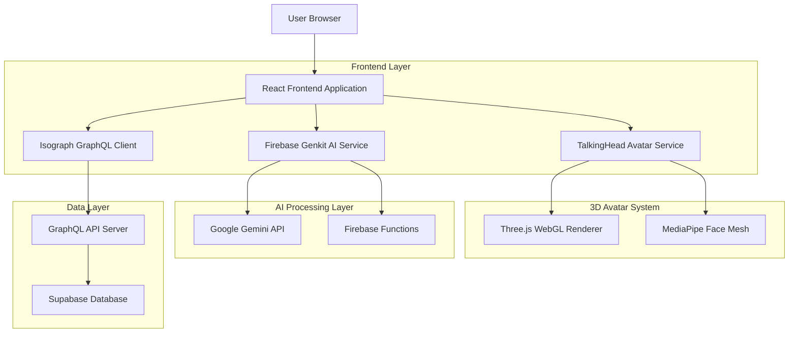
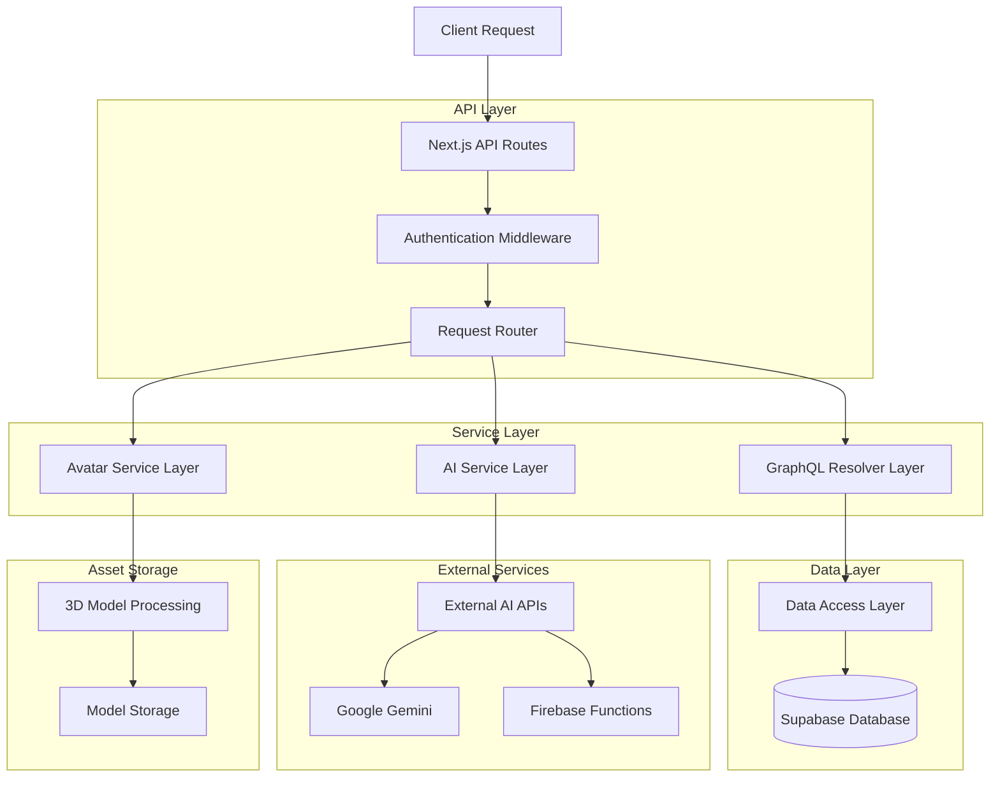
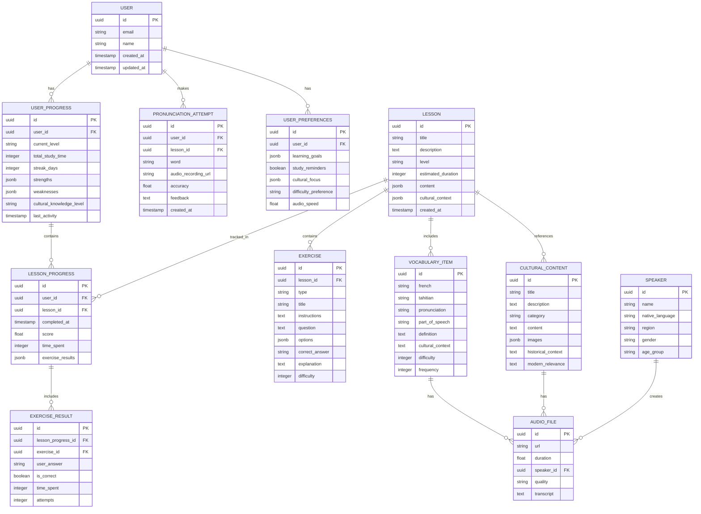

# TahitiSpeak Technical Architecture
## Enhanced French-Tahitian Learning Platform

## 1. Architecture Design



## 2. Technology Description

- **Frontend**: React@18 + TypeScript + Next.js@14 + TailwindCSS@3
- **3D Avatar**: Three.js + MediaPipe + WebGL2
- **AI Framework**: Firebase Genkit + Google Gemini API
- **GraphQL**: Isograph + Apollo Server + GraphQL Tools
- **Database**: Supabase (PostgreSQL)
- **Authentication**: Supabase Auth
- **Testing**: Jest + React Testing Library + Playwright
- **Build Tool**: Vite + SWC

## 3. Route Definitions

| Route | Purpose | Integrations Used |
|-------|---------|------------------|
| `/` | Home page with language selection | Isograph (user preferences) |
| `/learn` | Main learning dashboard | All three integrations |
| `/learn/lessons` | Lesson browser with filters | Isograph (lesson data) |
| `/learn/lessons/[id]` | Individual lesson with avatar | TalkingHead + Genkit + Isograph |
| `/practice/pronunciation` | Pronunciation practice with AI feedback | TalkingHead + Genkit |
| `/practice/conversation` | AI-generated conversations | Genkit + Isograph |
| `/cultural/insights` | Cultural content and context | Genkit + Isograph |
| `/progress` | User progress tracking | Isograph (progress data) |
| `/admin/dashboard` | Integration monitoring dashboard | All (health checks) |

## 4. API Definitions

### 4.1 Core GraphQL API

**Lesson Management**
```graphql
query GetLessons($filters: LessonFilters) {
  lessons(filters: $filters) {
    id
    title
    level
    culturalContext {
      themes
      significance
    }
    content {
      frenchText
      tahitianText
      pronunciation {
        ipa
        audioUrl
      }
    }
  }
}
```

**Progress Tracking**
```graphql
mutation UpdateProgress($input: ProgressUpdateInput!) {
  updateProgress(input: $input) {
    id
    completedLessons {
      lessonId
      score
      completedAt
    }
    currentLevel
    streakDays
  }
}
```

### 4.2 AI Service API

**Conversation Generation**
```
POST /api/ai/generate-conversation
```

Request:
| Param Name | Param Type | isRequired | Description |
|------------|------------|------------|-------------|
| topic | string | true | Conversation topic |
| level | enum | true | Learning level (beginner/intermediate/advanced) |
| culturalContext | string | true | Cultural context for the conversation |
| userLanguage | enum | true | User's native language (fr/en) |

Response:
| Param Name | Param Type | Description |
|------------|------------|-------------|
| exchanges | array | Conversation exchanges with translations |
| culturalNotes | array | Cultural insights and context |
| pronunciationTips | array | Pronunciation guidance |
| vocabulary | array | Key vocabulary with cultural significance |

Example:
```json
{
  "topic": "traditional greetings",
  "level": "beginner",
  "culturalContext": "formal meeting with elders",
  "userLanguage": "fr"
}
```

**Pronunciation Feedback**
```
POST /api/ai/pronunciation-feedback
```

Request:
| Param Name | Param Type | isRequired | Description |
|------------|------------|------------|-------------|
| audioData | base64 | true | User's pronunciation recording |
| targetPhrase | string | true | Target phrase for comparison |
| language | enum | true | Language (fr/ty) |

Response:
| Param Name | Param Type | Description |
|------------|------------|-------------|
| accuracy | number | Pronunciation accuracy score (0-1) |
| feedback | string | Overall feedback message |
| specificFeedback | array | Word-by-word feedback |
| culturalNotes | string | Cultural pronunciation context |

### 4.3 Avatar Service API

**Avatar Control**
```
POST /api/avatar/speak
```

Request:
| Param Name | Param Type | isRequired | Description |
|------------|------------|------------|-------------|
| text | string | true | Text to be spoken |
| language | enum | true | Language (fr/ty) |
| culturalStyle | enum | true | Avatar cultural styling |
| lipSyncData | object | true | Phoneme timing data |

Response:
| Param Name | Param Type | Description |
|------------|------------|-------------|
| audioUrl | string | Generated audio file URL |
| duration | number | Audio duration in milliseconds |
| lipSyncTimings | array | Lip sync animation timings |

## 5. Server Architecture Diagram



## 6. Data Model

### 6.1 Data Model Definition



### 6.2 Data Definition Language

**User Management Tables**
```sql
-- Users table
CREATE TABLE users (
    id UUID PRIMARY KEY DEFAULT gen_random_uuid(),
    email VARCHAR(255) UNIQUE NOT NULL,
    name VARCHAR(100) NOT NULL,
    created_at TIMESTAMP WITH TIME ZONE DEFAULT NOW(),
    updated_at TIMESTAMP WITH TIME ZONE DEFAULT NOW()
);

-- User preferences
CREATE TABLE user_preferences (
    id UUID PRIMARY KEY DEFAULT gen_random_uuid(),
    user_id UUID REFERENCES users(id) ON DELETE CASCADE,
    learning_goals JSONB DEFAULT '[]',
    study_reminders BOOLEAN DEFAULT true,
    cultural_focus JSONB DEFAULT '[]',
    difficulty_preference VARCHAR(20) DEFAULT 'adaptive',
    audio_speed FLOAT DEFAULT 1.0,
    created_at TIMESTAMP WITH TIME ZONE DEFAULT NOW(),
    updated_at TIMESTAMP WITH TIME ZONE DEFAULT NOW()
);

-- User progress tracking
CREATE TABLE user_progress (
    id UUID PRIMARY KEY DEFAULT gen_random_uuid(),
    user_id UUID REFERENCES users(id) ON DELETE CASCADE,
    current_level VARCHAR(20) DEFAULT 'BEGINNER',
    total_study_time INTEGER DEFAULT 0,
    streak_days INTEGER DEFAULT 0,
    strengths JSONB DEFAULT '[]',
    weaknesses JSONB DEFAULT '[]',
    cultural_knowledge_level VARCHAR(20) DEFAULT 'BASIC',
    last_activity TIMESTAMP WITH TIME ZONE DEFAULT NOW(),
    created_at TIMESTAMP WITH TIME ZONE DEFAULT NOW(),
    updated_at TIMESTAMP WITH TIME ZONE DEFAULT NOW()
);
```

**Content Management Tables**
```sql
-- Lessons
CREATE TABLE lessons (
    id UUID PRIMARY KEY DEFAULT gen_random_uuid(),
    title VARCHAR(200) NOT NULL,
    description TEXT,
    level VARCHAR(20) NOT NULL CHECK (level IN ('BEGINNER', 'INTERMEDIATE', 'ADVANCED')),
    estimated_duration INTEGER NOT NULL,
    content JSONB NOT NULL,
    cultural_context JSONB,
    created_at TIMESTAMP WITH TIME ZONE DEFAULT NOW(),
    updated_at TIMESTAMP WITH TIME ZONE DEFAULT NOW()
);

-- Vocabulary items
CREATE TABLE vocabulary_items (
    id UUID PRIMARY KEY DEFAULT gen_random_uuid(),
    french VARCHAR(100) NOT NULL,
    tahitian VARCHAR(100) NOT NULL,
    pronunciation VARCHAR(200) NOT NULL,
    part_of_speech VARCHAR(20) NOT NULL,
    definition TEXT NOT NULL,
    cultural_context TEXT,
    difficulty INTEGER DEFAULT 1 CHECK (difficulty BETWEEN 1 AND 5),
    frequency INTEGER DEFAULT 1,
    created_at TIMESTAMP WITH TIME ZONE DEFAULT NOW()
);

-- Cultural content
CREATE TABLE cultural_content (
    id UUID PRIMARY KEY DEFAULT gen_random_uuid(),
    title VARCHAR(200) NOT NULL,
    description TEXT,
    category VARCHAR(50) NOT NULL,
    content TEXT NOT NULL,
    images JSONB DEFAULT '[]',
    historical_context TEXT,
    modern_relevance TEXT,
    created_at TIMESTAMP WITH TIME ZONE DEFAULT NOW()
);

-- Audio files
CREATE TABLE audio_files (
    id UUID PRIMARY KEY DEFAULT gen_random_uuid(),
    url VARCHAR(500) NOT NULL,
    duration FLOAT NOT NULL,
    speaker_id UUID REFERENCES speakers(id),
    quality VARCHAR(20) DEFAULT 'MEDIUM',
    transcript TEXT,
    created_at TIMESTAMP WITH TIME ZONE DEFAULT NOW()
);

-- Speakers
CREATE TABLE speakers (
    id UUID PRIMARY KEY DEFAULT gen_random_uuid(),
    name VARCHAR(100) NOT NULL,
    native_language VARCHAR(10) NOT NULL,
    region VARCHAR(100),
    gender VARCHAR(20),
    age_group VARCHAR(20),
    created_at TIMESTAMP WITH TIME ZONE DEFAULT NOW()
);
```

**Learning Progress Tables**
```sql
-- Lesson progress
CREATE TABLE lesson_progress (
    id UUID PRIMARY KEY DEFAULT gen_random_uuid(),
    user_id UUID REFERENCES users(id) ON DELETE CASCADE,
    lesson_id UUID REFERENCES lessons(id) ON DELETE CASCADE,
    completed_at TIMESTAMP WITH TIME ZONE DEFAULT NOW(),
    score FLOAT CHECK (score BETWEEN 0 AND 1),
    time_spent INTEGER DEFAULT 0,
    exercise_results JSONB DEFAULT '[]',
    UNIQUE(user_id, lesson_id)
);

-- Exercises
CREATE TABLE exercises (
    id UUID PRIMARY KEY DEFAULT gen_random_uuid(),
    lesson_id UUID REFERENCES lessons(id) ON DELETE CASCADE,
    type VARCHAR(50) NOT NULL,
    title VARCHAR(200) NOT NULL,
    instructions TEXT,
    question TEXT NOT NULL,
    options JSONB,
    correct_answer TEXT NOT NULL,
    explanation TEXT,
    difficulty INTEGER DEFAULT 1 CHECK (difficulty BETWEEN 1 AND 5),
    created_at TIMESTAMP WITH TIME ZONE DEFAULT NOW()
);

-- Exercise results
CREATE TABLE exercise_results (
    id UUID PRIMARY KEY DEFAULT gen_random_uuid(),
    lesson_progress_id UUID REFERENCES lesson_progress(id) ON DELETE CASCADE,
    exercise_id UUID REFERENCES exercises(id) ON DELETE CASCADE,
    user_answer TEXT,
    is_correct BOOLEAN NOT NULL,
    time_spent INTEGER DEFAULT 0,
    attempts INTEGER DEFAULT 1,
    created_at TIMESTAMP WITH TIME ZONE DEFAULT NOW()
);

-- Pronunciation attempts
CREATE TABLE pronunciation_attempts (
    id UUID PRIMARY KEY DEFAULT gen_random_uuid(),
    user_id UUID REFERENCES users(id) ON DELETE CASCADE,
    lesson_id UUID REFERENCES lessons(id),
    word VARCHAR(100) NOT NULL,
    audio_recording_url VARCHAR(500) NOT NULL,
    accuracy FLOAT CHECK (accuracy BETWEEN 0 AND 1),
    feedback TEXT,
    created_at TIMESTAMP WITH TIME ZONE DEFAULT NOW()
);
```

**Indexes for Performance**
```sql
-- User-related indexes
CREATE INDEX idx_user_preferences_user_id ON user_preferences(user_id);
CREATE INDEX idx_user_progress_user_id ON user_progress(user_id);
CREATE INDEX idx_lesson_progress_user_id ON lesson_progress(user_id);
CREATE INDEX idx_lesson_progress_lesson_id ON lesson_progress(lesson_id);
CREATE INDEX idx_pronunciation_attempts_user_id ON pronunciation_attempts(user_id);

-- Content-related indexes
CREATE INDEX idx_lessons_level ON lessons(level);
CREATE INDEX idx_vocabulary_items_difficulty ON vocabulary_items(difficulty);
CREATE INDEX idx_vocabulary_items_frequency ON vocabulary_items(frequency);
CREATE INDEX idx_cultural_content_category ON cultural_content(category);
CREATE INDEX idx_exercises_lesson_id ON exercises(lesson_id);
CREATE INDEX idx_exercise_results_lesson_progress_id ON exercise_results(lesson_progress_id);

-- Performance indexes
CREATE INDEX idx_lesson_progress_completed_at ON lesson_progress(completed_at DESC);
CREATE INDEX idx_pronunciation_attempts_created_at ON pronunciation_attempts(created_at DESC);
CREATE INDEX idx_user_progress_last_activity ON user_progress(last_activity DESC);
```

**Row Level Security (RLS) Policies**
```sql
-- Enable RLS
ALTER TABLE users ENABLE ROW LEVEL SECURITY;
ALTER TABLE user_preferences ENABLE ROW LEVEL SECURITY;
ALTER TABLE user_progress ENABLE ROW LEVEL SECURITY;
ALTER TABLE lesson_progress ENABLE ROW LEVEL SECURITY;
ALTER TABLE pronunciation_attempts ENABLE ROW LEVEL SECURITY;

-- User data access policies
CREATE POLICY "Users can view own data" ON users
    FOR SELECT USING (auth.uid() = id);

CREATE POLICY "Users can update own data" ON users
    FOR UPDATE USING (auth.uid() = id);

CREATE POLICY "Users can view own preferences" ON user_preferences
    FOR ALL USING (auth.uid() = user_id);

CREATE POLICY "Users can view own progress" ON user_progress
    FOR ALL USING (auth.uid() = user_id);

CREATE POLICY "Users can view own lesson progress" ON lesson_progress
    FOR ALL USING (auth.uid() = user_id);

CREATE POLICY "Users can view own pronunciation attempts" ON pronunciation_attempts
    FOR ALL USING (auth.uid() = user_id);

-- Public content access
CREATE POLICY "Anyone can view lessons" ON lessons
    FOR SELECT USING (true);

CREATE POLICY "Anyone can view vocabulary" ON vocabulary_items
    FOR SELECT USING (true);

CREATE POLICY "Anyone can view cultural content" ON cultural_content
    FOR SELECT USING (true);

CREATE POLICY "Anyone can view exercises" ON exercises
    FOR SELECT USING (true);
```

**Initial Data**
```sql
-- Sample speakers
INSERT INTO speakers (name, native_language, region, gender, age_group) VALUES
('Marie Tetuanui', 'TAHITIAN', 'Tahiti', 'FEMALE', 'ADULT'),
('Jean-Pierre Teriitahi', 'TAHITIAN', 'Moorea', 'MALE', 'ELDER'),
('Sophie Temarii', 'FRENCH', 'Papeete', 'FEMALE', 'YOUNG_ADULT'),
('Claude Teiva', 'TAHITIAN', 'Bora Bora', 'MALE', 'ADULT');

-- Sample vocabulary
INSERT INTO vocabulary_items (french, tahitian, pronunciation, part_of_speech, definition, cultural_context, difficulty, frequency) VALUES
('bonjour', 'ia ora na', '[ia ˈora na]', 'INTERJECTION', 'Greeting used throughout the day', 'Universal Tahitian greeting expressing good health and well-being', 1, 10),
('merci', 'mauruuru', '[mauˈruuru]', 'INTERJECTION', 'Expression of gratitude', 'Deep gratitude often accompanied by physical gestures', 1, 9),
('famille', 'fetii', '[feˈtii]', 'NOUN', 'Family members and relatives', 'Extended family concept including adopted and spiritual family', 2, 8),
('maison', 'fare', '[ˈfare]', 'NOUN', 'House or dwelling', 'Traditional Tahitian homes were open-air structures', 1, 7),
('eau', 'pape', '[ˈpape]', 'NOUN', 'Water', 'Sacred element in Tahitian culture, essential for life', 1, 6);

-- Sample cultural content
INSERT INTO cultural_content (title, description, category, content, historical_context, modern_relevance) VALUES
('Traditional Greetings', 'The art of Tahitian greetings and their cultural significance', 'TRADITIONS', 'Tahitian greetings go beyond simple words...', 'Historically, greetings were ceremonial...', 'Modern Tahitians still value traditional greeting customs...'),
('Family Structure', 'Understanding the extended family concept in Tahitian society', 'FAMILY', 'The concept of fetii extends beyond blood relations...', 'Traditional Polynesian societies were organized around extended families...', 'Contemporary Tahitian families maintain strong extended family bonds...');
```

This technical architecture provides a comprehensive foundation for integrating TalkingHead avatars, Firebase Genkit AI, and Isograph GraphQL into the TahitiSpeak French-Tahitian learning platform, ensuring scalability, performance, and cultural authenticity.