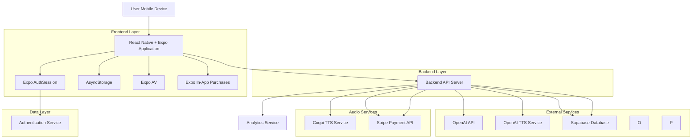
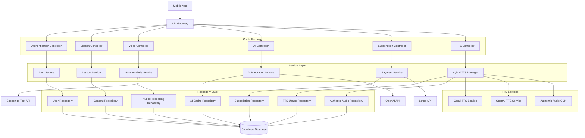

# Tahiti French Tutor - Technical Architecture Document

## 1. Architecture Design



## 2. Technology Description

- **Frontend**: React Native with Expo SDK 49+, TypeScript, React Navigation v6, React Context API
- **Backend**: Node.js with Express.js, TypeScript
- **Database**: Supabase (PostgreSQL) with real-time subscriptions
- **Authentication**: Expo AuthSession with Supabase Auth
- **Storage**: AsyncStorage for offline data, Expo FileSystem for audio caching
- **Audio**: Expo AV for pronunciation practice and cultural audio stories
- **Text-to-Speech**: Hybrid TTS strategy with Coqui TTS (primary), OpenAI TTS (premium), and pre-recorded authentic audio
- **Payments**: Expo In-App Purchases with Stripe backend integration
- **AI Integration**: OpenAI API for cultural tutoring and content generation
- **Analytics**: Expo Analytics with privacy-compliant tracking

## 3. Route Definitions

| Route | Purpose |
|-------|---------|
| /welcome | Welcome screen with cultural imagery and app introduction |
| /auth/signup | User registration with email or social media |
| /auth/login | User authentication and session management |
| /profile-setup | Initial user profile creation and learning goals |
| /learn | Main learning tab with lessons and cultural context |
| /practice | Interactive exercises and voice practice features |
| /culture | Cultural insights, stories, and historical content |
| /business | Professional French modules for tourism industry |
| /profile | User dashboard, progress tracking, and subscription management |
| /lesson/:id | Individual lesson view with interactive content |
| /story/:id | Cultural audio story player with transcript |
| /subscription | Premium subscription selection and payment |
| /settings | App settings, notifications, and privacy controls |

## 4. API Definitions

### 4.1 Core API

**User Authentication**
```
POST /api/auth/register
```

Request:
| Param Name | Param Type | isRequired | Description |
|------------|------------|------------|-------------|
| email | string | true | User email address |
| password | string | true | User password (min 8 characters) |
| name | string | true | User display name |
| learningGoals | array | false | Selected learning objectives |

Response:
| Param Name | Param Type | Description |
|------------|------------|-------------|
| success | boolean | Registration status |
| user | object | User profile data |
| token | string | JWT authentication token |

**Lesson Progress Tracking**
```
POST /api/lessons/progress
```

Request:
| Param Name | Param Type | isRequired | Description |
|------------|------------|------------|-------------|
| lessonId | string | true | Unique lesson identifier |
| completed | boolean | true | Lesson completion status |
| score | number | false | Lesson performance score (0-100) |
| timeSpent | number | true | Time spent in seconds |
| culturalQuizScore | number | false | Cultural knowledge assessment score |

**Voice Pronunciation Analysis**
```
POST /api/voice/analyze
```

Request:
| Param Name | Param Type | isRequired | Description |
|------------|------------|------------|-------------|
| audioFile | file | true | Recorded audio file (WAV/MP3) |
| targetPhrase | string | true | Expected French phrase |
| culturalContext | string | false | Polynesian cultural context |

Response:
| Param Name | Param Type | Description |
|------------|------------|-------------|
| accuracy | number | Pronunciation accuracy (0-100) |
| feedback | string | Detailed pronunciation feedback |
| culturalNotes | string | Cultural appropriateness notes |

**AI Cultural Tutor**
```
POST /api/ai/cultural-tutor
```

Request:
| Param Name | Param Type | isRequired | Description |
|------------|------------|------------|-------------|
| question | string | true | User question about culture/language |
| context | string | false | Current lesson or cultural topic |
| userLevel | string | true | CEFR level (A1-C1) |

Response:
| Param Name | Param Type | Description |
|------------|------------|-------------|
| response | string | AI-generated cultural explanation |
| relatedContent | array | Suggested related lessons/stories |
| vocabulary | array | Key vocabulary with cultural context |

**Hybrid Text-to-Speech with Cultural Analysis**
```
POST /api/tts/generate
```

Request:
| Param Name | Param Type | isRequired | Description |
|------------|------------|------------|-------------|
| text | string | true | Text to convert to speech |
| language | string | true | Target language (french/english/multilingual) |
| voiceType | string | true | primary/premium/authentic |
| culturalContext | string | false | Polynesian cultural context for pronunciation |
| userSubscription | string | true | User subscription tier |
| userNationality | string | false | User's nationality for accent adaptation |
| emotionLevel | string | false | Desired emotional tone (warm/neutral/formal) |

Response:
| Param Name | Param Type | Description |
|------------|------------|-------------|
| audioUrl | string | Generated audio file URL |
| duration | number | Audio duration in seconds |
| voiceModel | string | TTS model used for generation |
| ttsProvider | string | Service used (coqui/openai/authentic) |
| costUsed | number | API cost consumed (for premium) |
| remainingQuota | number | Remaining monthly quota |
| culturalNotes | string | Cultural context and significance |
| pronunciationGuide | string | Phonetic pronunciation guide |
| culturalAnalysis | object | Detailed cultural context analysis |

**TTS Voice Selection**
```
GET /api/tts/voice-options
```

Request:
| Param Name | Param Type | isRequired | Description |
|------------|------------|------------|-------------|
| language | string | true | Target language for voice options |
| subscriptionTier | string | true | User subscription level |

Response:
| Param Name | Param Type | Description |
|------------|------------|-------------|
| availableVoices | array | List of available voice models |
| authenticAudioSamples | array | Pre-recorded authentic audio options |
| premiumFeatures | array | Premium TTS features available |

**Subscription Management**
```
POST /api/subscriptions/create
```

Request:
| Param Name | Param Type | isRequired | Description |
|------------|------------|------------|-------------|
| planType | string | true | 'individual' or 'corporate' |
| paymentToken | string | true | Stripe payment token |
| teamSize | number | false | Number of corporate users |

## 5. Server Architecture Diagram



## 6. Data Model

### 6.1 Data Model Definition

```mermaid
erDiagram
    USERS ||--o{ USER_PROGRESS : tracks
    USERS ||--o{ SUBSCRIPTIONS : has
    USERS ||--o{ VOICE_RECORDINGS : creates
    LESSONS ||--o{ USER_PROGRESS : completed_in
    LESSONS ||--o{ CULTURAL_CONTENT : contains
    CULTURAL_STORIES ||--o{ STORY_PROGRESS : tracked_in
    USERS ||--o{ STORY_PROGRESS : has
    BUSINESS_SCENARIOS ||--o{ SCENARIO_PROGRESS : completed_in
    USERS ||--o{ SCENARIO_PROGRESS : has
    USERS ||--o{ TTS_USAGE : tracks
    AUTHENTIC_AUDIO ||--o{ TTS_USAGE : used_in
    
    USERS {
        uuid id PK
        string email
        string name
        string password_hash
        string learning_goals
        string cefr_level
        timestamp created_at
        timestamp updated_at
    }
    
    SUBSCRIPTIONS {
        uuid id PK
        uuid user_id FK
        string plan_type
        string status
        timestamp expires_at
        string stripe_subscription_id
        timestamp created_at
    }
    
    LESSONS {
        uuid id PK
        string title
        string description
        string cefr_level
        json content
        json cultural_context
        string audio_url
        boolean is_premium
        integer order_index
        timestamp created_at
    }
    
    USER_PROGRESS {
        uuid id PK
        uuid user_id FK
        uuid lesson_id FK
        boolean completed
        integer score
        integer time_spent
        integer cultural_quiz_score
        timestamp completed_at
    }
    
    CULTURAL_STORIES {
        uuid id PK
        string title
        string description
        text content
        string audio_url
        integer duration_minutes
        string difficulty_level
        json vocabulary
        timestamp created_at
    }
    
    STORY_PROGRESS {
        uuid id PK
        uuid user_id FK
        uuid story_id FK
        boolean completed
        integer progress_percentage
        timestamp last_accessed
    }
    
    BUSINESS_SCENARIOS {
        uuid id PK
        string title
        string industry
        text scenario_description
        json dialogue
        json vocabulary
        string difficulty_level
        boolean is_premium
    }
    
    SCENARIO_PROGRESS {
        uuid id PK
        uuid user_id FK
        uuid scenario_id FK
        boolean completed
        integer score
        timestamp completed_at
    }
    
    VOICE_RECORDINGS {
        uuid id PK
        uuid user_id FK
        string audio_file_url
        string target_phrase
        integer accuracy_score
        text feedback
        timestamp created_at
    }
    
    CULTURAL_CONTENT {
        uuid id PK
        uuid lesson_id FK
        string content_type
        string title
        text description
        json metadata
        timestamp created_at
    }
    
    TTS_USAGE {
        uuid id PK
        uuid user_id FK
        string tts_strategy
        string text_content
        integer character_count
        string language
        string voice_model
        decimal cost_incurred
        timestamp created_at
    }
    
    AUTHENTIC_AUDIO {
        uuid id PK
        string phrase_key
        string audio_url
        string language
        string cultural_context
        text description
        integer duration_seconds
        string quality_level
        timestamp created_at
    }
```



### 6.2 Data Definition Language

**Users Table**
```sql
-- Create users table
CREATE TABLE users (
    id UUID PRIMARY KEY DEFAULT gen_random_uuid(),
    email VARCHAR(255) UNIQUE NOT NULL,
    name VARCHAR(100) NOT NULL,
    password_hash VARCHAR(255) NOT NULL,
    learning_goals TEXT[],
    cefr_level VARCHAR(2) DEFAULT 'A1' CHECK (cefr_level IN ('A1', 'A2', 'B1', 'B2', 'C1')),
    created_at TIMESTAMP WITH TIME ZONE DEFAULT NOW(),
    updated_at TIMESTAMP WITH TIME ZONE DEFAULT NOW()
);

-- Create indexes
CREATE INDEX idx_users_email ON users(email);
CREATE INDEX idx_users_cefr_level ON users(cefr_level);

-- Grant permissions
GRANT SELECT ON users TO anon;
GRANT ALL PRIVILEGES ON users TO authenticated;
```

**Subscriptions Table**
```sql
-- Create subscriptions table
CREATE TABLE subscriptions (
    id UUID PRIMARY KEY DEFAULT gen_random_uuid(),
    user_id UUID REFERENCES users(id) ON DELETE CASCADE,
    plan_type VARCHAR(20) NOT NULL CHECK (plan_type IN ('free', 'individual', 'corporate')),
    status VARCHAR(20) DEFAULT 'active' CHECK (status IN ('active', 'cancelled', 'expired')),
    expires_at TIMESTAMP WITH TIME ZONE,
    stripe_subscription_id VARCHAR(255),
    created_at TIMESTAMP WITH TIME ZONE DEFAULT NOW()
);

-- Create indexes
CREATE INDEX idx_subscriptions_user_id ON subscriptions(user_id);
CREATE INDEX idx_subscriptions_status ON subscriptions(status);

-- Grant permissions
GRANT SELECT ON subscriptions TO anon;
GRANT ALL PRIVILEGES ON subscriptions TO authenticated;
```

**Lessons Table**
```sql
-- Create lessons table
CREATE TABLE lessons (
    id UUID PRIMARY KEY DEFAULT gen_random_uuid(),
    title VARCHAR(200) NOT NULL,
    description TEXT,
    cefr_level VARCHAR(2) NOT NULL CHECK (cefr_level IN ('A1', 'A2', 'B1', 'B2', 'C1')),
    content JSONB NOT NULL,
    cultural_context JSONB,
    audio_url VARCHAR(500),
    is_premium BOOLEAN DEFAULT false,
    order_index INTEGER NOT NULL,
    created_at TIMESTAMP WITH TIME ZONE DEFAULT NOW()
);

-- Create indexes
CREATE INDEX idx_lessons_cefr_level ON lessons(cefr_level);
CREATE INDEX idx_lessons_order ON lessons(order_index);
CREATE INDEX idx_lessons_premium ON lessons(is_premium);

-- Grant permissions
GRANT SELECT ON lessons TO anon;
GRANT ALL PRIVILEGES ON lessons TO authenticated;
```

**Cultural Stories Table**
```sql
-- Create cultural_stories table
CREATE TABLE cultural_stories (
    id UUID PRIMARY KEY DEFAULT gen_random_uuid(),
    title VARCHAR(200) NOT NULL,
    description TEXT,
    content TEXT NOT NULL,
    audio_url VARCHAR(500),
    duration_minutes INTEGER,
    difficulty_level VARCHAR(20) CHECK (difficulty_level IN ('beginner', 'intermediate', 'advanced')),
    vocabulary JSONB,
    created_at TIMESTAMP WITH TIME ZONE DEFAULT NOW()
);

-- Create indexes
CREATE INDEX idx_cultural_stories_difficulty ON cultural_stories(difficulty_level);

-- Grant permissions
GRANT SELECT ON cultural_stories TO anon;
GRANT ALL PRIVILEGES ON cultural_stories TO authenticated;
```

**Initial Data**
```sql
-- Insert foundation lessons
INSERT INTO lessons (title, description, cefr_level, content, cultural_context, is_premium, order_index) VALUES
('Greetings & Respect', 'Learn French greetings with Tahitian cultural protocols', 'A1', 
 '{"phrases": [{"french": "Bonjour", "tahitian": "Ia ora na", "context": "Morning greeting with cultural respect"}]}',
 '{"cultural_notes": "In Polynesian culture, greetings acknowledge the mana (spiritual power) of others"}',
 false, 1),

('Food & Hospitality', 'Restaurant French with Polynesian cuisine context', 'A1',
 '{"phrases": [{"french": "Merci", "tahitian": "Mauruuru", "context": "Gratitude in dining situations"}]}',
 '{"cultural_notes": "Polynesian hospitality emphasizes sharing and community dining"}',
 false, 2),

('Travel & Navigation', 'Transportation vocabulary with island geography', 'A1',
 '{"phrases": [{"french": "Au revoir", "tahitian": "Nana", "context": "Farewell customs in travel"}]}',
 '{"cultural_notes": "Traditional Polynesian navigation used stars and ocean patterns"}',
 false, 3);

**TTS Usage Tracking Table**
```sql
-- Create tts_usage table
CREATE TABLE tts_usage (
    id UUID PRIMARY KEY DEFAULT gen_random_uuid(),
    user_id UUID REFERENCES users(id) ON DELETE CASCADE,
    tts_strategy VARCHAR(20) NOT NULL CHECK (tts_strategy IN ('coqui', 'openai', 'authentic')),
    text_content TEXT NOT NULL,
    character_count INTEGER NOT NULL,
    language VARCHAR(20) NOT NULL,
    voice_model VARCHAR(100),
    cost_incurred DECIMAL(10,6) DEFAULT 0.00,
    created_at TIMESTAMP WITH TIME ZONE DEFAULT NOW()
);

-- Create indexes
CREATE INDEX idx_tts_usage_user_id ON tts_usage(user_id);
CREATE INDEX idx_tts_usage_strategy ON tts_usage(tts_strategy);
CREATE INDEX idx_tts_usage_created_at ON tts_usage(created_at DESC);

-- Grant permissions
GRANT SELECT ON tts_usage TO anon;
GRANT ALL PRIVILEGES ON tts_usage TO authenticated;
```

**Authentic Audio Table**
```sql
-- Create authentic_audio table
CREATE TABLE authentic_audio (
    id UUID PRIMARY KEY DEFAULT gen_random_uuid(),
    phrase_key VARCHAR(200) UNIQUE NOT NULL,
    audio_url VARCHAR(500) NOT NULL,
    language VARCHAR(20) NOT NULL,
    cultural_context VARCHAR(100),
    description TEXT,
    duration_seconds INTEGER,
    quality_level VARCHAR(20) DEFAULT 'high' CHECK (quality_level IN ('high', 'medium', 'low')),
    created_at TIMESTAMP WITH TIME ZONE DEFAULT NOW()
);

-- Create indexes
CREATE INDEX idx_authentic_audio_phrase_key ON authentic_audio(phrase_key);
CREATE INDEX idx_authentic_audio_language ON authentic_audio(language);
CREATE INDEX idx_authentic_audio_cultural_context ON authentic_audio(cultural_context);

-- Grant permissions
GRANT SELECT ON authentic_audio TO anon;
GRANT ALL PRIVILEGES ON authentic_audio TO authenticated;
```

**Initial Data**
```sql
-- Insert foundation lessons
INSERT INTO lessons (title, description, cefr_level, content, cultural_context, is_premium, order_index) VALUES
('Greetings & Respect', 'Learn French greetings with Tahitian cultural protocols', 'A1', 
 '{"phrases": [{"french": "Bonjour", "tahitian": "Ia ora na", "context": "Morning greeting with cultural respect"}]}',
 '{"cultural_notes": "In Polynesian culture, greetings acknowledge the mana (spiritual power) of others"}',
 false, 1),

('Food & Hospitality', 'Restaurant French with Polynesian cuisine context', 'A1',
 '{"phrases": [{"french": "Merci", "tahitian": "Mauruuru", "context": "Gratitude in dining situations"}]}',
 '{"cultural_notes": "Polynesian hospitality emphasizes sharing and community dining"}',
 false, 2),

('Travel & Navigation', 'Transportation vocabulary with island geography', 'A1',
 '{"phrases": [{"french": "Au revoir", "tahitian": "Nana", "context": "Farewell customs in travel"}]}',
 '{"cultural_notes": "Traditional Polynesian navigation used stars and ocean patterns"}',
 false, 3);

-- Insert cultural stories
INSERT INTO cultural_stories (title, description, content, duration_minutes, difficulty_level, vocabulary) VALUES
('The Legend of Mount Orohena', 'Traditional Polynesian legend told in simple French', 
 'Il était une fois, sur l\'île de Tahiti, une montagne sacrée appelée Orohena...', 
 3, 'beginner',
 '{"vocabulary": [{"word": "montagne", "translation": "mountain", "cultural_context": "Sacred peaks in Polynesian mythology"}]}'),

('Modern Tahitian Wedding Customs', 'Contemporary wedding traditions with French vocabulary',
 'Les mariages tahitiens modernes mélangent les traditions polynésiennes et françaises...',
 2, 'intermediate',
 '{"vocabulary": [{"word": "mariage", "translation": "wedding", "cultural_context": "Blend of Polynesian and French traditions"}]}');

-- Insert authentic audio samples
INSERT INTO authentic_audio (phrase_key, audio_url, language, cultural_context, description, duration_seconds, quality_level) VALUES
('greeting_ia_ora_na', '/audio/authentic/ia_ora_na.mp3', 'tahitian', 'traditional_greeting', 'Authentic Tahitian morning greeting with proper pronunciation', 2, 'high'),
('greeting_bonjour_polynesian', '/audio/authentic/bonjour_polynesian.mp3', 'french', 'polynesian_accent', 'French greeting with authentic Polynesian accent', 2, 'high'),
('gratitude_mauruuru', '/audio/authentic/mauruuru.mp3', 'tahitian', 'hospitality', 'Traditional Tahitian expression of gratitude', 1, 'high'),
('business_welcome_maeva', '/audio/authentic/maeva_business.mp3', 'tahitian', 'hospitality_business', 'Professional welcome in hospitality context', 3, 'high'),
('legend_orohena_intro', '/audio/authentic/orohena_legend_intro.mp3', 'french', 'cultural_storytelling', 'Introduction to Mount Orohena legend in French', 15, 'high');
```

## 7. Security & Privacy

- **Data Encryption**: All user data encrypted at rest and in transit using AES-256
- **API Security**: JWT tokens with refresh mechanism, rate limiting, CORS protection
- **Privacy Compliance**: GDPR and COPPA compliant data handling with user consent
- **Secure Storage**: Sensitive data stored in Expo SecureStore, API keys in environment variables
- **Audio Privacy**: Voice recordings processed locally when possible, server recordings deleted after analysis
- **Payment Security**: PCI DSS compliant payment processing through Stripe

## 8. Hybrid Text-to-Speech Strategy with AI-Powered Cultural Analysis

### 8.1 Enhanced Four-Tier TTS Architecture

**Primary: Open Source Coqui TTS**
- **Framework**: Coqui TTS with local deployment capability
- **Models**:
  - English: VITS-English-American (for USA/Canada markets)
  - French: VITS-French-European (for France pronunciation)
  - Multilingual: XTTS-v2 (multi-language support)
  - Custom: `english_polynesian_blend`, `french_polynesian_authentic`
- **Advantages**:
  - Unlimited usage with no API costs
  - Customizable voices with fine-tuning capabilities
  - Local deployment with DeepSeek R1-3.1 integration
  - Regional accent training for Polynesian-French pronunciation
  - Voice cloning potential for authentic cultural narration

**Secondary: Piper TTS (Ultra-Fast Alternative)**
- **Framework**: Speed-optimized for real-time applications
- **Models**: 50+ language support with resource efficiency
- **Use Cases**: Interactive exercises, real-time pronunciation feedback
- **Advantages**: Ultra-fast generation, mobile-friendly, fallback option

**Tertiary: OpenAI TTS (Premium Only)**
- **Usage Scope**: Limited to premium features only
- **Triggers**:
  - Complex cultural pronunciations requiring high accuracy
  - Professional certification audio content
  - Corporate client custom content generation
- **Cost Control**: 10,000 characters per month per premium user
- **Implementation**: Fallback system when Coqui TTS quality insufficient

**Quaternary: Pre-recorded Authentic Audio**
- **Source**: Authentic voice recordings from Polynesian cultural expert
- **Content Types**:
  - Key Polynesian cultural phrases with proper pronunciation
  - Business scenario dialogues with cultural context
  - Cultural storytelling snippets and legends
  - Authentic French-Polynesian accent examples
- **Advantage**: Unmatched authenticity and cultural credibility
- **Storage**: High-quality audio files cached locally and served via CDN

### 8.2 HybridTTSManager Implementation

```typescript
class HybridTTSManager {
  private coquiTTS: CoquiTTSService;
  private piperTTS: PiperTTSService;
  private deepseekR1: DeepSeekR1Client;
  private openaiTTS: OpenAITTSService;
  private authenticAudio: AuthenticAudioService;
  
  async generateCulturalAudio(
    text: string, 
    userNationality: string, 
    context: string,
    lessonType?: string
  ): Promise<CulturalAudioResponse> {
    // Step 1: Check for pre-recorded authentic audio
    const authenticAudio = await this.authenticAudio.findByText(text);
    if (authenticAudio) {
      return {
        audio: authenticAudio.url,
        provider: 'authentic',
        culturalNotes: authenticAudio.culturalNotes,
        pronunciationGuide: authenticAudio.pronunciationGuide,
        cost: 0
      };
    }
    
    // Step 2: Use DeepSeek R1-3.1 for cultural context analysis
    const culturalAnalysis = await this.deepseekR1.analyzeCulturalContext({
      text,
      nationality: userNationality,
      context,
      lessonType
    });
    
    // Step 3: Select appropriate voice model based on user nationality
    const voiceModel = this.selectVoiceModel(userNationality, culturalAnalysis);
    
    // Step 4: Generate audio with Coqui TTS (primary choice)
    try {
      const audio = await this.coquiTTS.synthesize({
        text,
        voice: voiceModel,
        culturalContext: culturalAnalysis.context,
        emotion: culturalAnalysis.emotionLevel,
        speed: culturalAnalysis.recommendedSpeed
      });
      
      return {
        audio: audio.url,
        provider: 'coqui',
        culturalNotes: culturalAnalysis.culturalNotes,
        pronunciationGuide: culturalAnalysis.pronunciationTips,
        culturalAnalysis: culturalAnalysis,
        cost: 0
      };
    } catch (error) {
      // Fallback to Piper TTS for speed
      return await this.generateWithPiper(text, voiceModel, culturalAnalysis);
    }
  }
  
  private selectVoiceModel(nationality: string, analysis: CulturalAnalysis): string {
    const nativeEnglishCountries = ['USA', 'Canada', 'Australia', 'New Zealand', 'UK'];
    
    if (nativeEnglishCountries.includes(nationality)) {
      return analysis.requiresPolynesian ? 
        'english_polynesian_blend' : 'english_neutral';
    }
    
    if (nationality === 'France' || nationality === 'French Polynesia') {
      return analysis.requiresPolynesian ? 
        'french_polynesian_authentic' : 'french_metropolitan';
    }
    
    // Default to English Polynesian blend for international users
    return 'english_polynesian_blend';
  }
}

interface CulturalAnalysis {
  context: string;
  emotionLevel: 'warm' | 'neutral' | 'formal' | 'joyful';
  culturalNotes: string;
  pronunciationTips: string;
  requiresPolynesian: boolean;
  recommendedSpeed: number;
  culturalSignificance: string;
}

interface CulturalAudioResponse {
  audio: string;
  provider: 'coqui' | 'piper' | 'openai' | 'authentic';
  culturalNotes: string;
  pronunciationGuide: string;
  culturalAnalysis?: CulturalAnalysis;
  cost: number;
}
```

### 8.3 Enhanced TTS Selection Algorithm

```typescript
const selectTTSStrategy = (request: TTSRequest): TTSStrategy => {
  // Priority 1: Check for pre-recorded authentic audio
  if (hasAuthenticAudio(request.text, request.culturalContext)) {
    return 'authentic';
  }
  
  // Priority 2: Use Coqui TTS for all general content (unlimited)
  if (request.contentType === 'general' || request.culturalContext?.requiresPolynesian) {
    return 'coqui';
  }
  
  // Priority 3: Use Piper TTS for speed-critical scenarios
  if (request.requiresRealTime || request.contentType === 'interactive') {
    return 'piper';
  }
  
  // Priority 4: Use OpenAI for premium features with quota check
  if (request.userSubscription === 'premium' && 
      isPremiumTrigger(request.culturalContext) &&
      hasRemainingQuota(request.userId)) {
    return 'openai';
  }
  
  // Fallback to Coqui TTS (always available)
  return 'coqui';
};
```

### 8.4 DeepSeek R1-3.1 Cultural Context Analysis

```typescript
class DeepSeekR1Client {
  private client: OpenAI;
  
  constructor() {
    this.client = new OpenAI({
      baseURL: 'https://api.deepseek.com/v1',
      apiKey: process.env.DEEPSEEK_API_KEY
    });
  }
  
  async analyzeCulturalContext(params: {
    text: string;
    nationality: string;
    context: string;
    lessonType?: string;
  }): Promise<CulturalAnalysis> {
    const prompt = `
      Analyze the following French/Tahitian text for cultural context:
      Text: "${params.text}"
      User Nationality: ${params.nationality}
      Context: ${params.context}
      Lesson Type: ${params.lessonType || 'general'}
      
      Provide analysis for:
      1. Cultural significance in Polynesian context
      2. Appropriate emotional tone for pronunciation (warm/neutral/formal/joyful)
      3. Cultural notes for learner understanding
      4. Phonetic pronunciation guide using IPA or simplified phonetics
      5. Whether Polynesian accent/influence is needed (true/false)
      6. Recommended speech speed (0.8-1.2)
      7. Cultural significance explanation
      
      Return as JSON format:
      {
        "context": "cultural_context_type",
        "emotionLevel": "warm|neutral|formal|joyful",
        "culturalNotes": "explanation of cultural significance",
        "pronunciationTips": "phonetic guide",
        "requiresPolynesian": boolean,
        "recommendedSpeed": number,
        "culturalSignificance": "detailed explanation"
      }
    `;
    
    const response = await this.client.chat.completions.create({
      model: 'deepseek-r1',
      messages: [{ role: 'user', content: prompt }],
      temperature: 0.3,
      max_tokens: 1000
    });
    
    return this.parseAnalysisResponse(response.choices[0].message.content);
  }
  
  private parseAnalysisResponse(content: string): CulturalAnalysis {
    try {
      // Extract JSON from the response
      const jsonMatch = content.match(/\{[\s\S]*\}/);
      if (jsonMatch) {
        return JSON.parse(jsonMatch[0]);
      }
      
      // Fallback parsing if JSON format is not perfect
      return this.fallbackParsing(content);
    } catch (error) {
      console.error('Failed to parse cultural analysis:', error);
      return this.getDefaultAnalysis();
    }
  }
  
  private fallbackParsing(content: string): CulturalAnalysis {
    // Extract information using regex patterns
    const emotionMatch = content.match(/emotion.*?(warm|neutral|formal|joyful)/i);
    const speedMatch = content.match(/speed.*?(\d\.\d)/i);
    const polynesianMatch = content.match(/polynesian.*?(true|false)/i);
    
    return {
      context: 'general_cultural',
      emotionLevel: (emotionMatch?.[1] as any) || 'neutral',
      culturalNotes: this.extractCulturalNotes(content),
      pronunciationTips: this.extractPronunciationTips(content),
      requiresPolynesian: polynesianMatch?.[1] === 'true' || false,
      recommendedSpeed: parseFloat(speedMatch?.[1] || '1.0'),
      culturalSignificance: this.extractCulturalSignificance(content)
    };
  }
  
  private getDefaultAnalysis(): CulturalAnalysis {
    return {
      context: 'general',
      emotionLevel: 'neutral',
      culturalNotes: 'Standard French pronunciation with cultural awareness',
      pronunciationTips: 'Follow standard French phonetics',
      requiresPolynesian: false,
      recommendedSpeed: 1.0,
      culturalSignificance: 'General French language learning content'
    };
  }
  
  private extractCulturalNotes(content: string): string {
    const notesMatch = content.match(/cultural notes?:?\s*([^\n]+)/i);
    return notesMatch?.[1] || 'Cultural context provided for enhanced learning';
  }
  
  private extractPronunciationTips(content: string): string {
    const tipsMatch = content.match(/pronunciation.*?:?\s*([^\n]+)/i);
    return tipsMatch?.[1] || 'Follow standard pronunciation guidelines';
  }
  
  private extractCulturalSignificance(content: string): string {
    const sigMatch = content.match(/significance.*?:?\s*([^\n]+)/i);
    return sigMatch?.[1] || 'Enhances cultural understanding of French Polynesian context';
  }
}
```

### 8.5 Cost Optimization Strategy

- **Free Users**: Coqui TTS + Piper TTS (unlimited) + limited authentic audio samples
- **Premium Users**: Full access with OpenAI quota management + enhanced cultural analysis
- **Corporate Users**: Enhanced quotas + custom voice training options + unlimited access
- **Cultural Content**: Priority for authentic audio and Coqui TTS with cultural analysis
- **Real-time Features**: Piper TTS for optimal performance
- **AI Analysis**: DeepSeek R1-3.1 for cultural context (cost-effective compared to GPT-4)
- **Caching Strategy**: Aggressive caching of generated audio and cultural analysis to minimize API calls
- **Quality Fallback**: Automatic fallback from Coqui to Piper to OpenAI for quality issues

## 9. Deployment Configuration

- **Environment Variables**: Separate configs for development, staging, and production
- **TTS Services**: Docker containers for Coqui TTS deployment
- **App Store Assets**: Cultural imagery for icons, screenshots showcasing Polynesian integration
- **Deep Linking**: Universal links for premium content sharing and referral tracking
- **Analytics**: Privacy-compliant user engagement tracking with opt-out options
- **Auto-Updates**: Over-the-air updates for content using Expo Updates
- **Crash Reporting**: Sentry integration for error monitoring and performance tracking

```yaml
production:
  database:
    url: ${SUPABASE_URL}
    key: ${SUPABASE_SERVICE_ROLE_KEY}
  
  apis:
    openai:
      key: ${OPENAI_API_KEY}
      model: "gpt-4"
    
    deepseek:
      key: ${DEEPSEEK_API_KEY}
      model: "deepseek-r1"
      base_url: "https://api.deepseek.com/v1"
    
    stripe:
      secret_key: ${STRIPE_SECRET_KEY}
      webhook_secret: ${STRIPE_WEBHOOK_SECRET}
  
  tts_services:
    coqui:
      model: "xtts-v2"
      languages: ["en", "fr", "ty"]
      voice_models:
        - "english_polynesian_blend"
        - "french_polynesian_authentic"
        - "english_neutral"
        - "french_metropolitan"
      voice_cloning: true
      local_deployment: true
      gpu_acceleration: true
      cache_enabled: true
    
    piper:
      models: ["en_US-lessac-medium", "fr_FR-siwis-medium"]
      speed_optimization: true
      resource_efficient: true
      real_time_capable: true
      fallback_enabled: true
    
    openai_tts:
      model: "tts-1-hd"
      voices: ["alloy", "echo", "fable"]
      rate_limit: "100k_chars/month"
      fallback_enabled: true
      premium_only: true
    
    authentic_audio:
      storage: "cdn"
      format: "mp3"
      quality: "320kbps"
      cultural_metadata: true
      cache_duration: "30d"
  
  cultural_analysis:
    deepseek_r1:
      model: "deepseek-r1"
      temperature: 0.3
      max_tokens: 1000
      cache_duration: "24h"
      fallback_enabled: true
  
  storage:
    supabase_storage: ${SUPABASE_STORAGE_URL}
    cdn_url: ${CDN_BASE_URL}
    audio_cache_duration: "7d"
  
  security:
    jwt_secret: ${JWT_SECRET}
    encryption_key: ${ENCRYPTION_KEY}
    api_rate_limits:
      tts_generation: "1000/hour"
      cultural_analysis: "500/hour"
      audio_download: "5000/hour"
```